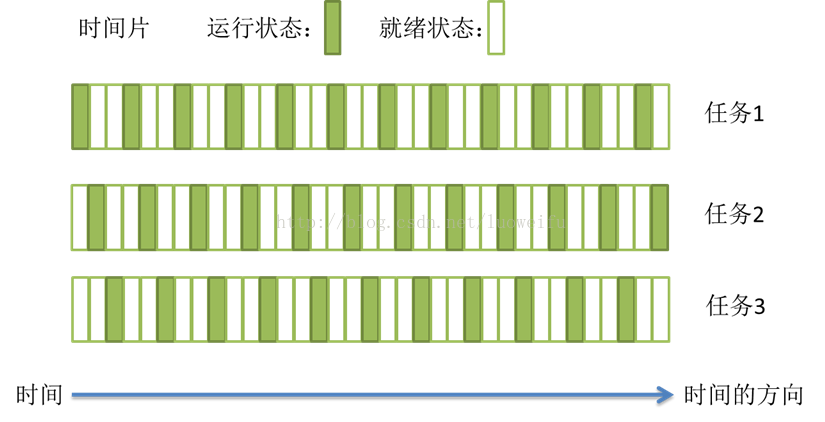

## 进程与线程

写这篇文章是想总结一下在操作系统中，进程和线程到底是什么样的，它们之间有什么区别和联系，虽然在实践中使用过多线程和多进程，但也只是了解了皮毛，故在此总结一下，因为操作系统是一个比较复杂的东西，通过进程和线程可以推演出各种复杂的概念和情况，所以文章只是在现有水平下的一点解释。

### 从操作系统说起

操作系统 (Operating System，OS) 是管理和控制计算机硬件与软件资源的计算机程序，是直接运行在“裸机”上的最基本的系统软件，任何其他软件都必须在操作系统的支持下才能运行。

操作系统的功能主要包括管理计算机系统的硬件、软件及数据资源，控制程序运行，改善人机界面，为其它应用软件提供支持，让计算机系统所有资源最大限度地发挥作用，提供各种形式的用户界面，使用户有一个好的工作环境，为其它软件的开发提供必要的服务和相应的接口等。

实际上，用户是不用接触操作系统的，操作系统管理着计算机硬件资源，同时按照应用程序的资源请求，分配资源，如：划分CPU时间，内存空间的开辟，调用打印机等。

我们的计算机由硬件和软件两个部分组成。硬件部分包括控制器、运算器、存储器、输入设备、输出设备；软件部分包括系统软件和应用软件。而在计算机运行过程中最最重要的就是控制器和运算器，他们构成了计算机的核心：CPU。简而言之，CPU+RAM+各种资源 (比如显卡，光驱，键盘，GPS, 等等外设) 构成我们的电脑，但是电脑的运行，实际就是CPU和相关寄存器以及RAM之间的事情。

目前计算机的软硬件发展太快，CPU的运行速度也是直线上升，而寄存器仅仅能够追的上他的脚步，RAM和别的挂在各总线上的设备完全是望其项背。那当多个任务要执行的时候怎么办呢？轮流着来？或者谁优先级高谁来？不管怎么样的策略，一句话就是：在CPU看来就是轮流着来。

### 搞清楚几个概念

**进程** 是计算机中的程序关于某数据集合上的一次运行活动，是系统进行资源分配和调度的基本单位，是操作系统结构的基础，是一个动态的概念；

**线程**是程序执行流的最小单元。一个标准的线程由线程ID，当前指令指针PC，寄存器集合和堆栈组成。另外，线程是进程中的一个实体，是被系统独立调度和分派的基本单位，线程自己不拥有系统资源，它可与同属一个进程的其它线程共享进程所拥有的全部资源。一个线程可以创建和撤消另一个线程，同一进程中的多个线程之间可以并发执行；

**程序**只是一组指令的有序集合，是一个静态的概念；

**任务**是指由软件完成的一个活动。一个任务既可以是一个进程，也可以是一个线程。它指的是一系列共同达到某一目的的操作。例如，读取数据并将数据放入内存中。这个任务可以作为一个进程来实现，也可以作为一个线程来实现。

### 任务调度

目前大部分的操作系统的任务调度是采用时间片轮转的抢占式调度方式，也就是说一个任务执行一小段时间后强制暂停去执行下一个任务，每个任务轮流执行。

任务执行的一小段时间叫做时间片，任务正在执行时的状态叫运行状态，任务执行一段时间后强制暂停去执行下一个任务，被暂停的任务就处于就绪状态，等待下一个属于它的时间片的到来。这样每个任务都能得到执行，由于CPU的执行效率非常高，时间片非常短，在各个任务之间快速地切换，给人的感觉就是多个任务在“同时进行”，这也就是我们所说的并发。多任务运行过程的示意图如下：

当执行一段程序代码，实现一个功能的过程时，得到CPU时间片的时候，相关的资源必须也已经就位，比如显卡等资源，然后CPU开始执行。这时除了CPU以外所有的其他资源就构成了这个程序的执行环境，也就是我们所说的程序上下文。当这个程序执行完了，或者分配给他的CPU时间片用完了，那它就要被切换出去，等待下一次CPU的**临幸**。在被切换出去的最后一步工作就是保存程序上下文，因为这个是下次他被CPU临幸的运行环境，必须保存。

具体的轮流执行方法就是：先加载程序 A 的上下文，然后开始执行 A ，保存程序 A 的上下文，调入下一个要执行的程序 B 的程序上下文，然后开始执行 B ，保存程序 B 的上下文......循环执行。

### 进程

计算机的核心是CPU，它承担了所有的计算任务；而操作系统是计算机的管理者，它负责任务的调度、资源的分配和管理，统领整个计算机硬件；应用程序侧是具有某种功能的程序，程序是运行于操作系统之上的。

进程一般由程序、数据集合和进程控制块三部分组成。程序用于描述进程要完成的功能，是控制进程执行的指令集；数据集合是程序在执行时所需要的数据和工作区；程序控制块 (PCB) 包含进程的描述信息和控制信息，是进程存在的唯一标志。

程序并不能单独运行，只有将程序装载到内存中，系统为它分配资源才能运行，而这种执行的程序就称之为**进程**。

**进程具有的特征**：
**动态性**：进程是程序的一次执行过程，是临时的，有生命期的，是动态产生，动态消亡的；
**并发性**：任何进程都可以同其他进程一起并发执行；
**独立性**：进程是系统进行资源分配和调度的一个独立单位；
**结构性**：进程由程序、数据和进程控制块三部分组成。

### 线程

在早期的操作系统中并没有线程的概念，进程是能拥有资源和独立运行的最小单位，也是程序执行的最小单位。任务调度采用的是时间片轮转的抢占式调度方式，而进程是任务调度的最小单位，每个进程有各自独立的一块内存，使得各个进程之间内存地址相互隔离。

随着计算机的发展，对 CPU 的要求越来越高，进程之间的切换开销较大，已经无法满足越来越复杂的程序的要求了。于是就发明了线程，线程是程序执行中一个单一的顺序控制流程，是程序执行流的最小单元，是处理器调度和分派的基本单位。一个进程可以有一个或多个线程，各个线程之间共享程序的内存空间（也就是所在进程的内存空间）。一个标准的线程由线程ID、当前指令指针(PC)、寄存器和堆栈组成。而进程由内存空间（代码、数据、进程空间、打开的文件）和一个或多个线程组成。

**为什么需要线程**

进程只能在一个时间干一件事，如果想同时干两件事或多件事，进程就无能为力了。

进程在执行的过程中如果阻塞，例如等待输入，整个进程就会挂起，即使进程中有些工作不依赖于输入的数据，也将无法执行。

**线程的优点**

进程属于在处理器这一层上提供的抽象；线程则属于在进程这个层次上再提供了一层并发的抽象。如果我们进入计算机体系结构里，就会发现，流水线提供的也是一种并发，不过是指令级的并发。这样，流水线、线程、进程就从低到高在三个层次上提供我们所迫切需要的并发。

除了提高进程的并发度，线程还有个好处，就是可以有效地利用多处理器和多核计算机。现在的处理器有个趋势就是朝着多核方向发展，在没有线程之前，多核并不能让一个进程的执行速度提高，原因还是上面所有的两点限制。但如果讲一个进程分解为若干个线程，则可以让不同的线程运行在不同的核上，从而提高了进程的执行速度。

例如：我们经常使用微软的Word进行文字排版，实际上就打开了多个线程。这些线程一个负责显示，一个接受键盘的输入，一个进行存盘等等。这些线程一起运行，让我们感觉到我们输入和屏幕显示同时发生，而不是输入一些字符，过一段时间才能看到显示出来。在我们不经意间，还进行了自动存盘操作。这就是线程给我们带来的方便之处。

### 进程间通信

#### 无名管道通信

管道是一种半双工的通信方式，数据只能单向流动，而且只能在具有亲缘关系的进程间使用。进程的亲缘关系通常是指父子进程关系。

#### 高级管道通信

将另一个程序当做一个新的进程在当前程序进程中启动，则它算是当前程序的子进程，这种方式我们成为高级管道方式。

#### 有名管道通信

有名管道也是半双工的通信方式，但是它允许无亲缘关系进程间的通信。

#### 消息队列通信

消息队列是由消息的链表，存放在内核中并由消息队列标识符标识。消息队列克服了信号传递信息少、管道只能承载无格式字节流以及缓冲区大小受限等缺点。

#### 信号量通信

信号量是一个计数器，可以用来控制多个进程对共享资源的访问。它常作为一种锁机制，防止某进程正在访问共享资源时，其他进程也访问该资源。因此，主要作为进程间以及同一进程内不同线程之间的同步手段。

#### 信号

信号是一种比较复杂的通信方式，用于通知接收进程某个事件已经发生。

#### 共享内存通信

共享内存就是映射一段能被其他进程所访问的内存，这段共享内存由一个进程创建，但多个进程都可以访问。共享内存是最快的 IPC 方式，它是针对其他进程间通信方式运行效率低而专门设计的。它往往与其他通信机制，如信号量，配合使用，来实现进程间的同步和通信。

#### 套接字通信

 套接口也是一种进程间通信机制，与其他通信机制不同的是，它可用于不同机器间的进程通信。

### 线程间通信

线程间的通信目的主要是用于线程同步，所以线程没有像进程通信中的用于数据交换的通信机制。

#### 互斥锁

提供了以排他方式阻止数据结构被并发修改的方法。

#### 条件变量

可以以原子的方式阻塞进程，直到某个特定条件为真为止。对条件测试是在互斥锁的保护下进行的。条件变量始终与互斥锁一起使用。

#### 读写锁

允许多个线程同时读共享数据，而对写操作时互斥的。

#### 信号量机制

包括无名线程信号量和命名线程信号量。

#### 信号

类似进程间的信号处理。

### 进程与线程的区别

一个线程只能属于一个进程，而一个进程可以有多个线程，但至少有一个线程。

资源分配给进程，同一进程的所有线程共享该进程的所有资源。

处理机分给线程，即真正在处理机上运行的是线程。

线程在执行过程中，需要协作同步。不同进程的线程间要利用消息通信的办法实现同步。

划分尺度：线程更小，所以多线程程序并发性更高；

资源分配：进程是资源分配的基本单位，同一进程内多个线程共享其资源；

地址空间：进程拥有独立的地址空间，同一进程内多个线程共享其资源；

处理器调度：线程是处理器调度的基本单位；

执行：每个线程都有一个程序运行的入口，顺序执行序列和程序的出口，但线程不能单独执行，必须组成进程，一个进程至少有一个主线程。

调度和切换：线程上下文切换比进程上下文切换要快得多；

### 进程与程序的区别

程序只是一组指令的有序集合，它本身没有任何运行的含义，它只是一个静态的实体。而进程则不同，它是程序在某个数据集上的执行。

进程是一个动态的实体，它有自己的生命周期。它因创建而产生，因调度而运行，因等待资源或事件而被处于等待状态，因完成任务而被撤消。反映了一个程序在一定的数据集上运行的全部动态过程。

进程和程序并不是一一对应的，一个程序执行在不同的数据集上就成为不同的进程，可以用进程控制块来唯一地标识每个进程。而这一点正是程序无法做到的，由于程序没有和数据产生直接的联系，既使是执行不同的数据的程序，他们的指令的集合依然是一样的，所以无法唯一地标识出这些运行于不同数据集上的程序。一般来说，一个进程肯定有一个与之对应的程序，而且只有一个。而一个程序有可能没有与之对应的进程（因为它没有执行），也有可能有多个进程与之对应（运行在几个不同的数据集上）。

进程还具有并发性和交往性，这也与程序的封闭性不同。进程和线程都是由操作系统所体会的程序运行的基本单元，系统利用该基本单元实现系统对应用的并发性。

**一个程序至少有一个进程，一个进程至少有一个线程。**

Read More:

> [操作系统](http://baike.baidu.com/link?url=4fOde2n_NRgpRtqZoalXZ06Aayt58wQqHh2mObGpB1VMjxqC9mh9KOYyUUJYgxNYFn99uBslB2vi1FsJixsNVak3o9wzgXQp7mQXBYevW1NStO1VyvH8o4r0oLHJiQ9p)  
>
> [计算机组成](http://baike.baidu.com/link?url=vJj7GOmk5b7mmXDQ_2lqqrMiW9dQij-XKGOP3KpEW835yuIqIAsKbfalfXoBIVqSNQcUn0pEnsJ9rQTuf4AbFVvU-9T0weTo116bFk5B-3s0J8WEyIlut5Sc3kD6y8CnMgK6m5VSOy6DtlgHzynDLK)  
>
> [线程](http://baike.baidu.com/link?url=aVTgdRi8naSwdGTY_CWy9hFsphNKF7y7-CU3sANapR1ymm3M-tMMLF7Wu7JgHu_cVsHIVzzBLzu_ZfPNvPxV0dn1nH1Dr_QxEty0lhr1Zz3#6)  
>
> [进程](http://baike.baidu.com/link?url=F9FJKdccMHkGhOdEAFbGUyqttk1lf6zz5y2jjrgtacsMeHLeu38Uewn4asIvKyT46rxz2NpMm6Ha5CkzEQXgh2Fc1tlKYY7_qlXCm-W93a3)  
>
> [线程和进程的区别是什么？](https://www.zhihu.com/question/25532384/answer/81152571)  
>
> [进程间8种通信方式详解](http://blog.csdn.net/violet_echo_0908/article/details/51201278)  
>
> [程序、任务、进程和线程的联系与区别 ](http://blog.163.com/magicc_love/blog/static/185853662201111810300646/)  
>
> [操作系统专题——进程与线程的区别](http://blog.csdn.net/cowena/article/details/47132675)  
>
> [进程与线程的一个简单解释](http://www.ruanyifeng.com/blog/2013/04/processes_and_threads.html)