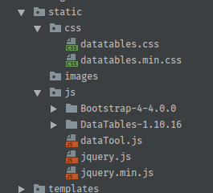
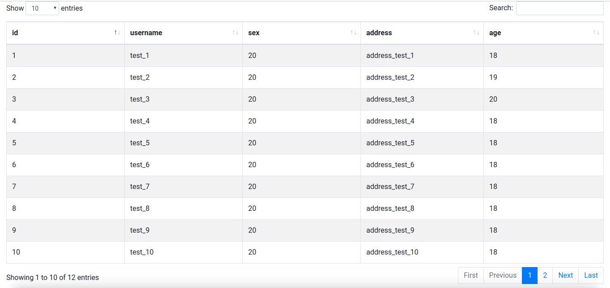

## Datatables - 基础配置

[Datatables](https://datatables.net/) 为是 [JQuery](https://jquery.com/) 的一款表格插件库，是一个高度灵活的工具，可以将任何 HTML 表格添加高级的交互功能。特别是后台开发者，对前端相关框架或知识并不是很熟悉，在做一些内部使用的工具时，总会涉及到页面展示的功能，[Buttons](http://www.bootcss.com/p/buttons/) 同样是一个高度可定制的、免费并且开源的按钮 CSS 样式库。类似插件对于后台开发者来说，简直是福音。本文主要介绍 [Datatables](https://datatables.net/) 的基本配置和使用。

### 下载

从 [Download](https://datatables.net/download/) 页面可下载需要使用的 JS 文件和其他的插件，可以根据需求选择不同的样式、包文件和扩展文件，如：

```
Step 1. Choose a styling framework
    Bootstrap 4
Step 2. Select packages
    jQuery 3
    Bootstrap 4
    DataTables
Extensions
    可选
Step 3. Pick a download method
    Minify
    Concatenate
    下载方式常用是CDN和本地文件方式（推荐）
```

然后我们下载打包好的文件到本地就可以了。

### 基本使用

将文件打包下载后，因为一般页面都是在 web 应用中使用，所以笔者创建了一个简单的 [Tornado](http://www.tornadoweb.org/en/stable/) 应用，将所有的静态文件放到了 `/static` 目录下：

 

**注意：** `jquery.js` 文件是必需的，目前使用 `3.0` 版本。

然后我们可以创建一个简单的 HTML 静态页面，引入基本的 `js`  文件：

```
<!DOCTYPE html>
<html lang="en">
<head>
    <meta charset="UTF-8">
    <title>Datatables</title>

    <link rel="stylesheet" type="text/css" href="static/js/Bootstrap-4-4.0.0/css/bootstrap.css"/>
    <link rel="stylesheet" type="text/css" href="static/js/DataTables-1.10.16/css/dataTables.bootstrap4.css"/>
    <link rel="stylesheet" type="text/css" href="static/css/datatables.min.css"/>

    <script src="static/js/jquery.js"></script>
    <script src="static/js/Bootstrap-4-4.0.0/js/bootstrap.js"></script>
    <script src="static/js/DataTables-1.10.16/js/jquery.dataTables.js"></script>
    <script src="static/js/DataTables-1.10.16/js/dataTables.bootstrap4.js"></script>
</head>
<body>
</body>
</html>
```

**注意：** 如果在调试过程中，出现表格显示错误，请检查 `css` 文件和 `js`  文件的引用顺序。

接下来创建一个 `div` 作为表格区域：

```
<div>
    <table id="test_dt" class="table table-striped table-bordered" cellspacing="0" style="width: 100%">
        <thead>
        <tr>
            <th>id</th>
            <th>username</th>
            <th>sex</th>
            <th>address</th>
            <th>age</th>
        </tr>
        </thead>
    </table>
</div>
```

`table` 中的 `class` 属性都是在 `css` 文件中定义好的，直接引用即可。

然后就是通过 `js` 为 `test_dt` 表格填充数据，数据源一般 [Data sources](https://datatables.net/examples/data_sources/) 这些，我们在 `web` 应用中使用最多的就是 [Ajax](https://datatables.net/examples/ajax/) 方式了，可以局部刷新页面。

本文数据源方式使用 [Ajax data source (objects)](https://datatables.net/examples/ajax/objects.html) 这种方式，`js` 代码如下：

```
function init_table(){
    $('#test_dt').DataTable({
        order: [[ 0, "desc"]],
        searching: true,
        stateSave: true,
        paging: true,
        pagingType: 'full_numbers',
        autoWidth: true,
        responsive: false,
        pageLength: 10,
        destroy: true,
        ajax: {
            'url': '/index',
            'dataSrc': handle_data_src,
            'type': 'POST',
            'async': false,
            'data': {}
        },
        columns:[
            {
                "data":"id",
                "width": "10%"
            },
            {
                "data":"username",
                "width": "10%"
            },
            {
                "data":"sex",
                "width": "10%"
            },
            {
                "data":"address",
                "width": "10%"
            },
            {
                "data":"age",
                "width": "10%"
            },
        ],
    });
}
```

通过 `POST` 方式获取表格数据，方便表格的刷新操作。其中 `dataSrc` 参数可以对请求的数据在显示到表格前做其他处理。

效果图基本如下：



### 配置参数

Datatables 支持参数配置方式以提供各种场景下对表格的需求，目前笔者主要使用的参数如下：

| 参数         | 含义                             | 可选值                                      |
| ---------- | ------------------------------ | ---------------------------------------- |
| order      | 表格在初始化的时候的排序                   | [order](https://datatables.net/reference/option/order) |
| searching  | 允许表格搜索                         | true false                               |
| stateSave  | 允许浏览器缓存 Datatables，以便下次恢复之前的状态 | true false                               |
| paging     | 允许表格分页                         | true false                               |
| pagingType | 分页按钮显示选项                       | [pagingType](http://www.datatables.club/reference/option/pagingType.html) |
| autoWidth  | 定义是否由控件自动控制列宽                  | true false                               |
| pageLength | 单页显示的数据条数                      | integer                                  |
| destroy    | 销毁已经存在的 Datatables 实例并替换新的选项   | true false                               |
| ajax       | 异步获取数据填充到表格显示                  | [ajax](http://www.datatables.club/reference/option/ajax.html) |
| columns    | 设定列的所有初始属性                     | [columns](http://www.datatables.club/reference/option/columns.html) |
| info       | 控制总数信息（标准界面右下角显示总数和过滤条数的控件）的显隐 | true false                               |

其他参数设置可参考 [Options](https://datatables.net/manual/options) 。

### Tips[持续更新]

**ajax.reload()**

场景：间隔一定时间进行局部刷新。

该场景下如果每次都初始化 datatables ，则会使表格在刷新时失去鼠标控制，用户体验较差。使用 `ajax.reload(callback, resetPaging)  ` 方式可以在重复初始化 `datatables` 下重新加载数据，如：

```
$('#test_dt').DataTable().ajax.reload(null, false);
```

当使用该方式时，如果 `ajax` 提交的请求 `data` 字段带的参数值需要动态更新的话，可以使用：

```
'data': function(d){
    d.test_name = test_name;
}
```

通过 `js` 函数动态更新参数值，这样在 `reload` 表格时，提交的参数就是动态获取的了。

**render**

场景：获取数据后，需要根据某列值对数据进行预处理。

我们可以在 `dataSrc` 中对数据进行处理，但是 `Datatables` 提供了另外一种更加方便的处理方式，即 [columns.render](https://datatables.net/reference/option/columns.render) 方法，如：

```
{
    "data":"address",
    render: function (data, type, row, meta) {
        var node = "<span ";
        if (data <= bw_warn) {
            node += "style='color:red;font-weight: bold;'"
        }
        node += ">" + data + "</span>"
        return node;
    },
    "width": "10%"
},
```

可以根据列值，对该列的显示添加其他的 `css` 属性。

**自定义排序**

Datatables 可以根据指定的列进行排序，但是实际场景中某列值可能较为复杂，而我们只需使用其中的一部分进行排序，例如：去掉前缀。Datatables 的扩展插件提供了很多较为强大的[自定义排序功能](https://datatables.net/plug-ins/sorting/)。

例如：去掉前缀字符 `prefix` ，将剩下字符作为整型排序，可以参考 [Anti-the](https://datatables.net/plug-ins/sorting/anti-the)。

首先新建一个名为 jquery.datatable.sort.plugin.js 文件，将以下 copy 到文件中。

```
jQuery.extend( jQuery.fn.dataTableExt.oSort, {
    "anti-prefix-pre": function ( a ) {
        var x = a.replace(/^prefix /i, "");
        return parseInt(x);
    },
 
    "anti-prefix-asc": function ( a, b ) {
        return ((a < b) ? -1 : ((a > b) ? 1 : 0));
    },
 
    "anti-prefix-desc": function ( a, b ) {
        return ((a < b) ? 1 : ((a > b) ? -1 : 0));
    }
} );
```

然后在页面中按照如下方式引用

```
<script type="text/javascript" src="/path/jquery.datatable.sort.plugin.js"></script>
```

最后在 Datatables 中加入

```
columnDefs: [
    { type: 'anti-prefix', targets: 0 }
]
```

其中：targets 表示列编号，从0开始。

Example：

```
$('#example').dataTable( {
    columnDefs: [
        { type: 'anti-the', targets: 0 }
    ]
} );
```


Read More:

> [Datatables](https://datatables.net/) 