# DDD 实践学习

## MVC(Model View Controller)

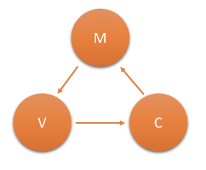

M(Model)：业务规则封装

V(View)：用户看到并与之交互的界面

C(Controller)：控制器。接受用户的输入并调用模型和视图去完成用户的需求，控制器本身不输出任何东西和做任何处理

### 痛点描述

- 移动端的发展使得视图展示与数据操作方式进一步剥离，大多数场景下已不再需要服务端渲染View
- Model层级的代码既维护着数据，也封装着业务逻辑，这一层功能逻辑会变得越来越臃肿不易维护
- Controller和Model的职责边界比较模糊，对于开发人员写好代码的要求会比较高，不适应工业化的软件生产

## 3-Tier Architecture

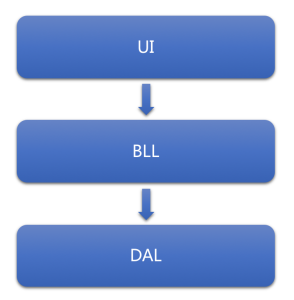

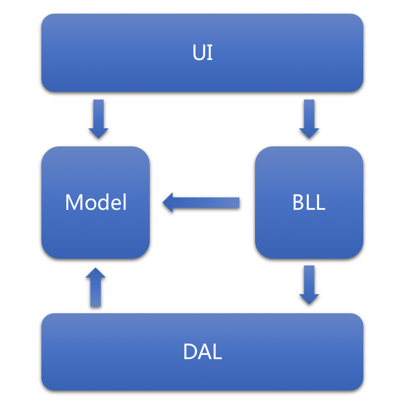

### UI：表示层

主要是B/S中的 WEB页面，也可以是API接口

### BLL：业务逻辑层

对具体问题进行逻辑判断与执行操作，对接收数据进行逻辑处理，实现数据的增删改查等功能

### DAL：数据访问层

实现数据的增删改查等操作，并将操作结果反馈到业务逻辑层BLL

### Model：模型定义层

主要用于数据库表的映射对象，实体类库主要服务于表示层、业务逻辑层以及数据访问层，在三层之间进行数据参数传输，强化数据表示的简约性。

### 与MVC的关系

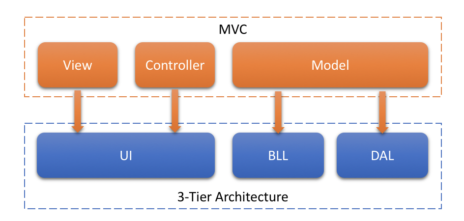

在三层架构设计中，UI表示层即相当于MVC的View和Controller层，原本在MVC中这两层的逻辑应当是比较"轻量"的，因此被合并为一层进行统一管理也可以理解。比较重要的一点是，原本MVC中的Model被拆分为了BLL和DAL，即将业务逻辑与数据访问进行分离，将原本臃肿的Model进行了进一步的解耦，有利于项目的更好维护

## 关注DDD

- 希望在项目设计开发之初，选用的架构模型就能帮助我们考虑到未来可能面临的更复杂的业务场景
- 希望能借鉴其他优秀的架构设计模式来提升工程代码的质量和开发效率
- 高内聚、低耦合

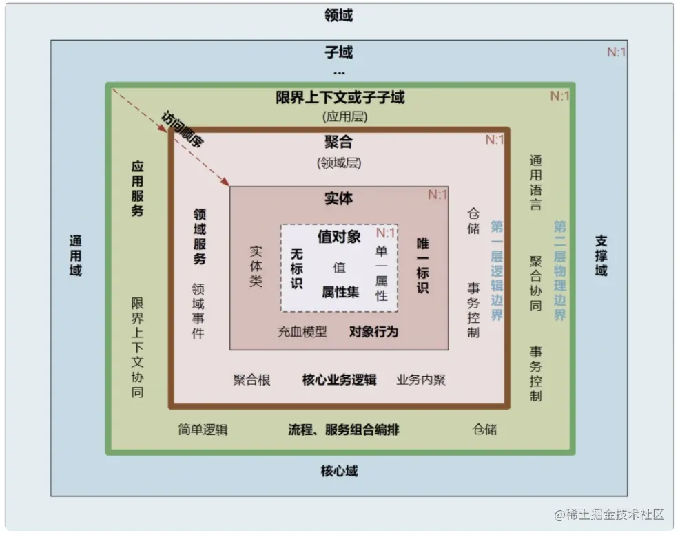

# DDD 的架构设计

## 分层架构(Layer Architecture) 2003

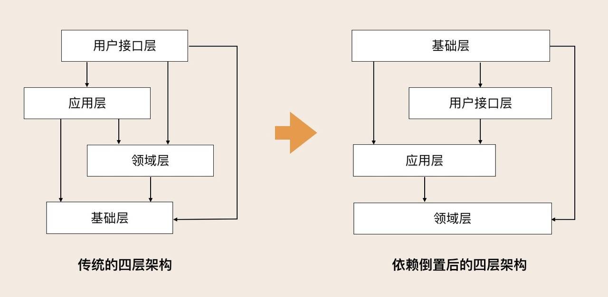

### 传统四层架构

- 基础层被其他层所依赖，基础层是核心

### 优化后四层架构

- 采用依赖倒置设计，领域层是核心
- 解耦其他各层对基础层的依赖

#### 用户接口层

负责向用户显示信息和解释用户指令。这里的用户可能是：用户、程序、自动化测试和批处理脚本等等

#### 应用层

用于实现服务编排和组合，适应业务流程快速变化的需求。这一层聚集了应用服务和事件相关的功能

- 进行服务编排、组合、转发等
- 负责处理业务用例的执行顺序以及结果的拼装
- 以粗粒度的服务通过 API 网关向前端发布
- 进行安全认证、权限校验、事务控制、发送或订阅领域事件等等

#### 领域层

实现核心业务逻辑，通过各种校验手段保证业务的正确性。领域层主要体现领域模型的业务能力，它用来表达业务概念、业务状态和业务规则。

- 聚合根
- 实体
- 值对象
- 领域服务
- ......

实体会采用充血模型来实现所有与之相关的业务功能，当领域中的某些功能，单一实体（或者值对象）不能实现时，就需要使用领域服务来组合聚合内的多个实体（或者值对象），实现复杂的业务逻辑。

#### 基础层

为其它各层提供通用的技术和基础服务，包括第三方工具、驱动、消息中间件、网关、文件、缓存以及数据库等

DDD 分层的一个重要原则：**每层只能与位于其下方的层发生耦合**

目前 DDD 分层架构就是优化后的四层架构

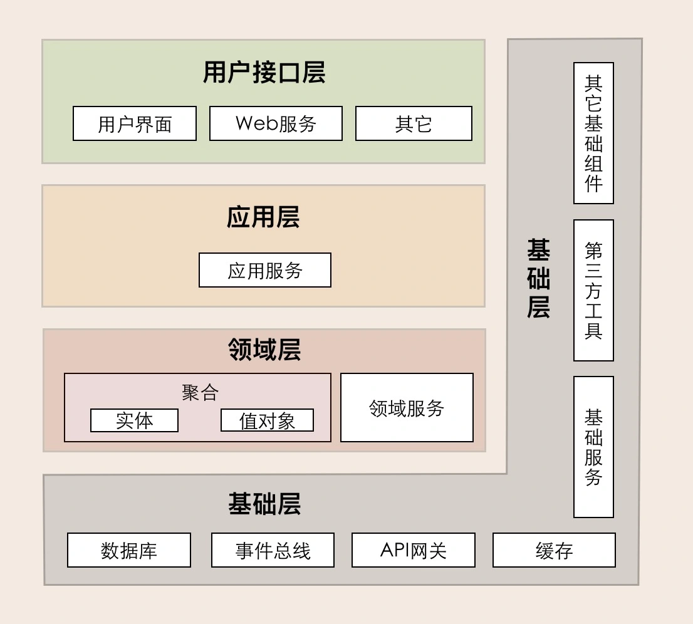

在传统的架构设计中，由于上层应用对数据库的强耦合，很多公司在架构演进中最担忧的可能就是换数据库了，因为一旦更换数据库，就可能需要重写大部分的代码，这对应用来说是致命的。那采用依赖倒置的设计以后，应用层就可以通过解耦来保持独立的核心业务逻辑。当数据库变更时，我们只需要更换数据库基础服务就可以了，这样就将资源变更对应用的影响降到了最低。

### 一些优势

- 层间松耦合，专注于本层的设计，而不必关心其它层，也不必担心自己的设计会影响其它层，降低了层与层之间的依赖
- 程序结构变得清晰，升级和维护更加容易
  - 修改某层代码时，只要本层的接口参数不变，其它层可以不必修改
  - 本层的接口发生变化，只影响相邻的上层，不会带来意外的风险

### 三层架构如何演进

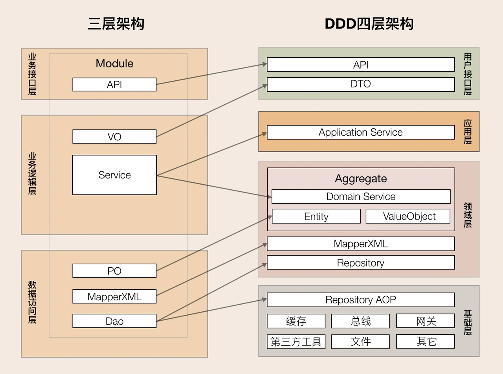

- 架构演进主要发生在业务逻辑层和数据访问层
- 用户接口层引入 DTO，对前端更加友好
- 将业务逻辑层的服务拆分到了应用层和领域层，改善了三层架构核心业务逻辑混乱，代码改动相互影响大的情况
- 数据访问层和基础层之间，数据库等基础资源的访问方式由 DAO 改成了仓储设计模式，通过依赖倒置实现各层对基础资源的解耦
  - 仓储接口：领域层中
  - 仓储实现：基础层。原来三层架构通用的第三方工具包、驱动、Common、Utility、Config 等通用的公共的资源类统一放到了基础层

### 示例

- [go-layered-architecture-sample](https://github.com/ryokky59/go-layered-architecture-sample)

```Shell
.
├── Dockerfile
├── README.md
├── api
│   └── main.go
├── config
│   └── database.go
├── docker-compose.yml
├── domain（领域层）
│   ├── model
│   │   └── task.go
│   └── repository
│       └── task.go
├── go.mod
├── go.sum
├── infra（基础层）
│   └── task.go
├── interface
│   └── handler
│       ├── router.go
│       └── task.go（应用层）
└── usecase（用户接口层）
    └── task.go
```

- [kendoDDD](https://github.com/KendoCross/kendoDDD)
- [ddd-framework](https://github.com/lml200701158/ddd-framework)

## 六边形架构(Hexagonal Architecture) 2005

也称为 **端口适配器架构(Ports and Adapters Architecture)**

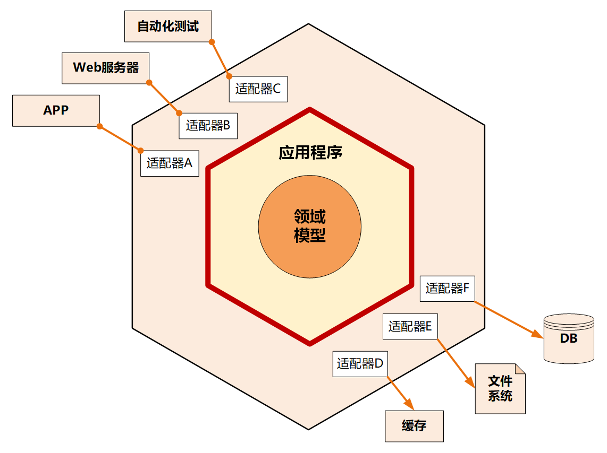

### **核心理念**

应用是通过端口与外部进行交互的.

- 端口：是对其消费者无感知的进入/离开应用的入口和出口。在许多编程语言里端口可以理解为接口
- 适配器：是将一个接口转换(适配)成另一个接口的类。

六边形架构由内六边形和外六边形组成，其职责如下：

- 内六边形
  - 实现应用的核心业务逻辑
- 外六边形
  - 完成外部应用、驱动和基础资源等的交互和访问
  - 对前端应用以 API 主动适配的方式提供服务，对基础资源以依赖倒置被动适配的方式实现资源访问。

### **优势**

- 解决了业务逻辑与用户界面的代码交错问题，很好地实现前后端分离
- 保持应用和实现细节（昙花一现的技术、工具和传达机制）之间的隔离，业务逻辑可重用
- 依赖关系由外向内进行依赖

### 示例

```Shell
.
├── Dockerfile
├── Jenkinsfile
├── Makefile
├── README.md
├── common // 通用类
│   ├── md5.go
│   ├── object_factory.go
│   ├── response.go
│   ├── resty_client.go
│   ├── serializer.go
│   ├── single_flight.go
│   ├── string_utility.go
│   ├── times.go
│   └── trace.go
├── config.yaml
├── go.mod
├── go.sum
├── main.go
├── app
│   ├── adapter
│   │   ├── in
│   │   │   └── gin
│   │   │       ├── controller
│   │   │       ├── middleware
│   │   │       └── router
│   │   └── out
│   │       ├── config
│   │       │   ├── mock_config_adapter.go
│   │       │   └── yaml_config_adpater.go
│   │       ├── local_cache
│   │       │   └── big_cache_adpater.go
│   ├── application
│   │   ├── port
│   │   │   ├── in
│   │   │   │   ├── my_test_use_case.go
│   │   │   └── out
│   │   │       ├── config_port.go
│   │   │       ├── local_cache_port.go
│   │   └── service
│   │       └── my_test_service.go
│   └── domain
│       ├── my_test.go
└── zap_log.yaml
```

## 洋葱架构(Onion Architecture) 2008

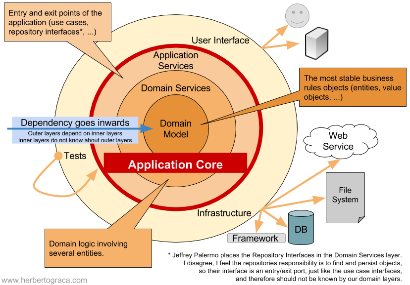

六边形架构只是提到了两个同心圆层次：

- 代表传达机制和基础设施的外层
- 代表业务逻辑的内层

洋葱架构与六边形架构都通过编写**适配器代码**将应用核心从对基础设施的关注中解放出来，避免基础设施代码渗透到应用核心之中。

### 优势

- 企业应用中存在着不止两个层次，它在业务逻辑中加入了一些在领域驱动设计的过程中被识别出来的层次
  - 在应用程序和领域模型中间增加了领域服务层
    - 比如创建模型的时候有业务逻辑。虽然创建模型通常是放在工厂中实现，但工厂里面并不适合放业务逻辑。而这个时候领域模型还没有创建，所以就可以放在领域服务里面
- 明确了六边形架构中关于依赖的方向
  - 外层依赖内层
  - 内层对外层无感知
- 任何一个外部层次都可以直接调用任何一个内部层次，这样既不会破坏耦合的方向，也避免了仅仅为了追求分层模式而创建一些没有任何业务逻辑的代理方法甚至代理类

### 示例

- [java-oniondemo](https://github.com/Liyndon/java-oniondemo)

```Shell
oniondemo-adapter
|- config      // 配置类
|- consumer    // 队列消费入口
|-- event      // 消费到事件的结构定义
|- controller  // 接口
|-- param      // 接口参数接口定义
oniondemo-app
|- builder     // 返回结果构造器
oniondemo-common
|- dto         // 应用服务、领域服务的入参定义
|- exception   // 异常定义
|- vo          // 应用服务、领域服务的返回值定义
oniondemo-domain
|- entity      // 领域模型（聚合根、实体、值对象）、防腐层模型、读模型
|- event       // 领域事件
|- interfaces  // 对基础实施以来的接口约定
|- repository  // 对领域模型持久化的接口约定
|- service     // 领域服务（与应用服务的区别是领域服务具有不变性，如果识别不了可以都写到应用服务中）
oniondemo-infrastructure
|- feign       // 对外的HTTP请求
|-- input      // Feign的入参结构定义
|-- output     // Feign的返回结构定义
|- mybatis     // 对Mysql的访问
|-- mapper     // mybatis的访问接口
|-- po         // 存储模型结构定义
|- persistence // 领域模型持久化的实现，实现了领域模型到存储模型的转换与落库
|- publisher   // 对事件发布的实现
|- service     // 对应用层、领域层的定义接口的实现
```

- [onion-architecture](https://github.com/splaw88/onion-architecture)

## 整洁架构(Clean Architecture) 2012

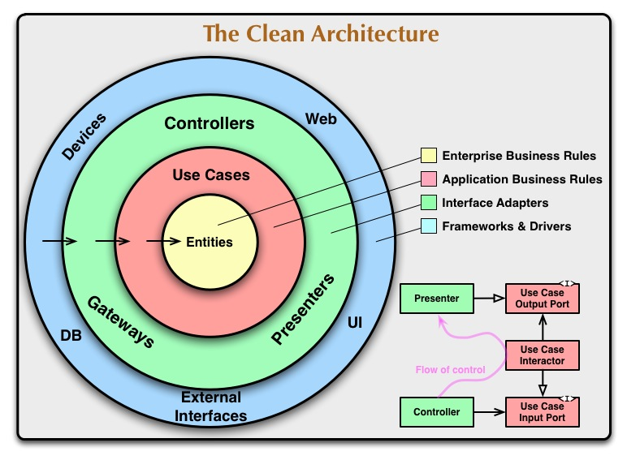

和六边形架构、洋葱架构的目标一致性：

- 工具无关
- 传达机制无关
- 独立的可测试性

### 核心概念

#### **Entities**

存放实体、值对象、聚合等领域模型的。业务逻辑都应该尽量内聚在这一层，这一层是最纯净的，不需要依赖任何其它东西。

#### **Use Cases**

用例层。用于协调进出Entities层的数据流，通过调用和编排领域模型来实现用例。

类似于洋葱架构中的Application Service层，是很薄的一层，只用来做一些比较简单的事情。

#### **Interface Adapters**

接口适配层，主要用来与外部进行适配的。

类似于洋葱架构的最外层。比如Web请求进来的Controllers（写）和Presenters（读）。这一层会将User Cases或Entities层需要的数据结构与外层的数据结构做一个转换。比如操作数据库、调用第三方接口等。

#### **Frameworks and Drivers**

这一层主要是框架和驱动层，比如数据库驱动、WEB框架、UI等，日常编码中很少会在这一层编写代码。

**和洋葱架构没啥区别？？？**

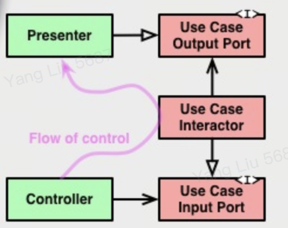

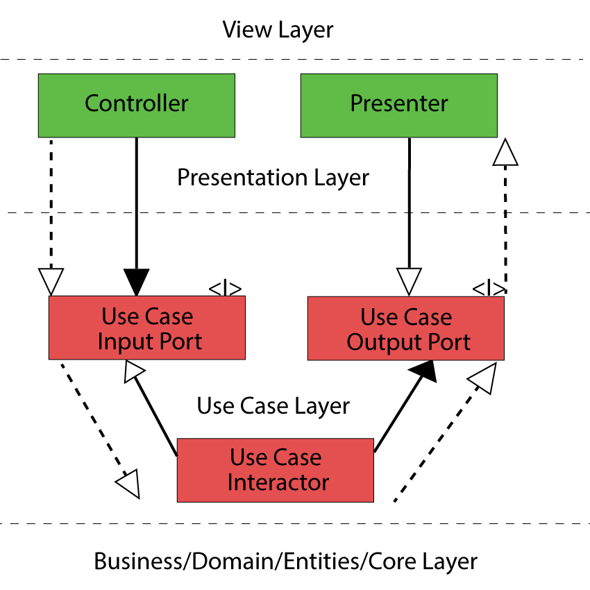

**跨越边界和依赖反转**

在Use Cases层定义两种抽象类或者接口：Use Case Input Port， 或者Use Case Output Port。Use Case Interactor去实现了Use Case Input Port，而Presenter去实现了Use Case Output Port。

这样Use Cases层就不用依赖外部的层了。同样的道理，也可用于对数据库、第三方接口等的交互场景。

### 示例

- [golang-clean-architecture](https://github.com/manakuro/golang-clean-architecture/tree/main)

```Shell
├── Makefile
├── README.md
├── bin
│   └── init_db.sh
├── cmd
│   ├── app
│   │   └── main.go
│   └── seed
│       └── main.go
├── db
│   └── migrations
│       └── 20190802195721_createUsers.sql
├── docker
│   ├── docker-compose.yml
│   └── mysql_data
│       └── sql
│           └── reset_database.sql
├── go.mod
├── go.sum
└── pkg
    ├── adapter（对应Interface Adapters层）
    │   ├── controller
    │   │   ├── app.go
    │   │   ├── context.go
    │   │   └── user.go
    │   └── repository
    │       ├── db.go
    │       └── user.go
    ├── config
    │   ├── config.go
    │   └── config.yml
    ├── domain（对应Entities层）
    │   └── model
    │       └── user.go
    ├── infrastructure（对应FrameWorks & Divers层）
    │   ├── datastore
    │   │   └── db.go
    │   └── router
    │       └── router.go
    ├── registry
    │   ├── registry.go
    │   └── user.go
    └── usecase（对应Use Cases层）
        ├── repository
        │   ├── db.go
        │   └── user.go
        └── usecase
            └── user.go
```

## 清晰架构(Explicit Architecture) 2017

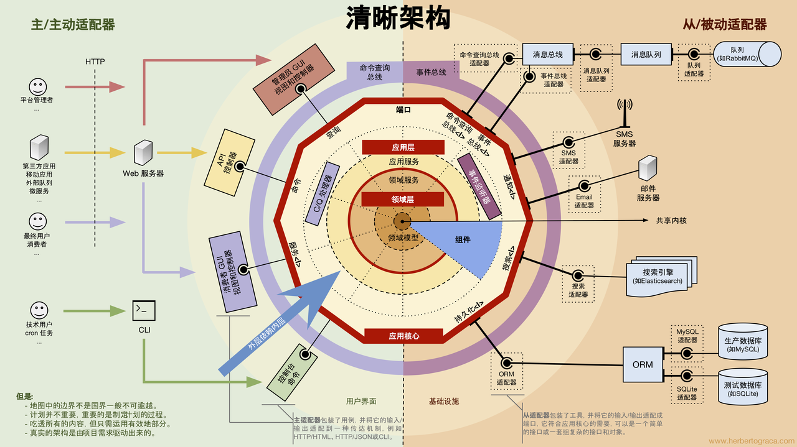

将六边形、洋葱、整洁架构等融合到一起的清晰架构

自行学习 [13.整洁架构(译)](https://www.jianshu.com/p/b565f0c00c0c)

# 附录

## **强烈推荐**

[DDD 实战课](https://zq99299.github.io/note-book2/ddd/)

[The Clean Code Blog](https://blog.cleancoder.com/uncle-bob/2012/08/13/the-clean-architecture.html)

[DDD, Hexagonal, Onion, Clean, CQRS, … How I put it all together](https://herbertograca.com/2017/11/16/explicit-architecture-01-ddd-hexagonal-onion-clean-cqrs-how-i-put-it-all-together/)

[领域驱动设计](https://tonydeng.github.io/EA-practices/app-arch/domain-driven-design.html)

[领域驱动设计：从理论到实践](https://juejin.cn/post/7034480747683512357)

[DDD之代码架构](https://concurrent.redspider.group/articles/112)

[11.端口和适配器架构(译)](https://www.jianshu.com/p/f39f4537857e)

[12.洋葱架构(译)](https://www.jianshu.com/p/d87d5389c92a)

[13.整洁架构(译)](https://www.jianshu.com/p/b565f0c00c0c)

[清晰架构: 融合 DDD、洋葱架构、整洁架构、CQRS..](https://www.jianshu.com/p/4cf50cf3e127)

## **其他推荐**

[领域驱动设计在互联网业务开发中的实践](https://tech.meituan.com/2017/12/22/ddd-in-practice.html)

[the-onion-architecture-part-1](https://jeffreypalermo.com/2008/07/the-onion-architecture-part-1/)

[the-onion-architecture-part-2](https://jeffreypalermo.com/2008/07/the-onion-architecture-part-2/)

[the-onion-architecture-part-3](https://jeffreypalermo.com/2008/08/the-onion-architecture-part-3/)

[the-onion-architecture-part-4](https://jeffreypalermo.com/2013/08/onion-architecture-part-4-after-four-years/)

[go-frame](https://goframe.org/pages/viewpage.action?pageId=3672399)