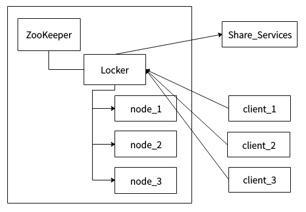
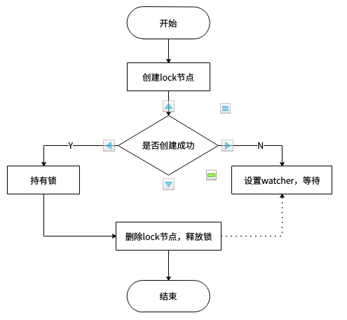

## 分布式锁

### 前言

进入正题之前，先来说说问题的产生背景。目前绝大多数的业务都跑在高并发的情境下，而数据库（大多数是mysql）数据一致性的问题是不可避免的，笔者同样遇到了这种问题：

> 高并发情境下数据库的数据重复写入问题

数据的重复写入实际上就是对共享资源的竞争操作，导致数据出现不一致，给线上业务带来影响。解决这种问题，最直接的思路是在数据库层面寻求解决方案，借助数据库的锁机制，或者在业务上通过数据库语句的限制避免重复数据，如：

- insert ignore into 语句；
- on duplicate key update 语句；
- insert … select … where not exist 语句；
- replace into 语句。

以上语句在简单业务中避免mysql插入重复数据是有一定效果的，但是在复杂场景下并不能满足需求。因为高并发业务除了要求数据一致性外，对性能、稳定性的要求也较高，单纯使用数据库语句很难达到预期效果，因此，从单机锁发展而来的分布式锁提供了一种新的解决方案。

### SQL语句解决方案

insert ignore into

```
INSERT [LOW_PRIORITY | HIGH_PRIORITY] [IGNORE]
    [INTO] tbl_name
    [PARTITION (partition_name [, partition_name] ...)]
    [(col_name [, col_name] ...)]
    SELECT ...
    [ON DUPLICATE KEY UPDATE assignment_list]

value:
    {expr | DEFAULT}

assignment:
    col_name = value

assignment_list:
    assignment [, assignment] ...
```

> Specify **IGNORE** to ignore rows that would cause duplicate-key violations. 

通过mysql给出的官方解释：IGNORE 关键字会忽略重复键的行。当插入数据时，如出现错误（重复数据），将不返回错误，只以警告形式返回。所以使用 IGNORE 请确保语句本身没有问题，否则语句的其他错误也会被忽略掉。如果使用 IGNORE 关键字，则插入的字段必须是主键或唯一索引。

```
mysql> show tables;
+----------------------------+
| Tables_in_openlivedb       |
+----------------------------+
| admin                      |
| auth_group                 |
| auth_group_permissions     |
| auth_permission            |
| auth_user                  |
| auth_user_groups           |
| auth_user_user_permissions |
| cmd_template               |
| cutter_node                |
| django_admin_log           |
| django_content_type        |
| django_migrations          |
| django_session             |
| flv_slice                  |
| mp4_slice                  |
| test_table                 |
| ts_slice                   |
+----------------------------+
17 rows in set (0.00 sec)

mysql> select * from admin;
+----+-------------------+----------------------------------+
| id | username          | password                         |
+----+-------------------+----------------------------------+
|  1 | liuxiaoyang       | 96e79218965eb72c92a549dd5a330112 |
|  4 | liuxiaoyang_test2 |                                  |
+----+-------------------+----------------------------------+
2 rows in set (0.00 sec)

mysql> INSERT IGNORE INTO admin (username) VALUES ('liuxiaoyang_test2');
Query OK, 0 rows affected, 2 warnings (0.09 sec)

mysql> select * from admin;
+----+-------------------+----------------------------------+
| id | username          | password                         |
+----+-------------------+----------------------------------+
|  1 | liuxiaoyang       | 96e79218965eb72c92a549dd5a330112 |
|  4 | liuxiaoyang_test2 |                                  |
+----+-------------------+----------------------------------+
2 rows in set (0.00 sec)

mysql> INSERT IGNORE INTO admin (username) VALUES ('liuxiaoyang_test3');
Query OK, 1 row affected, 1 warning (0.11 sec)
```

以上操作可以看出，插入重复数据时，显示 `Query OK, 0 rows affected, 2 warnings (0.09 sec)` 表明出现了警告，当在业务中直接执行时：

```
am = AdminManager()
r = am.execute("select * from admin")
for i in r:
    print(i.username)
r2 = am.execute("INSERT IGNORE INTO admin (username, password) VALUES ('liuxiaoyang_test2', '123')")
```

结果如下：

```
liuxiaoyang
liuxiaoyang_test2
/usr/local/lib/python3.5/dist-packages/pymysql/cursors.py:165: Warning: (1062, "Duplicate entry 'liuxiaoyang_test2' for key 'username_unique'")
  result = self._query(query)
```

同样返回了警告信息。

on duplicate key update

> If you specify an **ON DUPLICATE KEY UPDATE** clause and a row to be inserted would cause a duplicate value in a UNIQUE index or PRIMARY KEY, an UPDATE of the old row occurs.

当遇到重复键时，对旧行执行 UPDATE 语句，否则插入新行。 

```
mysql> select * from admin;
+----+-------------------+----------------------------------+
| id | username          | password                         |
+----+-------------------+----------------------------------+
|  1 | liuxiaoyang       | 96e79218965eb72c92a549dd5a330112 |
|  4 | liuxiaoyang_test2 | 123                              |
+----+-------------------+----------------------------------+
2 rows in set (0.02 sec)

mysql> INSERT IGNORE INTO admin (username) VALUES ('liuxiaoyang_test2') ON DUPLICATE KEY UPDATE password='345';
Query OK, 2 rows affected, 1 warning (0.09 sec)

mysql> select * from admin;
+----+-------------------+----------------------------------+
| id | username          | password                         |
+----+-------------------+----------------------------------+
|  1 | liuxiaoyang       | 96e79218965eb72c92a549dd5a330112 |
|  4 | liuxiaoyang_test2 | 345                              |
+----+-------------------+----------------------------------+
2 rows in set (0.00 sec)
```

对于on duplicate key update语句，必需主键或唯一索引。

insert … select … where not exist

该方法利用了子查询，写法比较繁琐，性能较差，不推荐使用。

replace into 

```
REPLACE [LOW_PRIORITY | DELAYED]
    [INTO] tbl_name
    [PARTITION (partition_name [, partition_name] ...)]
    [(col_name [, col_name] ...)]
    {VALUES | VALUE} (value_list) [, (value_list)] ...

value:
    {expr | DEFAULT}

value_list:
    value [, value] ...

assignment:
    col_name = value

assignment_list:
    assignment [, assignment] ...
```

> REPLACE works exactly like INSERT, except that if an old row in the table has the same value as a new row for a PRIMARY KEY or a UNIQUE index, the old row is deleted before the new row is inserted. 

replace into 语句与insert语句类似，只不过它在插入时，如果存在主键或唯一键相同的记录，则会先删除，然后再插入新记录。

```
mysql> select * from admin;
+----+-------------------+----------------------------------+
| id | username          | password                         |
+----+-------------------+----------------------------------+
|  1 | liuxiaoyang       | 96e79218965eb72c92a549dd5a330112 |
|  5 | liuxiaoyang_test2 | 789                              |
+----+-------------------+----------------------------------+
2 rows in set (0.00 sec)

mysql> replace into admin(username, password) values('liuxiaoyang_test2', '1111');
Query OK, 2 rows affected (0.10 sec)

mysql> select * from admin;
+----+-------------------+----------------------------------+
| id | username          | password                         |
+----+-------------------+----------------------------------+
|  1 | liuxiaoyang       | 96e79218965eb72c92a549dd5a330112 |
|  6 | liuxiaoyang_test2 | 1111                             |
+----+-------------------+----------------------------------+
2 rows in set (0.00 sec)
```

> MySQL uses the following algorithm for REPLACE:
>
> 1. try to insert the new row into the table        
> 2. While the insertion fails because a duplicate-key error occurs for a primary key or unique index:
>    - Delete from the table the conflicting row that has the duplicate key value;
>    - try again to insert the new row into the table.

以上方法也会有些限制，如目前大多数业务的删除只是逻辑删除，并不做物理删除，在这种场景下就需要寻找其他方案。除了以上方法，mysql还提供了共享锁、排他锁等机制，mysql的锁机制会单独进行介绍，在此就不赘述。

### 分布式锁解决方案

#### 何为锁

在单进程的系统中，当存在多个线程可以同时改变某个变量（可变共享变量）时，就需要对变量或代码块做同步，使其在修改这种变量时能够线性执行消除并发修改变量；

而同步的本质是通过锁来实现的。为了实现多个线程在一个时刻同一个代码块只能有一个线程可执行，那么需要在某个地方做个标记，这个标记必须每个线程都能看到，当标记不存在时可以设置该标记，其余后续线程发现已经有标记了则等待拥有标记的线程结束同步代码块取消标记后再去尝试设置标记。这个标记可以理解为锁，不同地方实现锁的方式也不一样，只要能满足所有线程都能看得到标记即可；

除了利用内存数据做锁，其实任何互斥的都能做锁（只考虑互斥情况），如流水表中流水号与时间结合做幂等校验可以看作是一个不会释放的锁，或者使用某个文件是否存在作为锁等。只需要满足在对标记进行修改能保证原子性和内存可见性即可。

#### 什么是分布式

分布式的 CAP 理论告诉我们：

> 任何一个分布式系统都无法同时满足一致性（Consistency）、可用性（Availability）和分区容错性（Partition tolerance），最多只能同时满足两项。

目前很多大型网站及应用都是分布式部署的，分布式场景中的数据一致性问题一直是一个比较重要的话题。基于 CAP理论，很多系统在设计之初就要对这三者做出取舍。在互联网领域的绝大多数的场景中，都需要牺牲强一致性来换取系统的高可用性，系统往往只需要保证最终一致性。

分布式场景

> 此处主要指集群模式下，多个相同服务同时运行

在许多的场景中，我们为了保证数据的最终一致性，需要很多的技术方案来支持，比如**分布式事务**、**分布式锁**等。很多时候我们需要保证一个方法在同一时间内只能被同一个线程执行。在单机环境中，通过线程安全队列或者其他方式解决，但是在分布式环境下，这并不是一件容易的事儿。

- 分布式与单机情况下最大的不同在于其不是多线程而是**多进程**；
- 多线程由于可以共享堆内存，因此可以简单的采取内存作为标记存储位置。而进程之间甚至可能都不在同一台物理机上，因此需要将标记存储在一个所有进程都能看到的地方。

分布式锁

- 当在分布式模型下，数据只有一份（或有限制），此时需要利用锁的技术控制某一时刻修改数据的进程数；
- 与单机模式下的锁不仅需要保证进程可见，还需要考虑进程与锁之间的网络问题；
- 分布式锁还是可以将标记存在内存，只是该内存不是某个进程分配的内存而是公共内存如 Redis、Memcache。至于利用数据库、文件等做锁与单机的实现是一样的，只要保证标记能互斥就行。

#### 我们需要怎样的分布式锁

- 在分布式系统环境下，一个方法在同一时间只能被一个机器的一个线程执行； 
- 高可用的获取锁与释放锁； 
- 高性能的获取锁与释放锁； 
- 具备可重入特性； 
- 具备锁失效机制，防止死锁； 
- 具备非阻塞锁特性，即没有获取到锁将直接返回获取锁失败。

#### 分布式锁-基于数据库

乐观锁 - 基于表主键唯一做分布式锁

利用主键唯一的特性，如果有多个请求同时提交到数据库的话，数据库会保证只有一个操作可以成功，那么我们就可以认为操作成功的那个线程获得了该方法的锁，当方法执行完毕之后，想要释放锁的话，删除这条数据库记录即可。

这种简单的实现有以下几个问题：

- 这把锁强依赖数据库的可用性，数据库是一个单点，一旦数据库挂掉，会导致业务系统不可用；
- 这把锁没有失效时间，一旦解锁操作失败，就会导致锁记录一直在数据库中，其他线程无法再获得到锁；
- 这把锁只能是非阻塞的，因为数据的 insert 操作，一旦插入失败就会直接报错。没有获得锁的线程并不会进入排队队列，要想再次获得锁就要再次触发获得锁操作；
- 这把锁是非重入的，同一个线程在没有释放锁之前无法再次获得该锁。因为数据中数据已经存在了；
- 这把锁是非公平锁，所有等待锁的线程凭运气去争夺锁；
- 在 mysql 数据库中采用主键冲突防重，在大并发情况下有可能会造成锁表现象。

当然，我们也可以有其他方式解决上面的问题。

- 数据库是单点？搞两个数据库，数据之前双向同步，一旦挂掉快速切换到备库上；
- 没有失效时间？只要做一个定时任务，每隔一定时间把数据库中的超时数据清理一遍；
- 非阻塞的？搞一个 while 循环，直到 insert 成功再返回成功；
- 非重入的？在数据库表中加个字段，记录当前获得锁的机器的主机信息和线程信息，那么下次再获取锁的时候先查询数据库，如果当前机器的主机信息和线程信息在数据库可以查到的话，直接把锁分配给他就可以了；
- 非公平的？再建一张中间表，将等待锁的线程全记录下来，并根据创建时间排序，只有最先创建的允许获取锁；
- 比较好的办法是在程序中生产主键进行防重。

乐观锁 - 基于表字段版本号做分布式锁

这个策略源于 mysql 的 mvcc 机制，使用这个策略其实本身没有什么问题，唯一的问题就是对数据表侵入较大，我们要为每个表设计一个版本号字段，然后写一条判断 sql 每次进行判断，增加了数据库操作的次数，在高并发的要求下，对数据库连接的开销也是无法忍受的。

悲观锁 - 基于数据库排他锁做分布式锁

在查询语句后面增加 `for update`，数据库会在查询过程中给数据库表增加排他锁 （注意： InnoDB 引擎在加锁的时候，只有通过索引进行检索的时候才会使用行级锁，否则会使用表级锁。这里我们希望使用行级锁，就要给要执行的方法字段名添加索引，值得注意的是，这个索引一定要创建成唯一索引，否则会出现多个重载方法之间无法同时被访问的问题。重载方法的话建议把参数类型也加上）。当某条记录被加上排他锁之后，其他线程无法再在该行记录上增加排他锁。

我们可以认为获得排他锁的线程即可获得分布式锁，当获取到锁之后，可以执行方法的业务逻辑，执行完方法之后，通过 `connection.commit()` 操作来释放锁。

这种方法可以有效的解决上面提到的无法释放锁和阻塞锁的问题。

- 阻塞锁？ `for update`语句会在执行成功后立即返回，在执行失败时一直处于阻塞状态，直到成功；
- 锁定之后服务宕机，无法释放？使用这种方式，服务宕机之后数据库会自己把锁释放掉。

但是还是无法直接解决数据库单点和可重入问题。虽然我们对方法字段名使用了唯一索引，并且显示使用 `for update `来使用行级锁。但是，MySQL 会对查询进行优化，即便在条件中使用了索引字段，但是否使用索引来检索数据是由 MySQL 通过判断不同执行计划的代价来决定的，如果 MySQL 认为全表扫效率更高，比如对一些很小的表，它就不会使用索引，这种情况下 InnoDB 将使用表锁，而不是行锁。

还有一个问题，就是我们要使用排他锁来进行分布式锁的 lock，那么一个排他锁长时间不提交，就会占用数据库连接。一旦类似的连接变得多了，就可能把数据库连接池撑爆。

#### 分布式锁-基于Redis

Redis分布式锁主要使用其SETNX()、EXPIRE() 方法实现。

> SETNX key value : 将 `key` 的值设为 `value` ，当且仅当 `key` 不存在。若给定的 `key` 已经存在，则 ＳETNX 不做任何动作。SETNX 是『SET if Not eXists』(如果不存在，则 SET)的简写。
>
> EXPIRE key seconds : 为给定 `key` 设置生存时间，当 `key` 过期时(生存时间为 `0` )，它会被自动删除。

但是从 Redis 2.6.12 版本开始， SET 命令的行为可以通过一系列参数来修改：

- `EX second` ：设置键的过期时间为 `second` 秒。 `SET key value EX second` 效果等同于 `SETEX key second value` 。
- `PX millisecond` ：设置键的过期时间为 `millisecond` 毫秒。 `SET key value PX millisecond` 效果等同于 `PSETEX key millisecondvalue` 。
- `NX` ：只在键不存在时，才对键进行设置操作。 `SET key value NX` 效果等同于 `SETNX key value` 。
- `XX` ：只在键已经存在时，才对键进行设置操作。

所以SETNX()、EXPIRE() 方法被融合进了SET方法，而[官网](http://redisdoc.com/string/set.html) 给出

> 因为 [SET](http://redisdoc.com/string/set.html#set) 命令可以通过参数来实现和 [SETNX](http://redisdoc.com/string/setnx.html#setnx) 、 [SETEX](http://redisdoc.com/string/setex.html#setex) 和 [PSETEX](http://redisdoc.com/string/psetex.html#psetex) 三个命令的效果，所以将来的 Redis 版本可能会废弃并最终移除[SETNX](http://redisdoc.com/string/setnx.html#setnx) 、 [SETEX](http://redisdoc.com/string/setex.html#setex) 和 [PSETEX](http://redisdoc.com/string/psetex.html#psetex) 这三个命令。

在使用Redis实现分布式锁时，我们可以通过SET来实现。

设计思路

> 获取锁：
>
> - 调用 set 尝试获取锁，如果设置成功，表示获取到了锁；
> - 设置失败，
>   - 等待一定时间后，再次尝试获取锁；
>   - 若已达到最大获取锁时间未获取到锁，获取锁失败。
>
> 释放锁：
>
> - 确保每个客户端释放的是自己的锁；
> - 确保释放锁操作的原子性。

```
import time
import traceback

from contextlib import contextmanager
from lib.utils import get_logger
from tornado import gen

DEFAULT_EXPIRES = 3
ACQUIRE_TIMEOUT = 1

lock_logger = get_logger("redis_netlock")

@contextmanager
def dist_lock(key, client, unique_id acquire_timeout=ACQUIRE_TIMEOUT):
    key = 'lock_%s' % key
    try:
        t = _acquire_lock(key, client, unique_id, acquire_timeout)
        yield t
    finally:
        _release_lock(key, client, t)


def _acquire_lock(key, client, unique_id, acquire_timeout):
    end = time.time() + acquire_timeout
    while time.time() < end:
        if client.set(key, unique_id, ex=DEFAULT_EXPIRES, nx=True):
            return unique_id
        else:
            gen.sleep(.01)
    return None


def _release_lock(key, client, t):
    try:
        lua_command = """
            if redis.call("get",KEYS[1]) == ARGV[1]
            then
                return redis.call("del",KEYS[1])
            else
                return 0
            end
        """
        lua_script = client.register_script(lua_command)
        lock_logger.debug(lua_script(keys=[key], args=[t]))
    except Exception as e:
        lock_logger.error(traceback.format_exc())
```

unique_id：uuid1() 提供的全球唯一值，保证每个客户端释放的是自己的锁。

使用lua脚本释放锁是为了保证释放锁操作的原子性：

> **Atomicity of scripts**
>
> Redis uses the same Lua interpreter to run all the commands. Also Redis guarantees that a script is executed in an atomic way: no other script or Redis command will be executed while a script is being executed. This semantic is similar to the one of MULTI / EXEC. From the point of view of all the other clients the effects of a script are either still not visible or already completed.
>
> However this also means that executing slow scripts is not a good idea. It is not hard to create fast scripts, as the script overhead is very low, but if you are going to use slow scripts you should be aware that while the script is running no other client can execute commands.

获取锁时，给定超时时间是１s，避免出现死锁现象。

使用redis分布式锁的问题是，失效时间的设置。如果设置的失效时间太短，方法没等执行完，锁就自动释放了，那么就会产生并发问题。

#### 分布式锁-基于RedLock

Redlock 是 Redis 的作者 antirez 给出的集群模式的 Redis 分布式锁，它基于 N 个完全独立的 Redis 节点（通常情况下 N 可以设置成 5）。

算法的步骤如下：

1. 客户端获取当前时间，以毫秒为单位；
2. 客户端尝试获取 N 个节点的锁，（每个节点获取锁的方式和前面说的缓存锁一样），N 个节点以相同的 key 和 value 获取锁。客户端需要设置接口访问超时，接口超时时间需要远远小于锁超时时间，比如锁自动释放的时间是 10s，那么接口超时大概设置 5-50ms。这样可以在有 redis 节点宕机后，访问该节点时能尽快超时，而减小锁的正常使用；
3. 客户端计算在获得锁的时候花费了多少时间，方法是用当前时间减去在步骤一获取的时间，只有客户端获得了超过 3 个节点的锁，而且获取锁的时间小于锁的超时时间，客户端才获得了分布式锁；
4. 客户端获取的锁的时间为设置的锁超时时间减去步骤三计算出的获取锁花费时间；
5. 如果客户端获取锁失败了，客户端会依次删除所有的锁。

使用 Redlock 算法，可以保证在挂掉最多 2 个节点的时候，分布式锁服务仍然能工作，这相比之前的数据库锁和缓存锁大大提高了可用性，由于 redis 的高效性能，分布式缓存锁性能并不比数据库锁差。

#### 分布式锁-基于Zookeeper

ZooKeeper的架构通过冗余服务实现高可用性。因此，如果第一次无应答，客户端就可以询问另一台ZooKeeper主机。ZooKeeper节点将它们的数据存储于一个分层的命名空间，非常类似于一个文件系统或一个前缀树结构。客户端可以在节点读写，从而以这种方式拥有一个共享的配置服务，更新是全序的。

 

上图为系统架构，左边区域表示一个ZooKeeper集群，locker是ZooKeeper的一个持久节点，node\_1、node\_2、node\_3是locker这个持久节点下面的临时顺序节点。client\_1、client\_2、client\_3表示多个客户端，Share\_Service表示需要互斥访问的共享资源。

Zookeeper实现分布式锁的思路：

1. 多个客户端竞争创建 lock 临时节点；
2. 其中某个客户端成功创建 lock 节点，其他客户端对 lock 节点设置 watcher；
3. 持有锁的客户端删除 lock 节点或该客户端崩溃，由 Zookeeper 删除 lock 节点；
4. 其他客户端获得 lock 节点被删除的通知；
5. 重复上述4个步骤，直至无客户端在等待获取锁了。

 

Zookeeper方式性能上可能并没有缓存服务那么高，因为每次在创建锁和释放锁的过程中，都要动态创建、销毁临时节点来实现锁功能。ZK 中创建和删除节点只能通过 Leader 服务器来执行，然后将数据同步到所有的 Follower 机器上。

由于目前理解有限，一些细节需要进一步确定和实践，不当之处请指正。


Read More:

> [分布式锁的几种实现方式](https://www.cnblogs.com/austinspark-jessylu/p/8043726.html) [Redis分布式锁的正确实现方式（Java版）](http://www.importnew.com/27477.html) 
>
> [基于Redis的分布式锁到底安全吗（上）？](https://mp.weixin.qq.com/s/JTsJCDuasgIJ0j95K8Ay8w) 
>
> [分布式锁看这篇就够了](http://www.54tianzhisheng.cn/2018/04/24/Distributed_lock/#%E5%9F%BA%E4%BA%8E-Redlock-%E5%81%9A%E5%88%86%E5%B8%83%E5%BC%8F%E9%94%81) 
>
> [基于 Zookeeper 的分布式锁实现](https://segmentfault.com/a/1190000010895869) 
>
> [Redis命令参考](http://redisdoc.com/) [Redis Lua scripting](https://redis.io/commands/eval) 
>
> [mysql document](https://dev.mysql.com/doc/)