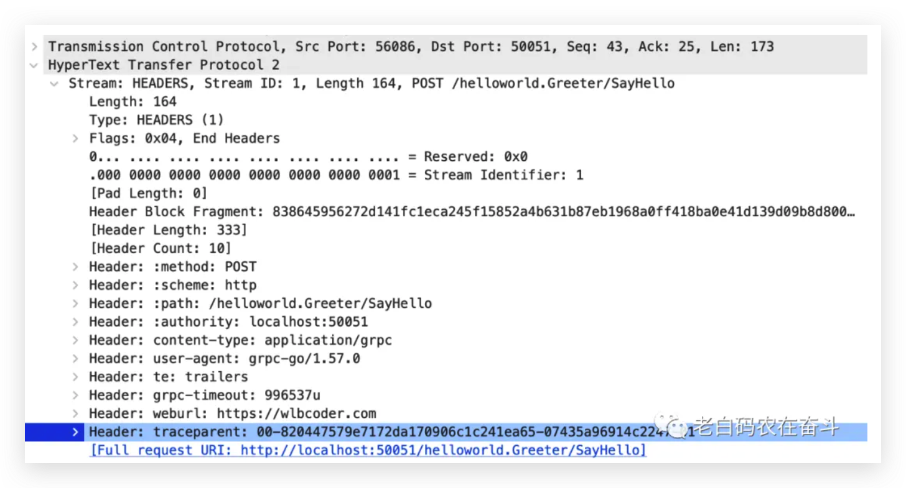

## GO 系列 - Context

### 基本认识

在介绍具体之前，先列几点关于 Context 接口以及 context 包的基本认识，文章后续也会不断的提及：

1. Context 只有两个简单的功能：跨 API 或在进程间
   - 携带键值对
   - 传递取消信号(主动取消、时限/超时自动取消)
2. Context 是接口，可以通过两种方式获得上下文：
   - 通过 `BackGround()` 或者 `TODO()` 创建空上下文
   - 通过 `With` 开头函数创建新的上下文，新老上下文是派生关系(derived)
3. 函数间传递的 Context 实际是某结构的地址，是高效的
4. 相同的 Context 可以多个 goroutine 中使用，是并发安全的

另外，实践中还应该遵循一些规范，这些在 Go 的官方文档中有提及：

1. Context 显式传递给每个需要它的函数且作为第一个参数，通常命名为 `ctx`
2. 不传递 `nil` 作为上下文，如果不确定传递什么，可以通过 `context.TODO()` 创建一个空上下文
3. 携带的键值对仅用于传输过程和 API 请求相关的数据（比如 security credentials, tracing information, deadlines, and cancellation signals across API and process boundaries），函数相关的参数应该通过函数参数传递

### 空的上下文的创建

空的上下文的创建有两种方式：

- 调用 `context.TODO()`
- 调用 `context.BackGround()`

这两个函数的实现都返回一个 `context.emptyCtx` 对象的地址：

```go
var (
  background = new(emptyCtx)
  todo = new(emptyCtx)
)
```

尽管本质上是一样的，但是区分两个函数是**为了在编写代码时，更清晰地表明开发人员在创建这个上下文的意图**：

- `TODO()`: 不确定要使用哪个上下文时，可以将其用作占位符
- `BackGround()`: 打算启动已知上下文的地方，通常我们都使用这个

空的上下文没有什么用途。因为 `emptyCtx` 的 `Done()`、`Err()`、`Value()` 等方法，都返回的 `nil`。

### 携带键值对

通过 `WithValue()` 函数可以让 Context 实现携带键值对的功能。

`WithValue()` 函数定义中，传入的 `Context` 命名为 `parent`：再次强调，**返回的 Context 与其是派生关系**。

```go
func WithValue(parent Context, key, val any) Context
```

举一个简单的例子：

```
func main() {
  a := context.Background() // 创建上下文
  b := context.WithValue(a, "k1", "v1") // 塞入一个kv
  c := context.WithValue(b, "k2", "v2") // 塞入另外一个kv
  d := context.WithValue(c, "k1", "vo1") // 覆盖一个kv

  fmt.Printf("k1 of b: %s\n", b.Value("k1"))
  fmt.Printf("k1 of d: %s\n", d.Value("k1"))
  fmt.Printf("k2 of d: %s\n", d.Value("k2"))
}
```

上述代码打印的内容：

```
k1 of b: v1
k1 of d: vo1
k2 of d: v2
```

直观的感觉是上下文中的**键值对**可以被**覆盖**，但看一下 `WithValue()` 的实现，这种表现并不是真正的覆盖了某些值。

另外，这里的值可以是任何类型，拿出来使用的时候，需要转换成具体的类型。

#### 实现原理

每次调用 `WithValue()` 函数，会返回一个 `*valueCtx` 的指针，将 key, val 设置进去(val 可以是任何类型)，并且将之前的 Context 嵌套进去。

`valueCtx` 的结构如下：

```go
type valueCtx struct {
  Context
  key, val any
}
```

而 `Context.Value()` 方法，则是不断的从 Context 中寻找是否有对应的 key 匹配，如果匹配则返回 val；如果不匹配在包裹的 Context 中继续寻找。

**如果不断地通过 `WithValue()` 同一个的 key 更新上下文，写入和读取就像使用一个栈，后边被设置进去的会被先读取到。** `Value()` 是一个递归解嵌套的过程，终止条件就是 Context 为 `emptyCtx` 或找到对应 key。

#### 打印上下文的所有 key/value

通过反射的方式，可以打印出 context 的所有 key-value，但是因为 key 和 value 可以是任何类型，不一定有 `String()`，打印的可能不容易理解。

### 传递取消信号

Context 接口要求实现 4 个方法，除了 `Value()` 是和上边介绍的传递键值对有关之外，其他的三个都和*传递取消信号*有关。

**上下文是可以结束的**。可以向使用 `context.Context` 的任何函数发出信号，表明上下文已结束。而这些函数在收到上下文完成的信号后，以自己的方式处理了有关上下文相关的工作。

这种处理方式是高效的：虽然可能因为超时或主动取消，没有得到预期结果，但可以及时停止后续操作、释放出资源来处理别的请求，而不必等待每个函数都有返回。

#### Done() 确定上下文是否完成

无论上下文是因为什么原因结束的，都可以通过调用其 `Done()` 方法确认：该方法返回一个通道(`chan struct{}`)，该通道会在上下文完成时被关闭，任何监听该通道的函数都会感应到对应上下文完成的事件。

**【channel 基础知识】通道有一种常见的用法：不会往通道里写入任何东西，在需要发送信号的时候关闭通道，此时接收操作符（receive operator）会立马收到一个管道类型的零值**，在 Go 规范中有详细描述：

> A receive operation on a closed channel can always proceed immediately, yielding the element type’s zero value after any previously sent values have been received.

通道的等待往往结合 `select` 一块使用。select 可以通过多个 case 同时读取多个 channel，如果每个 case 的 channel 都被阻塞则 select 会被阻塞。也会有另外的做法，在 default 做**逻辑**或者 sleep，将 select 放在循环中，不断的重复检查。

再说回 `Done()` 方法，它返回一个通道，在 Context 未关闭和关闭的表现：

- 没有关闭的时候，`case <- ctx.Done()` 会阻塞住
- 关闭之后，每次 `<- ctx.Done()` 都会返回一个零值

#### Cancel() 取消上下文

取消上下文是结束上下文最直接、最可控的方式。通过 `context.WithCancel` 会在 Context 上关联上一个 `CancelFunc` 类型的*取消函数*，该类型就是一个 `func()`，不接受参数也没有返回。

`WithCancel()` 返回的是第一个参数的 Context 是 `cancelCtx` 类型的对象。cancelCtx 结构有一个方法是 `cancel()`，而 WithCancel 返回的第二个就是该方法的封装：

```go
func WithCancel(parent Context) (ctx Context, cancel CancelFunc) {
  if parent == nil {
    panic("cannot create context from nil parent")
  }
  c := newCancelCtx(parent)
  propagateCancel(parent, &c)
  return &c, func() { c.cancel(true, Canceled) }
}
```

后边实现原理会介绍一下 cancelCtx 类型的具体内容。

##### 取消上下文的示例

下边的代码来自 Go 官方 context 包文档中 WithCancel 的示例，展示了在函数中使用了 `Done()` 和 `Cancel()` 两个方法。

```go
  gen := func(ctx context.Context) <-chan int {
    dst := make(chan int)
    n := 1
    go func() {
      for {
        select {
        case <-ctx.Done():
          return // returning not to leak the goroutine
        case dst <- n:
          n++
        }
      }
    }()
    return dst
  }

  ctx, cancel := context.WithCancel(context.Background())
  defer cancel() // cancel when we are finished consuming integers

  for n := range gen(ctx) {
    fmt.Println(n)
    if n == 5 {
      break
    }
  }
```

其中代码具体的执行，做一下简单的说明：

- `gen` 是一个函数变量，返回一个 `chan int`
- 使用 `BackGround()` 创建空白上下文，使用 `WithCancel()` 关联上一个取消函数 cancel
- 将 cancel 函数加入到 defer 栈
- 调用 `gen(ctx)`，传入 Context，在 `gen()` 函数中：
  - 创建一个 `chan int`。注意，这个 channel 的size 是0，也就是只有下游准备好接收的时候，才能塞入，这个之前文章有介绍过
  - 启动一个 goroutine，不断的循环在两个 channel 上读写：等待上下文结束通道关闭；等待目的通道可以写，写入递增数字
  - 返回目的通道 `dst`
- `for` 循环利用 `range` 不断的从 dst 通道中读出数字并打印
  - 在读出并打印出 5 之后，退出
- defer 栈中的 cancel 函数被拿出来执行，ctx 被取消，上下文结束
- gen() 函数中启动的 goroutine 中的函数接收到 `ctx.Done()` 中得到的 0，函数结束退出

这个示例，使用*取消上下文*的目的是为了**防止 goroutine 的泄漏**：如果没有上下文的结束信号，外部的for循环退出之后，goroutine 运行的函数会会一直阻塞在 select，对应的资源也不会被释放。

#### 实现原理

`WithCancel()` 的实现，是基于 `cancelCtx` 结构的，其定义如下：

```go
type cancelCtx struct {
  Context

  mu sync.Mutex // protects following fields
  done atomic.Value // of chan struct{}, created lazily, closed by first cancel call
  children map[canceler]struct{} // set to nil by the first cancel call
  err error // set to non-nil by the first cancel call
}
```

- 结构体中的 Context，会将 `BackGround()` 创建的空上下文放在这里
- `mu` 是用来保证多个 goroutine 中操作 Context 的锁
- `done` 就是用作 `Done()` 返回的变量，使用 `atomic.Value` 保证其原子性
- err 存储着具体的结束的原因
- 剩下的 children 在后边继续介绍

`Done()` 方法会简单地使用锁 + 原子变量的方式返回。

`Cancel()` 方法则是会关闭 done 中的 chan struct{}，另外还会关闭 children 等其他相关上下文。

### 带时限/超时的取消

上边介绍的 `WithCancel()` 派生出来的上下文，只能主动去取消上下文。context 包中还提供了两个可以带时间*自动取消上下文*的函数：

- 通过 `context.WithDeadline()` 设置上下文需要完成的截止时间，在到达截止时间之后回自动结束
- 通过 `context.WithTimeout()` 设置上下文的超时时间，在到达超时之后自动结束

其实，两个函数作用大同小异，`WithTimeout()` 也是在当前时间上加了一个超时时间，然后调用 `WithDeadline()` 函数实现的：

```go
func WithTimeout(parent Context, timeout time.Duration) (Context, CancelFunc) {
  return WithDeadline(parent, time.Now().Add(timeout))
}
```

#### 超时取消示例

这里仍然使用 context 官方文档上的一个示例，做了一点修改：

```go
  ctx, cancel := context.WithTimeout(context.Background(), 10 * time.Millisecond)

  // Even though ctx will be expired, it is good practice to call its
  // cancellation function in any case. Failure to do so may keep the
  // context and its parent alive longer than necessary.
  defer cancel()

  select {
  case <-time.After(1 * time.Second):
    fmt.Println("overslept")
  case <-ctx.Done():
    fmt.Println(ctx.Err())
  }
```

对上边的代码做一下简单解释：

- 创建空上下文，通过 `WithTimeout()` 创建一个带 10ms 超时的上下文
- 将得到的 cancel 函数压入 defer 栈中
- `select` 等待两个事件：一个是1秒之后的超时，另一个是等待上下文结束
- 由于上下文超时时间远小于定时时钟，所以会走到 `fmt.Println(ctx.Err())`
- select 结束，函数结束前执行 defer 栈中的 cancel 函数

如注释：**尽管上下文会在超时结束取消，但是作为一种良好实践，在任何场景中，都应该调用一下 cancel 函数**。

从另外角度理解，`CancelFunc()` 可以被多次调用，不会像多次 close channel 一样会 panic。

#### Err() 获取上下文错误

上边的示例代码会走到外边的 `<-ctx.Done()` 分支，会打印 `ctx.Err()` 得到的错误(DeadlineExceeded)：

> context deadline exceeded

Context 接口要求的实现一个方法是 `Err()`：

- 在 `Done()` 返回的 channel 没有被关闭的时候，调用 Err() 一定会返回 nil
- 在 `Done()` 关闭之后，`Err()` 会返回 Canceled 或 DeadlineExceeded 两种错误
- BackGround() 创建的 emptyCtx 在任何时候都会返回 nil

`Canceled` 和 `DeadlineExceeded` 是两个**包级别的变量**，是 error 接口。在 cancelCtx.cancel 方法参数中，可以指定使用何种错误取消上下文。实现上，`WithDeadline()` 等创建的上下文，在 `time.AfterFunc` 中调用取消的时候会填入 DeadlineExceeded，否则主动取消会填入Canceled。

#### 实现原理

前面提到过 WithTimeout 是调用了 WithDeadline，而后者则是返回一个 `*timerCtx`。`timerCtx` 是在 `cancelCtx` 的基础上，增加了一个定时器和一个 deadline ：

```go
type timerCtx struct {
  cancelCtx
  timer *time.Timer // Under cancelCtx.mu.

  deadline time.Time
}
```

在 `WithDeadline()` 中，使用了 time.AfterFunc 创建了一个定时器，在 dur 时间到达之后，调用 cancelCtx.cancel 方法：

```go
  c.timer = time.AfterFunc(dur, func() {
      c.cancel(true, DeadlineExceeded)
    })
```

### Context 树与 Cancel 传播

我们多次在前文中看到了：Context 的创建过程，是先通过 `BackGround()` 获得空上下文，然后在此基础上，调用 With 开头的4个函数，不断的派生上下文。

context 包文档中的这段话也是如此的描述，其中提到的是 **optionally**，这意味着**并不是每个函数都需要派生上下文，而是在确实需要的情况下可以派生，不然可以直接使用当前的上下文**：

> The chain of function calls between them must propagate the Context, optionally replacing it with a derived Context created using WithCancel, WithDeadline, WithTimeout, or WithValue. When a Context is canceled, all Contexts derived from it are also canceled.

因为一个 Context 可以派生出多个 child Context，因此所有的 Context 会形成一棵树，而这棵树的根就是 `BackGround()` 的空上下文。

#### WithValue 的过程

虽然前边提到过，通过 With 开头的函数，可以派生出新的上下文，但是实际使用中，**并不需要每个中间派生的上下文都需要存到一个变量中**。

下边的代码也很常见：

```
for key, val := range paramMap {
  ctx = context.WithValue(ctx, key, val)
}
```

这个场景中，中间派生出的 Context 并没有用途，但是随着一次次的 `ctx = WithValue(ctx, key, val)` 会将中间派生的 Context 保存在新的 Context 中，因此最后一个 ctx 还存在的情况下，中间的 Context 的引用计数没有归零，所以也不会被清理掉。

#### 为什么需要传播 cancel

这里的传播和之前提到的传递信号是两个概念：

- 传递信号是指创建 goroutine 调用函数，使用同一个上下文，调用方和被调函数都能够主动结束、或感知到结束
- 传播是指由派生关系的上下文，当父上下文结束之后，会将派生的上下文也 cancel 掉

> Calling the CancelFunc cancels the child and its children, removes the parent’s reference to the child, and stops any associated timers. Failing to call the CancelFunc leaks the child and its children until the parent is canceled or the timer fires. The go vet tool checks that CancelFuncs are used on all control-flow paths.

**上下文通过直接调用 Cancel 或者通过定时/截止时间间接调用 Cancel 来结束上下文，都会传递给该上下文的所派生出的所有上下文，使得这些上下文结束。**

**这个功能非常容易理解**：以一个 HTTP 请求处理函数为例，假设会多次查询 MySQL，如果我们整个请求处理的超时设置为1秒（会创建一个上下文 parent，WithTimeout 1s），每次 MySQL 请求的超时设置为 800ms(会派生出上下文 childN，WithTimeout 800ms)，当第N个 MySQL 请求还没有达到超时，但是总的超时时间已经达到1秒时，parent 会被自动 cancel 掉，这时候当前的 MySQL 查询（以及后续未执行的查询，但是还没有派生上下文），都没有意义，因此的这个派生的上下文childN 会在 parent canel 的过程中也被 cancel 掉。

#### Cancel 传播示例

以上边解释为什么要是传递给派生上下文的场景为例，写一个简单的例子：

```go
ctx, cancel := context.WithTimeout(context.Background(), time.Second)

defer cancel()

slowFunc := func(ctx context.Context, i int) {
    childCtx, cancel := context.WithTimeout(ctx, 800*time.Millisecond)
    defer cancel()

    fmt.Printf("query No. %d\n", i)
    select {
    case <-childCtx.Done():
        fmt.Printf("child context err: %v\n", childCtx.Err())
    }
}

for i := 0; i < 5; i++ {
    select {
    case <-ctx.Done():
        fmt.Printf("parent context err: %v\n", ctx.Err())
        return
    default:
        slowFunc(ctx, i)
    }
}
```

运行上边代码，会在 1秒钟之后结束，其屏幕输出结果是：

```
query No. 0
child context err: context deadline exceeded
query No. 1
child context err: context deadline exceeded
parent context err: context deadline exceeded
```

**将for移入default会是什么情况？**上边的代码中，每执行完一次查询，都去检查上下文是否完成，如果为未完成走 default 分支。如果将 for 循环移入 default 或者移入 slowFunc 中，结果会有什么异同呢？

- 也会在1秒钟之后结束
- 会调用5次 `slowFunc`，传入 i 从0到5，会打印 5 次 query 提示
- 不会打印到 parent context err：因为 select 只有一次，导致第一次进入default 之后就执行完毕了，而没有机会再进入到 `<-ctx.Done()` 的分支

#### 实现原理

cancel 的传播，也是基于 `cancelCtx` 结构及其方法来实现的：

- 通过 cancelCtx.Context 能获得自己父 Context 的信息
- cancelCtx.children 记录自己的派生的 Context，*cancelCtx 实现了 canceler 接口

```go
type cancelCtx struct {
  Context
  ...
  children map[canceler]struct{}
}

type canceler interface {
  cancel(removeFromParent bool, err error)
  Done() <-chan struct{}
}
```

`cancel()` 方法中，也分为3部分逻辑：获得 done 并关闭、cancel 所有的子上下文、从父上下文的children中移除自己。

```go
func (c *cancelCtx) cancel(removeFromParent bool, err error) {
  // 省略掉拿 done 并关闭的代码
  // ...
  
  // 结束所有子上下文
  for child := range c.children {
    // NOTE: acquiring the child's lock while holding parent's lock.
    child.cancel(false, err)
  }
  c.children = nil
  c.mu.Unlock()

  // 从父上下文的children中移除自己
  if removeFromParent {
    removeChild(c.Context, c)
  }
}
```

### 进程间 Context 间传递

context 包文档中第一句就介绍，Context 可以携带信息在跨越 API 边界或在进程间传递。前面的例子大多是说在 API 调用的时候传递 ctx 的例子，接下来介绍一下进程间传递信息的示例和实现。

在进程间传递上下文，需要 RPC 协议的支持。比如较流行的 gRPC 就支持上下文的传递，包括：

- 默认的 context 中部分信息，比如超时时间
- 用户自己需要传递的元数据信息 metadata

#### gRPC 传递上下文的示例

我这里修改 gRPC 中的例子，来演示一下，进程间传递的以上两种信息。

代码地址: https://github.com/panzhongxian/context-helloworld 。这个代码在 helloworld 的基础上做了两点修改：

- 在 greeter_client/main.go 中增加一个 metadata (weburl: [https://wlbcoder.com])
- 在 greeter_server/main.go 中增加打印 ctx、ctx.Deadline() 以及 metadata 到标准输出

构建并运行上述代码中的 server 和 client。server 上打印的屏幕输出为：

```
ctx:
  context.Background.WithValue(type transport.connectionKey, val <not Stringer>).WithValue(type peer.peerKey, val <not Stringer>).WithDeadline(2023-08-04 17:17:34.133095 +0800 CST m=+4.666423589 [997.208952ms]).WithValue(type metadata.mdIncomingKey, val <not Stringer>).WithValue(type grpc.streamKey, val <not Stringer>)

ctx.Deadline():
   2023-08-04 17:17:34.133095 +0800 CST m=+4.666423589

metadata:
  weburl: [https://wlbcoder.com]
  :authority: [localhost:50051]
  content-type: [application/grpc]
  user-agent: [grpc-go/1.57.0]
```

上面的日志可以看到：1) 上下文中有调用方传来的超时信息（997ms超时）；2) metadata 中包含自己注入的信息 weburl: [https://wlbcoder.com] ，同时还有别的一些默认的信息（user-agent、content-type等）

上边这些信息，我们通过 Wireshark 抓包，并过滤出 client 请求 server 的 HTTP2 包，也能找到是如何传输的：

- 部分信息使用 HTTP2 默认的 Header，比如 `content-type`
- 部分内部信息使用 `grpc-` 开头的 Header，比如 `grpc-timeout` 为 997ms，与server打印的一致
- 用户自定义信息，不使用 `grpc-` 开头，比如我们自定义的 `weburl`


#### OpenTelemetry 示例

如果对调用跟踪有了解，对于我们对上下文中携带和传递信息，会更有帮助：**在函数之间、在服务之间，传递着 TraceID、SpanID 的**，而其传递过程，也是依赖于上下文。

我这里写了一个简单的例子，展示的是 Context 在进程间传递：

- 函数 `func1()` 递归调用自己，传递的就是 Context，而没有传递 Span
- 同时，`func1()` 中从 ctx 创建 Span，而创建 Span 会从 ctx 中拿出 TraceID 等信息

```go
func func1(ctx context.Context, layer int) {
  newCtx, span := otel.Tracer("wlbcoder.com").Start(ctx, "Run")
  defer span.End()
  spc := span.SpanContext()
  fmt.Printf("span context %d, traceID: %s, spanID: %s\n",
    layer, spc.TraceID(), spc.SpanID())

  if layer > 3 {
    return
  } else {
    func1(newCtx, layer+1)
  }
}

func main() {
  tp := trace.NewTracerProvider()
  defer tp.Shutdown(context.Background())

  otel.SetTracerProvider(tp)
  func1(context.Background(), 0)
}
```

上述程序运行一次，打印的结果如下：

```
span context 0, traceID: 67d7c3e1b60c58f97c3a10614fbb13db, spanID: f4e1e8f28026251e
span context 1, traceID: 67d7c3e1b60c58f97c3a10614fbb13db, spanID: 8d3f7e79cf948050
span context 2, traceID: 67d7c3e1b60c58f97c3a10614fbb13db, spanID: e38ad89ba2722469
span context 3, traceID: 67d7c3e1b60c58f97c3a10614fbb13db, spanID: d0d22d786a020f42
span context 4, traceID: 67d7c3e1b60c58f97c3a10614fbb13db, spanID: bd01d2338f13626a
```


另外，opentelemetry 中的 TraceID 和 SpanID 也是会在进程间进行传递，但如前文提到的，这是依赖于 RPC 框架和通信协议的。接下来，看看 OpenTelemetry 在基于官方 HTTP 库和 gRPC 框架进行进程间传递的示例。

后边再提到 OpenTelemetry 会简称 OTEL。

##### OTEL x HTTP Client

如果作为 HTTP Client 请求，要携带 Trace 信息，则需要将上下文中的 Trace 信息，通过 HTTP 协议携带过去。

下边的代码是从 opentelemetry-go-contrib 中摘了一部分，代码来源：https://github.com/open-telemetry/opentelemetry-go-contrib/blob/instrumentation/net/http/otelhttp/example/v0.42.0/instrumentation/net/http/otelhttp/example/client/client.go

代码需要关注的只有一个地方：**在创建 http.Client 的时候，需要在 http.DefaultTransport 的基础上，多加一层 `otelhttp.NewTransport` 包装，这样就会在调用 `http.NewRequestWithContext` 的时候，会从 Context 中取得 Trace 信息，并拼装在 HTTP 请求得 Header 中**。

```go
  client := http.Client{Transport: otelhttp.NewTransport(http.DefaultTransport)}

  bag, _ := baggage.Parse("username=donuts")
  ctx := baggage.ContextWithBaggage(context.Background(), bag)

  var body []byte

  tr := otel.Tracer("example/client")
  err = func(ctx context.Context) error {
    ctx, span := tr.Start(ctx, "say hello", trace.WithAttributes(semconv.PeerService("ExampleService")))
    defer span.End()
    req, _ := http.NewRequestWithContext(ctx, "GET", *url, nil)

    fmt.Printf("Sending request...\n")
    res, err := client.Do(req)
    if err != nil {
      panic(err)
    }
    body, err = io.ReadAll(res.Body)
    _ = res.Body.Close()

    return err
  }(ctx)
```

而 W3C 的规范中，对调用跟踪有支持，也就是明确规定了可以使用哪些 Header 可以携带的调用的上下文：https://www.w3.org/TR/trace-context/

##### OTEL x gRPC Client

如果使用 gRPC 框架，和直接使用 HTTP Client 不同，无法让 OTEL 直接操作 HTTP 的拼装，而是通过满足 gRPC 要求的 UnaryInterceptor 或者 StreamInterceptor 来实现从上下文中读取或往上下文中写入 Trace 信息：

在 Server 端：

```go
s := grpc.NewServer(
    grpc.UnaryInterceptor(otelgrpc.UnaryServerInterceptor()),
    grpc.StreamInterceptor(otelgrpc.StreamServerInterceptor()),
)
pb.RegisterGreeterServer(s, &server{})
```

在 Client 端：

```go
conn, err := grpc.Dial(*addr, grpc.WithTransportCredentials(insecure.NewCredentials()),
    grpc.WithUnaryInterceptor(otelgrpc.UnaryClientInterceptor()),
    grpc.WithStreamInterceptor(otelgrpc.StreamClientInterceptor()),
)
```

我们观察一下 Client 和 Server 中的 Trace 信息的传递，Server 中的 Span 会将 Client 的 Span 作为 Parent Span：


同时，我们可以在抓包中看到的这个 Trace 的一些信息：

