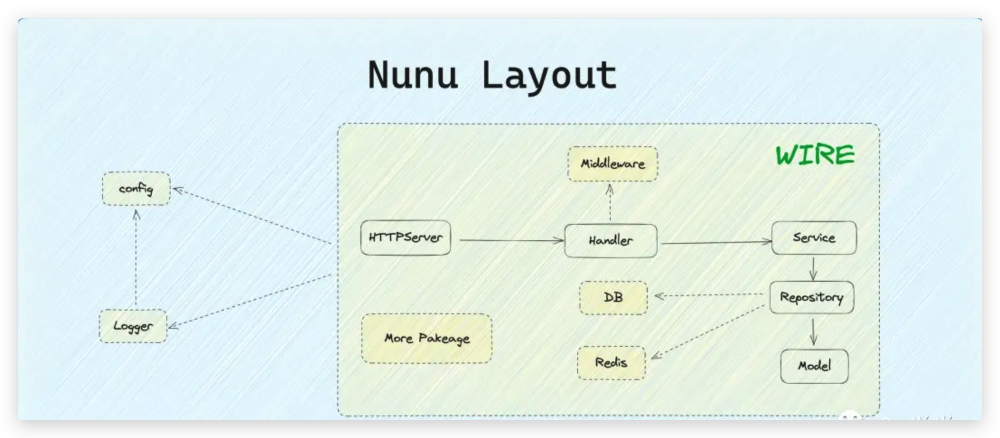

## GO 库 - nunu

项目地址：https://github.com/go-nunu/nunu

### 名字的由来

nunu这个名字来自于英雄联盟中的游戏角色，一个骑在雪怪肩膀上的小男孩。和努努一样，该项目也是站在巨人的肩膀上，它是由Golang生态中各种非常流行的库整合而成的，它们的组合可以帮助你**快速构建一个高效、可靠的应用程序**。

### 功能

nunu是基于以下流行的开源库组建而成的：

- **Gin**: https://github.com/gin-gonic/gin
- **Gorm**: https://github.com/go-gorm/gorm
- **Wire**: https://github.com/google/wire
- **Viper**: https://github.com/spf13/viper
- **Zap**: https://github.com/uber-go/zap
- **Golang-jwt**: https://github.com/golang-jwt/jwt
- **Go-redis**: https://github.com/go-redis/redis
- **Testify**: https://github.com/stretchr/testify
- **Sonyflake**: https://github.com/sony/sonyflake
- **Gocron**: https://github.com/go-co-op/gocron
- **Go-sqlmock**: https://github.com/DATA-DOG/go-sqlmock
- **Gomock**: https://github.com/golang/mock

### 简洁的分层架构

Nunu采用了经典的分层架构。同时，为了更好地实现模块化和解耦，采用了依赖注入框架Wire。



### 安装

您可以通过以下命令安装Nunu：

```
go install github.com/go-nunu/nunu@latest
```

> Tips: 如果go install成功，却提示找不到nunu命令，这是因为环境变量没有配置，可以把 GOBIN 目录配置到环境变量中即可

### 创建新项目

您可以使用以下命令创建一个新的Golang项目：

```
nunu new projectName
```

该命令实际上是从github的默认地址上拉取的模版。当然也可以使用国内加速的仓库作为模版：

```
// 使用基础模板
nunu new projectName -r https://gitee.com/go-nunu/nunu-layout-basic.git
// 使用高级模板
nunu new projectName -r https://gitee.com/go-nunu/nunu-layout-advanced.git
```

此命令将创建一个名为projectName的目录，并在其中生成一个优雅的Golang项目结构。

### 创建组件

您可以使用以下命令为项目创建handler、service、repository和model等组件：

```
nunu create handler user
nunu create service user
nunu create repository user
nunu create model user
```

或

```
nunu create all user
```

这些命令将分别创建一个名为UserHandler、UserService、UserRepository和UserModel的组件，并将它们放置在正确的目录中。

### 启动项目

您可以使用以下命令快速启动项目：

```
nunu run
```

此命令将启动您的Golang项目，并支持文件更新热重启。

### 目录结构

通过nunu创建的项目会自动的生成如下项目结构：

```
.
├── cmd
│   ├── job
│   │   ├── main.go
│   │   ├── wire.go
│   │   └── wire_gen.go
│   ├── migration
│   │   ├── main.go
│   │   ├── wire.go
│   │   └── wire_gen.go
│   └── server
│       ├── main.go
│       ├── wire.go
│       └── wire_gen.go
├── config
│   ├── local.yml
│   └── prod.yml
├── deploy
├── internal
│   ├── handler
│   │   ├── handler.go
│   │   └── user.go
│   ├── job
│   │   └── job.go
│   ├── middleware
│   ├── migration
│   │   └── migration.go
│   ├── model
│   │   └── user.go
│   ├── repository
│   │   ├── repository.go
│   │   └── user.go
│   ├── server
│   │   └── http.go
│   └── service
│       ├── service.go
│       └── user.go
├── mocks
│   ├── repository
│   │   └── user.go
│   └── service
│       └── user.go
├── pkg
├── scripts
├── storage
├── test
│   └── server
│       ├── handler
│       │   └── user_test.go
│       ├── repository
│       │   └── user_test.go
│       └── service
│           └── user_test.go
├── web
│   └── index.html
├── LICENSE
├── Makefile
├── README.md
├── README_zh.md
├── coverage.html
├── go.mod
└── go.sum
```

该项目的架构采用了典型的分层架构，主要包括以下几个模块：

- cmd：该模块包含了应用的入口点，根据不同的命令进行不同的操作，例如启动服务器、执行数据库迁移等。每个子模块都有一个main.go文件作为入口文件，以及wire.go和wire_gen.go文件用于依赖注入。

- config：该模块包含了应用的配置文件，根据不同的环境（如开发环境和生产环境）提供不同的配置。

- deploy：该模块用于部署应用，包含了一些部署脚本和配置文件。

- internal：该模块是应用的核心模块，包含了各种业务逻辑的实现。

- - handler：该子模块包含了处理HTTP请求的处理器，负责接收请求并调用相应的服务进行处理。
  - job：该子模块包含了后台任务的逻辑实现。
  - middleware：该子模块包含了中间件的实现，用于处理请求的前置和后置操作。
  - migration：该子模块包含了数据库迁移的逻辑实现。
  - model：该子模块包含了数据模型的定义。
  - repository：该子模块包含了数据访问层的实现，负责与数据库进行交互。
  - server：该子模块包含了HTTP服务器的实现。
  - service：该子模块包含了业务逻辑的实现，负责处理具体的业务操作。

- mocks：该模块包含了各个模块的接口的模拟实现，用于单元测试。

- pkg：该模块包含了一些通用的功能和工具。

- scripts：该模块包含了一些脚本文件，用于项目的构建、测试和部署等操作。

- storage：该模块用于存储文件或其他静态资源。

- test：该模块包含了各个模块的单元测试，按照模块划分子目录。

- web：该模块包含了前端相关的文件，如HTML、CSS和JavaScript等。

此外，还包含了一些其他的文件和目录，如授权文件、构建文件、README等。整体上，该项目的架构清晰，各个模块之间的职责明确，便于理解和维护。

