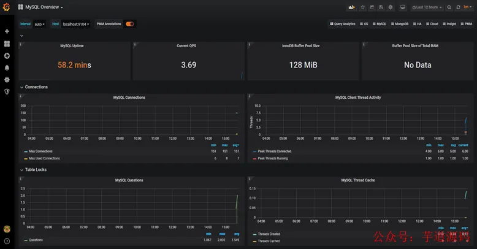

## 接口性能优化

### 1. 索引

接口性能优化大家第一个想到的可能是：`优化索引`。

没错，优化索引的成本是最小的。

通过查看线上日志或者监控报告，查到某个接口用到的某条 sql 语句耗时比较长。

这时你可能会有下面这些疑问：

1. 该 sql 语句加索引了没？

1. 加的索引生效了没？
2. mysql 选错索引了没？

#### 1.1 没加索引

sql 语句中`where`条件的关键字段，或者`order by`后面的排序字段，忘了加索引，这个问题在项目中很常见。

项目刚开始的时候，由于表中的数据量小，加不加索引 sql 查询性能差别不大。

后来，随着业务的发展，表中数据量越来越多，就不得不加索引了。

可以通过命令：

```
show index from `order`;
```

能单独查看某张表的索引情况。

也可以通过命令：

```
show create table `order`;
```

查看整张表的建表语句，里面同样会显示索引情况。

通过`ALTER TABLE`命令可以添加索引：

```
ALTER TABLE `order` ADD INDEX idx_name (name);
```

也可以通过`CREATE INDEX`命令添加索引：

```
CREATE INDEX idx_name ON `order` (name);
```

不过这里有一个需要注意的地方是：想通过命令修改索引，是不行的。

目前在 mysql 中如果想要修改索引，只能先删除索引，再重新添加新的。

删除索引可以用`ALTER TABLE`命令：

```
ALTER TABLE `order` DROP INDEX idx_name;
```

用`DROP INDEX`命令也行：

```
DROP INDEX idx_name ON `order`;
```

#### 1.2 索引失效

通过上面的命令我们已经能够确认索引是有的，但它生效了没？此时你内心或许会冒出这样一个疑问。

那么，如何查看索引有没有生效呢？

答：可以使用`explain`命令，查看 mysql 的执行计划，它会显示索引的使用情况。

执行计划包含列的含义如下图所示：


说实话，sql语句没有走索引，排除没有建索引之外，最大的可能性是索引失效了。

下面说说索引失效的常见原因：


如果不是上面的这些原因，则需要再进一步排查一下其他原因。

#### 1.3 选错索引

此外，你有没有遇到过这样一种情况：明明是同一条 sql，只有入参不同而已。有的时候走的索引 a，有的时候却走的索引 b？

没错，有时候 mysql 会选错索引。

必要时可以使用`force index`来强制查询 sql 走某个索引。

### 2. sql优化

如果优化了索引之后，也没啥效果。

接下来试着优化一下 sql 语句，因为它的改造成本相对于 java 代码来说也要小得多。

下面给大家列举了 sql 优化的 15 个小技巧：


### 3. 远程调用

很多时候，我们需要在某个接口中，调用其他服务的接口。

比如有这样的业务场景：

在用户信息查询接口中需要返回：用户名称、性别、等级、头像、积分、成长值等信息。

而用户名称、性别、等级、头像在用户服务中，积分在积分服务中，成长值在成长值服务中。为了汇总这些数据统一返回，需要另外提供一个对外接口服务。

于是，用户信息查询接口需要调用用户查询接口、积分查询接口和成长值查询接口，然后汇总数据统一返回。

调用过程如下图所示：


调用远程接口总耗时 530ms = 200ms + 150ms + 180ms。

显然这种串行调用远程接口性能是非常不好的，调用远程接口总的耗时为所有的远程接口耗时之和。

那么如何优化远程接口性能呢？

#### 3.1 并行调用

上面说到，既然串行调用多个远程接口性能很差，为什么不改成并行呢？

如下图所示：


调用远程接口总耗时 200ms = 200ms（即耗时最长的那次远程接口调用）。

在 java8 之前可以通过实现`Callable`接口，获取线程返回结果。java8 以后通过`CompleteFuture`类实现该功能。

我们这里以 CompleteFuture 为例：

```
public UserInfo getUserInfo(Long id) throws InterruptedException, ExecutionException {
    final UserInfo userInfo = new UserInfo();
    CompletableFuture userFuture = CompletableFuture.supplyAsync(() -> {
        getRemoteUserAndFill(id, userInfo);
        return Boolean.TRUE;
    }, executor);

    CompletableFuture bonusFuture = CompletableFuture.supplyAsync(() -> {
        getRemoteBonusAndFill(id, userInfo);
        return Boolean.TRUE;
    }, executor);

    CompletableFuture growthFuture = CompletableFuture.supplyAsync(() -> {
        getRemoteGrowthAndFill(id, userInfo);
        return Boolean.TRUE;
    }, executor);
    CompletableFuture.allOf(userFuture, bonusFuture, growthFuture).join();

    userFuture.get();
    bonusFuture.get();
    growthFuture.get();

    return userInfo;
}
```

> 温馨提醒一下，这两种方式别忘了使用线程池。示例中我用到了 executor，表示自定义的线程池，为了防止高并发场景下，出现线程过多的问题。

#### 3.2 数据异构

上面说到的用户信息查询接口需要调用用户查询接口、积分查询接口和成长值查询接口，然后汇总数据统一返回。

那么，我们能不能把数据冗余一下，把用户信息、积分和成长值的数据统一存储到一个地方，比如：redis，存的数据结构就是用户信息查询接口所需要的内容。然后通过用户 id，直接从 redis 中查询数据出来，不就 OK了？

如果在高并发的场景下，为了提升接口性能，远程接口调用大概率会被去掉，而改成保存冗余数据的数据异构方案。


但需要注意的是，如果使用了数据异构方案，就可能会出现数据一致性问题。

用户信息、积分和成长值有更新的话，大部分情况下，会先更新到数据库，然后同步到 redis。但这种跨库的操作，可能会导致两边数据不一致的情况产生。

### 4. 重复调用

`重复调用`在我们的日常工作代码中可以说随处可见，但如果没有控制好，会非常影响接口的性能。

不信，我们一起看看。

#### 4.1 循环查数据库

有时候，我们需要从指定的用户集合中，查询出有哪些是在数据库中已经存在的。

实现代码可以这样写：

```
public List<User> queryUser(List<User> searchList) {
    if (CollectionUtils.isEmpty(searchList)) {
        return Collections.emptyList();
    }

    List<User> result = Lists.newArrayList();
    searchList.forEach(user -> result.add(userMapper.getUserById(user.getId())));
    return result;
}
```

这里如果有 50 个用户，则需要循环 50 次去查询数据库。我们都知道，每查询一次数据库，就是一次远程调用。

如果查询 50 次数据库，就有 50 次远程调用，这是非常耗时的操作。

那么，我们如何优化呢？

具体代码如下：

```
public List<User> queryUser(List<User> searchList) {
    if (CollectionUtils.isEmpty(searchList)) {
        return Collections.emptyList();
    }
    List<Long> ids = searchList.stream().map(User::getId).collect(Collectors.toList());
    return userMapper.getUserByIds(ids);
}
```

提供一个根据用户 id 集合批量查询用户的接口，只远程调用一次，就能查询出所有的数据。

> 这里有个需要注意的地方是：id 集合的大小要做限制，最好一次不要请求太多的数据。要根据实际情况而定，建议控制每次请求的记录条数在 500 以内。

#### 4.2 死循环

有些小伙伴看到这个标题，可能会感到有点意外，死循环也算？

代码中不是应该避免死循环吗？为啥还是会产生死循环？

有时候死循环是我们自己写的，例如下面这段代码：

```
while(true) {
    if(condition) {
        break;
    }
    System.out.println("do samething");
}
```

这里使用了 while(true) 的循环调用，这种写法在`CAS自旋锁`中使用比较多。

当满足 condition 等于 true 的时候，则自动退出该循环。

如果 condition 条件非常复杂，一旦出现判断不正确，或者少写了一些逻辑判断，就可能在某些场景下出现死循环的问题。

出现死循环，大概率是开发人员人为的 bug 导致的，不过这种情况很容易被测出来。

> 还有一种隐藏的比较深的死循环，是由于代码写得不太严谨导致的。如果用正常数据，可能测不出问题，但一旦出现异常数据，就会立即出现死循环。

#### 4.3 无限递归

如果想要打印某个分类的所有父分类，可以用类似这样的递归方法实现：

```
public void printCategory(Category category) {
  if(category == null 
      || category.getParentId() == null) {
     return;
  } 
  System.out.println("父分类名称："+ category.getName());
  Category parent = categoryMapper.getCategoryById(category.getParentId());
  printCategory(parent);
}
```

正常情况下，这段代码是没有问题的。

但如果某次有人误操作，把某个分类的 parentId 指向了它自己，这样就会出现无限递归的情况。导致接口一直不能返回数据，最终会发生堆栈溢出。

> 建议写递归方法时，设定一个递归的深度，比如：分类最大等级有 4 级，则深度可以设置为 4。然后在递归方法中做判断，如果深度大于 4 时，则自动返回，这样就能避免无限循环的情况。

### 5. 异步处理

有时候，我们接口性能优化，需要重新梳理一下业务逻辑，看看是否有设计上不太合理的地方。

比如有个用户请求接口中，需要做业务操作、发站内通知和记录操作日志。为了实现起来比较方便，通常我们会将这些逻辑放在接口中同步执行，势必会对接口性能造成一定的影响。

接口内部流程图如下：


这个接口表面上看起来没有问题，但如果你仔细梳理一下业务逻辑，会发现只有业务操作才是`核心逻辑`，其他的功能都是`非核心逻辑`。

> 在这里有个原则就是：核心逻辑可以同步执行，同步写库。非核心逻辑，可以异步执行，异步写库。

上面这个例子中，发站内通知和用户操作日志功能，对实时性要求不高，即使晚点写库，用户无非是晚点收到站内通知，或者运营晚点看到用户操作日志，对业务影响不大，所以完全可以异步处理。

通常异步主要有两种：`多线程` 和 `mq`。

#### 5.1 线程池

使用`线程池`改造之后，接口逻辑如下：


发站内通知和用户操作日志功能，被提交到了两个单独的线程池中。

这样接口中重点关注的是业务操作，把其他的逻辑交给线程异步执行，这样改造之后，让接口性能瞬间提升了。

但使用线程池有个小问题就是：如果服务器重启了，或者是需要被执行的功能出现异常了，无法重试，会丢数据。

#### 5.2 mq

使用`mq`改造之后，接口逻辑如下：


对于发站内通知和用户操作日志功能，在接口中并没真正实现，它只发送了 mq 消息到 mq 服务器。然后由 mq 消费者消费消息时，才真正地执行这两个功能。

这样改造之后，接口性能同样提升了，因为发送 mq 消息速度是很快的，我们只需关注业务操作的代码即可。

### 6. 避免大事务

很多小伙伴在使用 spring 框架开发项目时，为了方便，喜欢使用`@Transactional`注解提供事务功能。

没错，使用 @Transactional 注解这种声明式事务的方式提供事务功能，确实能少写很多代码，提升开发效率。

但也容易造成大事务，引发其他的问题。

下面用一张图看看大事务引发的问题。


从图中能够看出，大事务问题可能会造成接口超时，对接口的性能有直接的影响。

我们该如何优化大事务呢？

1. 少用 @Transactional 注解
2. 将查询(select)方法放到事务外
3. 事务中避免远程调用
4. 事务中避免一次性处理太多数据
5. 有些功能可以非事务执行
6. 有些功能可以异步处理

### 7. 锁粒度

在某些业务场景中，多个线程并发修改某个共享数据，会造成数据异常。

为了解决并发场景下，多个线程同时修改数据造成数据不一致的情况，通常情况下，我们会：`加锁`。

但如果锁加得不好，导致锁的粒度太粗，也会非常影响接口性能。

#### 7.1 synchronized

在 java 中提供了`synchronized`关键字给我们的代码加锁。

通常有两种写法：`在方法上加锁` 和 `在代码块上加锁`。

先看看如何在方法上加锁：

```
public synchronized doSave(String fileUrl) {
    mkdir();
    uploadFile(fileUrl);
    sendMessage(fileUrl);
}
```

这里加锁的目的是为了防止并发的情况下创建了相同的目录，第二次会创建失败，影响业务功能。

但这种直接在方法上加锁，锁的粒度有点粗。因为 doSave 方法中的上传文件和发消息功能，是不需要加锁的。只有创建目录功能，才需要加锁。

我们都知道文件上传操作是非常耗时的，如果将整个方法加锁，那么需要等到整个方法执行完之后才能释放锁。显然，这会导致该方法的性能很差，变得得不偿失。

这时，我们可以改成在代码块上加锁了，具体代码如下：

```
public void doSave(String path,String fileUrl) {
    synchronized(this) {
      if(!exists(path)) {
          mkdir(path);
       }
    }
    uploadFile(fileUrl);
    sendMessage(fileUrl);
}
```

这样改造之后，锁的粒度一下子变小了，只有并发创建目录功能才加了锁。而创建目录是一个非常快的操作，即使加锁对接口的性能影响也不大。

最重要的是，其他的上传文件和发送消息功能，仍然可以并发执行。

当然，这样做在单机版的服务中，是没有问题的。但现在部署的生产环境，为了保证服务的稳定性，一般情况下，同一个服务会被部署在多个节点中。如果哪天挂了一个节点，其他的节点服务仍然可用。

多节点部署避免了因为某个节点挂了，导致服务不可用的情况。同时也能分摊整个系统的流量，避免系统压力过大。

同时它也带来了新的问题：synchronized 只能保证一个节点加锁是有效的，但如果有多个节点如何加锁呢?

答：这就需要使用：`分布式锁`了。目前主流的分布式锁包括：redis 分布式锁、zookeeper 分布式锁和数据库分布式锁。

由于 zookeeper 分布式锁的性能不太好，真实业务场景用的不多，这里就不讲了。

下面聊一下 redis 分布式锁。

#### 7.2 redis分布式锁

在分布式系统中，由于 redis 分布式锁相对更简单和高效，成为了分布式锁的首选，被我们用到了很多实际业务场景当中。

使用 redis 分布式锁的伪代码如下：

```
public void doSave(String path,String fileUrl) {
  try {
    String result = jedis.set(lockKey, requestId, "NX", "PX", expireTime);
    if ("OK".equals(result)) {
      if(!exists(path)) {
         mkdir(path);
         uploadFile(fileUrl);
         sendMessage(fileUrl);
      }
      return true;
    }
  } finally{
      unlock(lockKey,requestId);
  }  
  return false;
}
```

跟之前使用`synchronized`关键字加锁时一样，这里锁的范围也太大了，换句话说就是锁的粒度太粗，这样会导致整个方法的执行效率很低。

其实只有创建目录的时候，才需要加分布式锁，其余代码根本不用加锁。

于是，我们需要优化一下代码：

```
public void doSave(String path,String fileUrl) {
   if(this.tryLock()) {
      mkdir(path);
   }
   uploadFile(fileUrl);
   sendMessage(fileUrl);
}

private boolean tryLock() {
    try {
    String result = jedis.set(lockKey, requestId, "NX", "PX", expireTime);
    if ("OK".equals(result)) {
      return true;
    }
  } finally{
      unlock(lockKey,requestId);
  }  
  return false;
}
```

上面代码将加锁的范围缩小了，只有创建目录时才加了锁。这样看似简单的优化之后，接口性能能提升很多。说不定，会有意外的惊喜喔。哈哈哈。

redis 分布式锁虽说好用，但它在使用时，有很多注意的细节，隐藏了很多坑，如果稍不注意很容易踩中。redis 分布式锁的 8 大坑具体如下：


#### 7.3 数据库分布式锁

mysql 数据库中主要有三种锁：

- 表锁：加锁快，不会出现死锁。但锁的粒度大，发生锁冲突的概率最高，并发度最低。
- 行锁：加锁慢，会出现死锁。但锁的粒度最小，发生锁冲突的概率最低，并发度也最高。
- 间隙锁：开销和加锁时间界于表锁和行锁之间。它会出现死锁，锁的粒度界于表锁和行锁之间，并发度一般。

并发度越高，意味着接口性能越好。

所以数据库锁的优化方向是：优先使用`行锁`，其次使用`间隙锁`，再其次使用`表锁`。

赶紧看看，你用对了没？

### 8. 分页处理

有时候我们会调用某个接口批量查询数据，比如：通过用户 id 批量查询出用户信息，然后给这些用户送积分。

但如果你一次性查询的用户数量太多了，比如一次查询 2000 个用户的数据。参数中传入了 2000 个用户的 id，远程调用接口，会发现该用户查询接口经常超时。

调用代码如下：

```
List<User> users = remoteCallUser(ids);
```

众所周知，调用接口从数据库获取数据，是需要经过网络传输的。如果数据量太大，无论是获取数据的速度，还是网络传输受限于带宽，都会导致消耗时间比较长。

那么，这种情况要如何优化呢？

答：`分页处理`。

将一次获取所有数据的请求，改成分多次获取，每次只获取一部分用户的数据，最后进行合并和汇总。

其实，处理这个问题，要分为两种场景：`同步调用` 和 `异步调用`。

#### 8.1c同步调用

如果在`job`中需要获取 2000 个用户的信息，它要求只要能正确获取到数据就好，对获取数据的总耗时要求不太高。

但对每一次远程接口调用的耗时有要求，不能大于 500ms，不然会有邮件预警。

这时，我们可以同步分页调用批量查询用户信息接口。

具体示例代码如下：

```
List<List<Long>> allIds = Lists.partition(ids,200);

for(List<Long> batchIds:allIds) {
   List<User> users = remoteCallUser(batchIds);
}
```

代码中用了`google`的`guava`工具中的`Lists.partition`方法，用它来做分页简直太好用了，不然要巴拉巴拉写一大堆分页的代码。

#### 8.2 异步调用

如果是在`某个接口`中需要获取 2000 个用户的信息，它考虑的就需要更多一些。

除了需要考虑远程调用接口的耗时之外，还需要考虑该接口本身的总耗时，也不能超时 500ms。

这时候用上面的同步分页请求远程接口，肯定是行不通的。

那么，只能使用`异步调用`了。

代码如下：

```
List<List<Long>> allIds = Lists.partition(ids,200);

final List<User> result = Lists.newArrayList();
allIds.stream().forEach((batchIds) -> {
   CompletableFuture.supplyAsync(() -> {
        result.addAll(remoteCallUser(batchIds));
        return Boolean.TRUE;
    }, executor);
})
```

使用 CompletableFuture 类，多个线程异步调用远程接口，最后汇总结果统一返回。

### 9. 加缓存

解决接口性能问题，`加缓存`是一个非常高效的方法。

但不能为了缓存而缓存，还是要看具体的业务场景。毕竟加了缓存，会导致接口的复杂度增加，它会带来数据不一致问题。

在有些并发量比较低的场景中，比如用户下单，可以不用加缓存。

还有些场景，比如在商城首页显示商品分类的地方，假设这里的分类是调用接口获取到的数据，但页面暂时没有做静态化。

如果查询分类树的接口没有使用缓存，而直接从数据库查询数据，性能会非常差。

那么如何使用缓存呢？

**使用缓存时的注意事项**

- **缓存过期时间：** 设置合适的过期时间可以保证缓存的有效性，但过期时间过长可能会浪费内存空间，过期时间过短可能会导致频繁刷新缓存，影响性能。
- **缓存一致性：** 如果缓存的数据与数据库中的数据不一致，可能会导致业务逻辑出现问题。因此，在使用缓存时需要考虑缓存一致性的问题。
- **缓存容量限制：** 缓存容量有限，如果缓存的数据量过大，可能会导致内存溢出或者缓存频繁清理。因此，在使用缓存时需要注意缓存容量的限制。
- **缓存需要考虑负载均衡：** 在高并发场景下，需要考虑缓存的负载均衡问题，避免某些缓存服务器因为热点数据等问题负载过重导致系统崩溃或者响应变慢。
- **缓存需要考虑并发读写：** 当多个用户同时访问缓存时，需要考虑并发读写的问题，避免缓存冲突和数据一致性问题。
- **缓存穿透问题：** 当大量的查询请求都无法命中缓存时，导致每次查询都会落到数据库上，从而造成数据库压力过大。
- **缓存击穿问题：** 当缓存数据失效后，导致大量的请求直接打到数据库中，从而造成数据库压力过大。
- **查询时间复杂度：** 需额外注意缓存查询的时间复杂度问题，如果是 O(n)，甚至更差的时间复杂度，则会因为缓存的数据量增加而跟着增加。

**考虑到这些问题通常优化的手段**

- **数据压缩：** 选择合理的数据类型，举个例子：如果用 `Integer[]` 和` int[]`来比较，Integer 占用的空间大约是 int 的 4 倍。其他情况下，使用一些常见数据编码压缩技术也是常见的节省内存的方式，比如：BitMap、字典编码等。
- **预加载：** 当行为可预测时，那么提前加载便可解决构建缓存时的压力。
- **热点数据：** 热点数据如果不能打散，那么通常就会构建多级缓存，比如将应用服务设为一级缓存，Redis 设为二级缓存，一级缓存，缓存全量热点数据，从而实现压力分摊。
- **缓存穿透、击穿：** 针对命中不了缓存的查询也可以缓存一个额外的标识；而针对缓存失效，要么就在失效前，主动刷新一次，要么就分散失效时间，避免大量缓存同时失效。
- **时间复杂度：** 在设计缓存时，优先考虑选择常数级的时间复杂度的方法。

#### 9.1 redis缓存

通常情况下，我们使用最多的缓存可能是：`redis`和`memcached`。

但对于 java 应用来说，绝大多数都是使用的 redis，所以接下来我们以 redis 为例。

由于在关系型数据库，比如：mysql 中，菜单是有上下级关系的。某个四级分类是某个三级分类的子分类，这个三级分类又是某个二级分类的子分类，而这个二级分类又是某个一级分类的子分类。

这种存储结构决定了，想一次性查出这个分类树，并非是一件非常容易的事情。这就需要使用程序递归查询了，如果分类多的话，这个递归是比较耗时的。

所以，如果每次都直接从数据库中查询分类树的数据，是一个非常耗时的操作。

这时我们可以使用缓存，大部分情况，接口都直接从缓存中获取数据。操作 redis 可以使用成熟的框架，比如：jedis 和 redisson 等。

用 jedis 伪代码如下：

```
String json = jedis.get(key);
if(StringUtils.isNotEmpty(json)) {
   CategoryTree categoryTree = JsonUtil.toObject(json);
   return categoryTree;
}
return queryCategoryTreeFromDb();
```

先从 redis 中根据某个 key 查询是否有菜单数据，如果有则转换成对象，直接返回。如果 redis 中没有查到菜单数据，则再从数据库中查询菜单数据，有则返回。

此外，我们还需要有个 job，每隔一段时间从数据库中查询菜单数据，更新到 redis 当中，这样以后每次都能直接从 redis 中获取菜单的数据，而无需访问数据库了。


这样改造之后，能快速地提升性能。

但这样做性能提升不是最佳的，还有其他的方案，我们一起看看下面的内容。

#### 9.2 二级缓存

上面的方案是基于 redis 缓存的，虽说 redis 访问速度很快。但毕竟是一个远程调用，而且菜单树的数据很多，在网络传输的过程中，是有些耗时的。

有没有办法，不经过请求远程，就能直接获取到数据呢？

答：使用`二级缓存`，即基于内存的缓存。

除了自己手写的内存缓存之外，目前使用比较多的内存缓存框架有：guava、Ehcache、caffine等。

我们这里以`caffeine`为例，它是 spring 官方推荐的。

第一步，引入 caffeine 的相关 jar 包。

```
<dependency>
    <groupId>org.springframework.boot</groupId>
    <artifactId>spring-boot-starter-cache</artifactId>
</dependency>
<dependency>
    <groupId>com.github.ben-manes.caffeine</groupId>
    <artifactId>caffeine</artifactId>
    <version>2.6.0</version>
</dependency>
```

第二步，配置 CacheManager，开启 EnableCaching。

```
@Configuration
@EnableCaching
public class CacheConfig {
    @Bean
    public CacheManager cacheManager(){
        CaffeineCacheManager cacheManager = new CaffeineCacheManager();
        //Caffeine配置
        Caffeine<Object, Object> caffeine = Caffeine.newBuilder()
                //最后一次写入后经过固定时间过期
                .expireAfterWrite(10, TimeUnit.SECONDS)
                //缓存的最大条数
                .maximumSize(1000);
        cacheManager.setCaffeine(caffeine);
        return cacheManager;
    }
}
```

第三步，使用 Cacheable 注解获取数据。

```
@Service
public class CategoryService {
   
   @Cacheable(value = "category", key = "#categoryKey")
   public CategoryModel getCategory(String categoryKey) {
      String json = jedis.get(categoryKey);
      if(StringUtils.isNotEmpty(json)) {
         CategoryTree categoryTree = JsonUtil.toObject(json);
         return categoryTree;
      }
      return queryCategoryTreeFromDb();
   }
}
```

调用 categoryService.getCategory() 方法时，先从 caffine 缓存中获取数据，如果能够获取到数据，则直接返回该数据，不进入方法体。

如果不能获取到数据，则再从 redis 中查一次数据。如果查询到了，则返回数据，并且放入 caffine 中。

如果还是没有查到数据，则直接从数据库中获取到数据，然后放到 caffine 缓存中。

具体流程图如下：


该方案的性能更好，但有个缺点就是，如果数据更新了，不能及时刷新缓存。此外，如果有多台服务器节点，可能存在各个节点上数据不一样的情况。

由此可见，二级缓存给我们带来性能提升的同时，也带来了数据不一致的问题。使用二级缓存一定要结合实际的业务场景，并非所有的业务场景都适用。

但上面列举的分类场景，是适合使用二级缓存的。因为它属于用户不敏感数据，即使出现了稍微有点数据不一致也没有关系，用户有可能都没有察觉出来。

### 10. 分库分表

有时候，接口性能受限的不是别的，而是数据库。

当系统发展到一定的阶段，用户并发量大，会有大量的数据库请求，需要占用大量的数据库连接，同时会带来磁盘 IO 的性能瓶颈问题。

此外，随着用户数量越来越多，产生的数据也越来越多，一张表有可能存不下。由于数据量太大，sql 语句查询数据时，即使走了索引也会非常耗时。

这时该怎么办呢？

答：需要做`分库分表`。

如下图所示：


图中将用户库拆分成了三个库，每个库都包含了四张用户表。

如果有用户请求过来的时候，先根据用户 id 路由到其中一个用户库，然后再定位到某张表。

路由的算法挺多的：

- `根据 id 取模`，比如：id=7，有 4 张表，则 7%4=3，模为 3，路由到用户表 3。
- `给 id 指定一个区间范围`，比如：id 的值是 0-10 万，则数据存在用户表 0，id 的值是 10-20 万，则数据存在用户表 1。
- `一致性 hash 算法`

分库分表主要有两个方向：`垂直`和`水平`。

说实话，垂直方向（即业务方向）更简单。

在水平方向（即数据方向）上，分库和分表的作用，其实是有区别的，不能混为一谈。

- `分库`：是为了解决数据库连接资源不足问题和磁盘 IO 的性能瓶颈问题。
- `分表`：是为了解决单表数据量太大，sql 语句查询数据时，即使走了索引也非常耗时问题。此外还可以解决消耗 cpu 资源问题。
- `分库分表`：可以解决数据库连接资源不足、磁盘 IO 的性能瓶颈、检索数据耗时和消耗 cpu 资源等问题。

如果在有些业务场景中，用户并发量很大，但是需要保存的数据量很少，这时可以只分库，不分表。

如果在有些业务场景中，用户并发量不大，但是需要保存的数量很多，这时可以只分表，不分库。

如果在有些业务场景中，用户并发量大，并且需要保存的数量也很多时，可以分库分表。

### 11. 辅助功能

优化接口性能问题，除了上面提到的这些常用方法之外，还需要配合使用一些辅助功能，因为它们真的可以帮我们提升查找问题的效率。

#### 11.1 开启慢查询日志

通常情况下，为了定位 sql 的性能瓶颈，我们需要开启 mysql 的慢查询日志。把超过指定时间的 sql 语句，单独记录下来，方面以后分析和定位问题。

开启慢查询日志需要重点关注三个参数：

- `slow_query_log` 慢查询开关
- `slow_query_log_file` 慢查询日志存放的路径
- `long_query_time` 超过多少秒才会记录日志

通过 mysql 的`set`命令可以设置：

```
set global slow_query_log='ON';
set global slow_query_log_file='/usr/local/mysql/data/slow.log';
set global long_query_time=2;
```

设置完之后，如果某条 sql 的执行时间超过了 2 秒，会被自动记录到 slow.log 文件中。

当然也可以直接修改配置文件`my.cnf`。

```
[mysqld]
slow_query_log = ON
slow_query_log_file = /usr/local/mysql/data/slow.log
long_query_time = 2
```

但这种方式需要重启 mysql 服务。

很多公司每天早上都会发一封慢查询日志的邮件，开发人员根据这些信息优化 sql。

#### 11.2 加监控

为了出现 sql 问题时，能够让我们及时发现，我们需要对系统做`监控`。

目前业界使用比较多的开源监控系统是：`Prometheus`。

它提供了 `监控` 和 `预警` 的功能。

架构图如下：


我们可以用它监控如下信息：

- 接口响应时间
- 调用第三方服务耗时
- 慢查询 sql 耗时
- cpu 使用情况
- 内存使用情况
- 磁盘使用情况
- 数据库使用情况

等等。。。

它的界面大概长这样子：



可以看到 mysql 当前 qps、活跃线程数、连接数、缓存池的大小等信息。

如果发现数据量连接池占用太多，对接口的性能肯定会有影响。

这时可能是代码中开启了连接忘了关，或者并发量太大了导致的，需要做进一步排查和系统优化。

截图中只是它一小部分功能，如果你想了解更多功能，可以访问 Prometheus 的官网：https://prometheus.io/。

#### 11.3 链路追踪

有时候某个接口涉及的逻辑很多，比如：查数据库、查 redis、远程调用接口，发 mq 消息，执行业务代码等等。

该接口一次请求的链路很长，如果逐一排查，需要花费大量的时间，这时候，我们已经没法用传统的办法定位问题了。

有没有办法解决这问题呢？

用分布式链路跟踪系统：`skywalking`。

架构图如下：


通过 skywalking 定位性能问题：


在 skywalking 中可以通过`traceId`（全局唯一的 id），串联一个接口请求的完整链路。可以看到整个接口的耗时、调用的远程服务的耗时、访问数据库或者 redis 的耗时等等，功能非常强大。

之前没有这个功能的时候，为了定位线上接口性能问题，我们还需要在代码中加日志，手动打印出链路中各个环节的耗时情况，然后再逐一排查。

如果你用过 skywalking 排查接口性能问题，不自觉地会爱上它的。如果你想了解更多功能，可以访问 skywalking 的官网：https://skywalking.apache.org/。

### 12. 减少网络传输的体积

#### 12.1 精简字段

1.数据库查询时要避免频繁查询大文本字段，常见的如下面几种：`select url, describe, remark from t`

2.接口传输时同样要注意尽量减少内容传输的大小。

3.精简字段除了通过减少不必要的字段传输之外，也可以通过改变数据结构，数据类型来实现。

#### 12.2 数据传输格式

常用的如JSON，语法简单，相比XML来说传输体积更小，解析更快，但如果需要频繁传输大量数据时，使用protobuf则更会更加高效，因为其采用结构化的数据描述语言，并使用二进制编码，因为体积更小，速度更快。

#### 12.3 压缩

常见的数据压缩方式如：GZIP、zlib，而zip常用于文件压缩。

借助Hutool工具包，可以看下压缩的效果

gzip压缩

```
StringBuilder sb=newStringBuilder();
        for(inti=0; i <1000; i++){
        sb.append(i);
        }
        System.out.println("压缩前："+ sb.toString().getBytes().length);
        byte[] compressedBytes =ZipUtil.gzip(sb.toString(),CharsetUtil.UTF_8);
        System.out.println("压缩后："+ compressedBytes.length);
        Stringstr=ZipUtil.unGzip(compressedBytes,CharsetUtil.UTF_8);
        System.out.println("压缩还原："+ str.getBytes().length);
        压缩前：2890
        压缩后：1474
        压缩还原：2890
```

zlib压缩

```
StringBuilder sb=newStringBuilder();
        for(inti=0; i <1000; i++){
        sb.append(i);
        }
        System.out.println("压缩前："+ sb.toString().getBytes().length);
        byte[] compressedBytes =ZipUtil.zlib(sb.toString(),CharsetUtil.UTF_8,1);
        System.out.println("压缩后："+ compressedBytes.length);
        Stringstr=ZipUtil.unZlib(compressedBytes,CharsetUtil.UTF_8);
        System.out.println("压缩还原："+ str.getBytes().length);
        压缩前：2890
        压缩后：1518
        压缩还原：2890
```