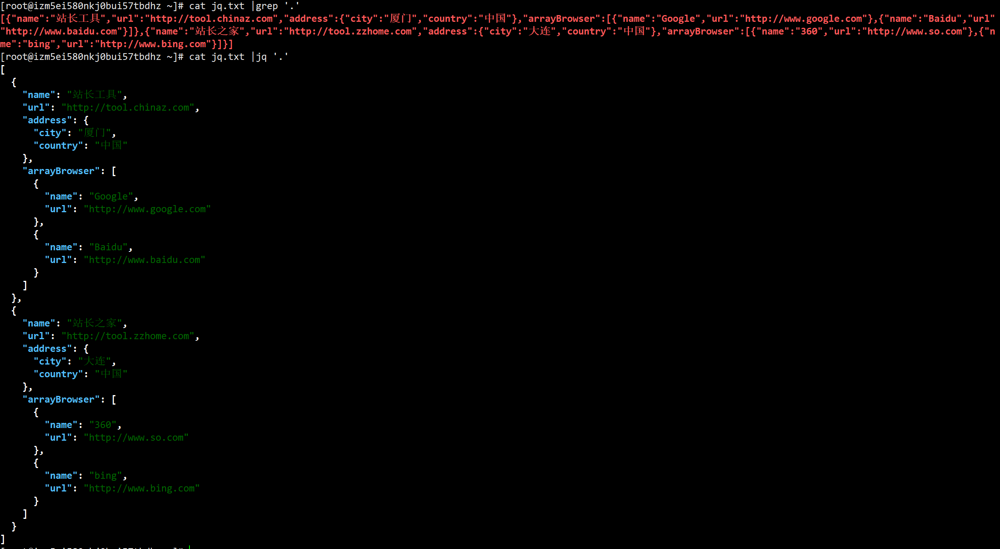

## Linux 命令 - jq

jq可以对json数据进行分片、过滤、映射和转换，和sed、awk、grep等命令一样，都可以让你轻松地把玩文本。它能轻松地把你拥有的数据转换成你期望的格式，而且需要写的程序通常也比你期望的更加简短。github地址：https://stedolan.github.io/jq/

json示例文件jq.txt为：

```
[{"name":"站长工具","url":"http://tool.chinaz.com","address":{"city":"厦门","country":"中国"},"arrayBrowser":[{"name":"Google","url":"http://www.google.com"},{"name":"Baidu","url""http://www.baidu.com"}]},{"name":"站长之家","url":"http://tool.zzhome.com","address":{"city":"大连","country":"中国"},"arrayBrowser":[{"name":"360","url":"http://www.so.com"},{"nme":"bing","url":"http://www.bing.com"}]}]
```

命令：`cat jq.txt|jq '.'`

效果如下：




输出列表中的第一个元素，可以使用[index]：

命令：`cat jq.txt|jq '.[0]'`

效果如下：


jq支持管道线`|`，它如同linux命令中的管道线——把前面命令的输出当作是后面命令的输入。如下命令把`.[0]`作为`{...}`的输入，进而访问嵌套的属性，如`.name`和`.address.city`。

命令：`cat jq.txt |jq '.[0] | {name:.name,address:.address}'`

效果如下：


命令：`cat jq.txt |jq '.[0] | {name:.name,city:.address.city}'`

效果如下：


命令：`cat jq.txt |jq '.[0] | {name:.arrayBrowser[1],city:.address.city}'`

效果如下：


如果希望把jq的输出当作一个数组，可以在前后加上`[]`：

命令：`cat jq.txt |jq "[.[] |{name:.arrayBrowser[1].name,city:.address.city}]"`

效果如下：


在{}中，冒号前面的名字是映射的名称，你可以任意修改，如： 

命令：`cat jq.txt |jq "[.[] |{name_001:.arrayBrowser[1].name,city_002:.address.city}]"`

效果如下：


Read More:

> [给力的linux命令--jq简易教程](https://www.jianshu.com/p/6de3cfdbdb0e)
>
> [每天学习一个命令：jq 命令行下处理 JSON](http://einverne.github.io/post/2018/12/jq-command-line-json-processor.html)


