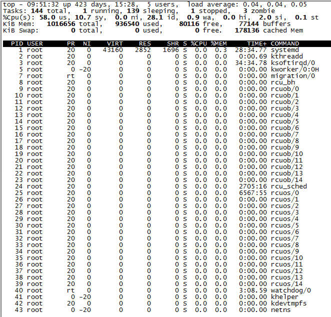

## Linux 命令 - top

### 简介

top 命令是 Linux 下常用的性能分析工具，能够实时显示系统中各个进程的资源占用状况，类似于Windows的任务管理器。

top 显示系统当前的进程和其他状况，是一个动态显示过程，即可以通过用户按键来不断刷新当前状态。如果在前台执行该命令，它将独占前台，直到用户终止该程序为止。比较准确的说，top命令提供了实时的对系统处理器的状态监视。它将显示系统中CPU最“敏感”的任务列表。该命令可以按CPU使用、内存使用、执行时间对任务进行排序；而且该命令的很多特性都可以通过交互式命令或者在个人定制文件中进行设定。

### 参数含义

统计信息区前五行是系统整体的统计信息。

第一行是任务队列信息，同 uptime 命令的执行结果。其内容如下：

| 参数                             | 意义                                       |
| ------------------------------ | ---------------------------------------- |
| 09:51:29                       | 当前时间                                     |
| up 423 days                    | 已经运行天数                                   |
| 15:28                          | 系统运行时间，格式为时:分                            |
| 5 users                        | 当前登录用户数                                  |
| load average: 0.09, 0.04, 0.05 | 系统负载，即任务队列的平均长度。三个数值分别为 1分钟、5分钟、15分钟前到现在的平均值。 |

第二行是进程信息。其内容如下：

| 参数           | 意义       |
| ------------ | -------- |
| 143 total    | 进程总数     |
| 2 running    | 正在运行的进程数 |
| 138 sleeping | 睡眠的进程数   |
| 0 stopped    | 停止的进程数   |
| 3 zombie     | 僵尸进程数    |

第三行是CPU信息。其内容如下：

| 参数      | 意义                       |
| ------- | ------------------------ |
| 1.0 us  | 用户空间占用CPU百分比             |
| 0.3 sy  | 内核空间占用CPU百分比             |
| 0.0 ni  | 用户进程空间内改变过优先级的进程占用CPU百分比 |
| 97.7 id | 空闲CPU百分比                 |
| 1.0 wa  | 等待输入输出的CPU时间百分比          |
| 0.0 hi  | 硬件CPU中断占用百分比             |
| 0.0 si  | 软中断占用百分比                 |
| 0.0 st  | 虚拟机占用百分比                 |

最后两行是内存信息。其内容如下：

| 参数                | 意义                                       |
| ----------------- | ---------------------------------------- |
| KiB Mem：          |                                          |
| 1016656 total     | 物理内存总量                                   |
| 936036 used       | 使用的物理内存总量                                |
| 80620 free        | 空闲内存总量                                   |
| 77144 buffers     | 用作内核缓存的内存量                               |
| KiB Swap：         |                                          |
| 0 total           | 交换区总量                                    |
| 0 used            | 使用的交换区总量                                 |
| 0 free            | 空闲交换区总量                                  |
| 178128 cached Mem | 缓冲的交换区总量，内存中的内容被换出到交换区，而后又被换入到内存，但使用过的交换区尚未被覆盖，该数值即为这些内容已存在于内存中的交换区的大小,相应的内存再次被换出时可不必再对交换区写入。 |

进程信息区统计信息区域的下方显示了各个进程的详细信息。首先来认识一下各列的含义。

| 序号   | 列名      | 含义                                       |
| ---- | ------- | ---------------------------------------- |
| 1    | PID     | 进程id                                     |
| 2    | PPID    | 父进程id                                    |
| 3    | RUSER   | 真正的用户名                                   |
| 4    | UID     | 进程所有者的用户id                               |
| 5    | USER    | 进程所有者的用户名                                |
| 6    | GROUP   | 进程所有者的组名                                 |
| 7    | TTY     | 启动进程的终端名。不是从终端启动的进程则显示为 ?                |
| 8    | PR      | 优先级                                      |
| 9    | NI      | nice值。负值表示高优先级，正值表示低优先级                  |
| 10   | P       | 最后使用的CPU，仅在多CPU环境下有意义                    |
| 11   | %CPU    | 上次更新到现在的CPU时间占用百分比                       |
| 12   | TIME    | 进程使用的CPU时间总计，单位秒                         |
| 13   | TIME+   | 进程使用的CPU时间总计，单位1/100秒                    |
| 14   | %MEM    | 进程使用的物理内存百分比                             |
| 15   | VIRT    | 进程使用的虚拟内存总量，单位kb。VIRT=SWAP+RES           |
| 16   | SWAP    | 进程使用的虚拟内存中，被换出的大小，单位kb。                  |
| 17   | RES     | 进程使用的、未被换出的物理内存大小，单位kb。RES=CODE+DATA     |
| 18   | CODE    | 可执行代码占用的物理内存大小，单位kb                      |
| 19   | DATA    | 可执行代码以外的部分(数据段+栈)占用的物理内存大小，单位kb          |
| 20   | SHR     | 共享内存大小，单位kb                              |
| 21   | nFLT    | 页面错误次数                                   |
| 22   | nDRT    | 最后一次写入到现在，被修改过的页面数。                      |
| 23   | S       | 进程状态(D=不可中断的睡眠状态,R=运行,S=睡眠,T=跟踪/停止,Z=僵尸进程) |
| 24   | COMMAND | 命令名/命令行                                  |
| 25   | WCHAN   | 若该进程在睡眠，则显示睡眠中的系统函数名                     |
| 26   | Flags   | 任务标志，参考 sched.h                          |

默认情况下仅显示比较重要的 PID、USER、PR、NI、VIRT、RES、SHR、S、%CPU、%MEM、TIME+、COMMAND 列。

可以通过下面的快捷键来更改显示内容。 更改显示内容通过 f 键可以选择显示的内容。按 f 键之后会显示列的列表，按 a-z 即可显示或隐藏对应的列，最后按回车键确定。 按 o 键可以改变列的显示顺序。按小写的 a-z 可以将相应的列向右移动，而大写的 A-Z 可以将相应的列向左移动。最后按回车键确定。 按大写的 F 或 O 键，然后按 a-z 可以将进程按照相应的列进行排序。而大写的 R 键可以将当前的排序倒转。

### 命令使用

top 使用格式

`top [-] [d] [q] [c] [S] [s] [i] [n] [b]`

#### 参数说明

| 参数   | 说明                                       |
| ---- | ---------------------------------------- |
| d    | 改变显示的更新速度，或是在交互式指令列( interactive command)按 s |
| q    | 没有任何延迟的显示速度，如果使用者是有 superuser 的权限，则 top 将会以最高的优先序执行 |
| c    | 切换显示模式，共有两种模式，一是只显示执行档的名称，另一种是显示完整的路径与名称S : 累积模式，会将己完成或消失的子行程 ( dead child process ) 的 CPU time 累积起来 |
| s    | 安全模式，将交互式指令取消, 避免潜在的危机                   |
| i    | 不显示任何闲置 (idle) 或无用 (zombie) 的行程          |
| n    | 更新的次数，完成后将会退出 top                        |
| b    | 批次档模式，搭配 "n" 参数一起使用，可以用来将 top 的结果输出到档案内  |

#### 交互命令

| 命令    | 说明                                       |
| ----- | ---------------------------------------- |
| h / ? | 显示帮助画面，给出一些简短的命令总结说明                     |
| k     | 终止一个进程。系统将提示用户输入需要终止的进程PID，以及需要发送给该进程什么样的信号。一般的终止进程可以使用15信号；如果不能正常结束那就使用信号9强制结束该进程。默认值是信号15。在安全模式中此命令被屏蔽 |
| i     | 忽略闲置和僵死进程。这是一个开关式命令                      |
| q     | 退出程序                                     |
| r     | 重新安排一个进程的优先级别。系统提示用户输入需要改变的进程PID以及需要设置的进程优先级值。输入一个正值将使优先级降低，反之则可以使该进程拥有更高的优先权。默认值是10 |
| S     | 切换到累计模式                                  |
| s     | 改变两次刷新之间的延迟时间。系统将提示用户输入新的时间，单位为s。如果有小数，就换算成m s。输入0值则系统将不断刷新，默认值是5 s。需要注意的是如果设置太小的时间，很可能会引起不断刷新，从而根本来不及看清显示的情况，而且系统负载也会大大增加 |
| f / F | 从当前显示中添加或者删除项目                           |
| o / O | 改变显示项目的顺序                                |
| l     | 切换显示平均负载和启动时间信息                          |
| m     | 切换显示内存信息                                 |
| t     | 切换显示进程和CPU状态信息                           |
| c     | 切换显示命令名称和完整命令行                           |
| M     | 根据驻留内存大小进行排序                             |
| P     | 根据CPU使用百分比大小进行排序                         |
| T     | 根据时间/累计时间进行排序                            |
| W     | 将当前设置写入~/.toprc文件中。这是写top配置文件的推荐方法       |

#### 常用操作

| 命令                    | 说明                                       |
| --------------------- | ---------------------------------------- |
| top                   | 每隔5秒显式所有进程的资源占用情况                        |
| top -d 2              | 每隔2秒显式所有进程的资源占用情况                        |
| top -c                | 每隔5秒显式进程的资源占用情况，并显示进程的命令行参数(默认只有进程名)     |
| top -p 12345 -p 6789  | 每隔5秒显示pid是12345和pid是6789的两个进程的资源占用情况     |
| top -d 2 -c -p 123456 | 每隔2秒显示pid是12345的进程的资源使用情况，并显示该进程启动的命令行参数 |

#### Load Average

平均负载 (load average) 是指系统的运行队列的平均利用率，也可以认为是可运行进程的平均数。通过系统命令"w" 或"top"可以查看当前 load average 情况。

第一位：表示最近1分钟平均负载；
第二位：表示最近5分钟平均负载；
第三位：表示最近15分钟平均负载。

假设我们的系统是单CPU单内核的，把它比喻成是一条单向马路，把CPU任务比作汽车。当车不多的时候，load < 1；当车占满整个马路的时候 load = 1；当马路都站满了，而且马路外还堆满了汽车的时候，load > 1。

我们经常会发现服务器Load > 1但是运行仍然不错，那是因为服务器是多核处理器。假设我们服务器CPU是2核，那么将意味我们拥有2条马路，我们的Load = 2时，所有马路都跑满车辆。

- 0.7 < load < 1：此时是不错的状态，如果进来更多的汽车，你的马路仍然可以应付；
- load = 1：你的马路即将拥堵，而且没有更多的资源额外的任务，赶紧看看发生了什么吧；
- load > 5：非常严重拥堵，我们的马路非常繁忙，每辆车都无法很快的运行。

通常我们先看15分钟load，如果load很高，再看1分钟和5分钟负载，查看是否有下降趋势。1分钟负载值 > 1，那么我们不用担心，但是如果15分钟负载都超过1，我们要赶紧看看发生了什么事情。所以我们要根据实际情况查看这三个值。

Read More:

> [Linux系统中的load average](http://www.cnblogs.com/kaituorensheng/p/3602805.html)  
>
> [linux 平均负载 load average 的含义](http://www.cnblogs.com/ghj1976/p/5611220.html)  
>
> [linux的top命令参数详解](http://www.cnblogs.com/ggjucheng/archive/2012/01/08/2316399.html)  
>
> [Linux top命令](http://www.runoob.com/linux/linux-comm-top.html)

