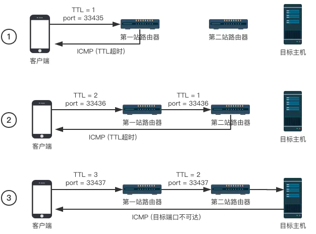
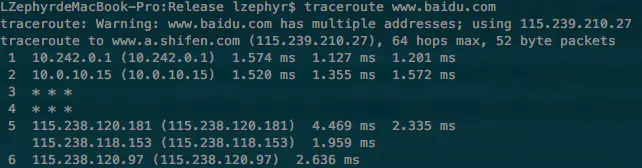
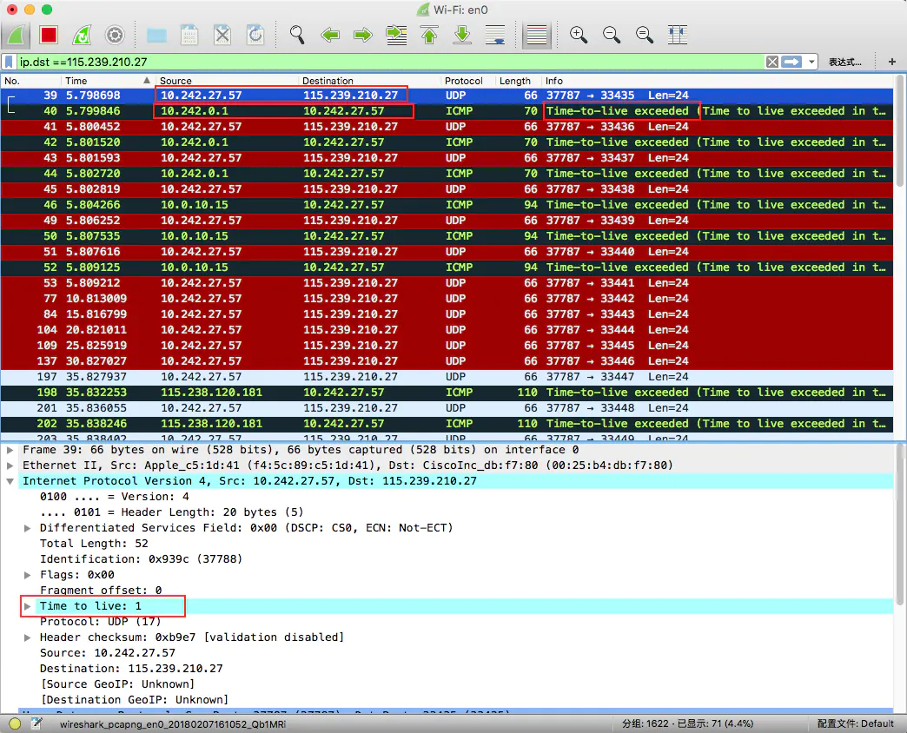
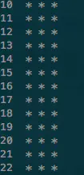
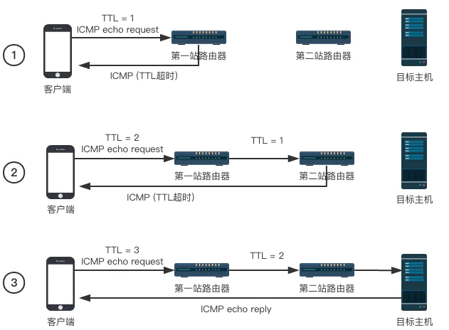
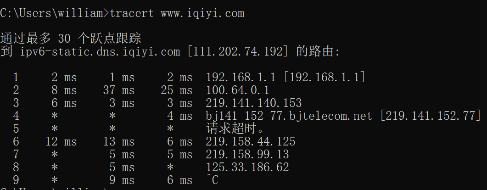

## traceroute的实现原理

现实世界中的网络是由无数的计算机和路由器组成的一张的大网，应用的数据包在发送到服务器之前都要经过层层的路由转发。而 `traceroute` 是一种常规的网络分析工具，用来定位到目标主机之间的所有路由器。

### 安装traceroute

若未安装该命令，需执行以下命令进行安装

```
yum install -y traceroute
```

测试一下

```
[root@test ~]# traceroute www.iqiyi.com
traceroute to www.iqiyi.com (124.192.145.92), 30 hops max, 60 byte packets
 1  gateway (10.16.191.254)  14.099 ms  14.475 ms  14.773 ms
 2  172.27.33.82 (172.27.33.82)  0.366 ms  0.399 ms  0.409 ms
 3  10.16.156.15 (10.16.156.15)  0.109 ms 10.16.156.16 (10.16.156.16)  0.106 ms  0.110 ms
 4  172.16.20.30 (172.16.20.30)  2.039 ms  2.061 ms 172.16.20.46 (172.16.20.46)  1.950 ms
 5  * * *
 6  * * *
 7  * * *
 8  * * *
 9  *^C

```

从结果中看到，`www.iqiyi.com` 解析的ip地址为 `124.192.145.92` ，最多经过30跳，发送的数据包为60字节，每一行都有三个时间，是探测数据包向每个网关发送三个数据包后，网关响应后返回的时间。

traceroute参数如下

- -d: 使用Socket层级的排错功能
- -f<存活数值>: 设置第一个检测数据包的存活数值TTL的大小
- -F: 设置勿离断位
- -g<网关>: 设置来源路由网关，最多可设置8个
- -i<网络界面>: 使用指定的网络界面送出数据包
- -I: 使用ICMP回应取代UDP资料信息
- -m<存活数值>: 设置检测数据包的最大存活数值TTL的大小
- -n: 直接使用IP地址而非主机名称
- -p<通信端口>: 设置UDP传输协议的通信端口
- -r: 忽略普通的Routing Table，直接将数据包送到远端主机上
- -s<来源地址>: 设置本地主机送出数据包的IP地址
- -t<服务类型>: 设置检测数据包的TOS数值
- -v: 详细显示指令的执行过程
- -w<超时秒数>: 设置等待远端主机回报的时间
- -x: 开启或关闭数据包的正确性检验

### 名词解释

在介绍traceroute的原理之前，需要了解几个技术名词

#### IP协议

IP协议是TCP/IP协议族中最核心的部分，它的作用是在两台主机之间传输数据，所有上层协议的数据（HTTP、TCP、UDP等）都会被封装在一个个的IP数据包中被发送到网络上。

#### ICMP

 ICMP全称为[互联网控制报文协议](https://zh.wikipedia.org/wiki/%E4%BA%92%E8%81%94%E7%BD%91%E6%8E%A7%E5%88%B6%E6%B6%88%E6%81%AF%E5%8D%8F%E8%AE%AE)，它常用于传递错误信息，ICMP协议是IP层的一部分，它的报文也是通过IP数据包来传输的。

#### TTL

 TTL（time-to-live）是IP数据包中的一个字段，它指定了数据包最多能经过几次路由器。从我们源主机发出去的数据包在到达目的主机的路上要经过许多个路由器的转发，在发送数据包的时候源主机会设置一个TTL的值，每经过一个路由器TTL就会被减去一，当TTL为0的时候该数据包会被直接丢弃（不再继续转发），并发送一个超时ICMP报文给源主机。

### 实现方案

#### 基于UDP的实现

在基于UDP的实现中，客户端发送的数据包是通过UDP协议来传输的，使用了一个大于30000的端口号，服务器在收到这个数据包的时候会返回一个**端口不可达**的ICMP错误信息，客户端通过判断收到的错误信息是TTL超时还是端口不可达来判断数据包是否到达目标主机，具体的流程如图：



- 客户端发送一个TTL为1，端口号大于30000的UDP数据包，到达第一站路由器之后TTL被减去1，返回了一个超时的ICMP数据包，客户端得到第一跳路由器的地址

- 客户端发送一个TTL为2的数据包，在第二跳的路由器节点处超时，得到第二跳路由器的地址

- 客户端发送一个TTL为3的数据包，数据包成功到达目标主机，返回一个**端口不可达**错误，traceroute结束

Linux和macOS系统自带了一个`traceroute`指令，可以结合Wireshark抓包来看看它的实现原理。首先对百度的域名进行traceroute：`traceroute www.baidu.com`，每一跳默认发送三个数据包，我们会看到下面这样的输出：



对该域名的IP：`115.239.210.27`进行traceroute，此时Wireshark抓包的结果如下：



注意看红框处的内容，跟第一张图对比，可以看到`traceroute`程序首先通过UDP协议向目标地址115.239.210.27发送了一个**TTL为1**的数据包，然后在第一个路由器中TTL超时，返回一个错误类型为`Time-to-live exceeded`的ICMP数据包，此时我们通过该数据包的源地址可知第一站路由器的地址为`10.242.0.1`。之后只需要不停增加TTL的值就能得到每一跳的地址了。

然而一直跑下去会发现，traceroute并不能到达目的地，当TTL增加到一定大小之后就一直拿不到返回的数据包了：



其实这个时候数据包已经到达目标服务器了，但是因为安全问题大部分的应用服务器都不提供UDP服务（或者被防火墙挡掉），所以我们拿不到服务器的任何返回，程序就理所当然的认为还没有结束，一直尝试增加数据包的TTL。

目前在网上找到许多开源iOS traceroute实现大多都是基于UDP的方案，实际用起来并不能达到想要的效果，所以我们需要采用另一种方案来实现。

#### 基于ICMP的实现

上述方案失败的原因是由于服务器对于UDP数据包的处理，所以在这一种实现中我们不使用UDP协议，而是直接发送一个**ICMP回显请求（echo request）**数据包，服务器在收到回显请求的时候会向客户端发送一个**ICMP回显应答（echo reply）**数据包，在这之后的流程还是跟第一种方案一样。这样就避免了我们的traceroute数据包被服务器的防火墙策略墙掉。

采用这种方案的实现流程如下：



- 客户端发送一个TTL为1的**ICMP请求回显**数据包，在第一跳的时候超时并返回一个ICMP超时数据包，得到第一跳的地址。

- 客户端发送一个TTL为2的ICMP请求回显数据包，得到第二跳的地址。

- 客户端发送一个TTL为3的ICMP请求回显数据包，到达目标主机，目标主机返回一个**ICMP回显应答**，traceroute结束。

可以看出与第一种实现相比，区别主要在发送的数据包类型以及对于结束的判断上，大体的流程还是一致的。

**需要注意的是**，并不是所有网关都会如实返回 ICMP 超时报文。出于安全性考虑，大多数防火墙以及启用了防火墙功能的路由器缺省配置为不返回各种 ICMP 报文，其余路由器或交换机也可被管理员主动修改配置变为不返回 ICMP 报文。因此 Traceroute 程序不一定能拿全所有的沿途网关地址。所以，当某个 TTL 值的数据包得不到响应时，并不能停止这一追踪过程，程序仍然会把 TTL 递增而发出下一个数据包。一直达到默认或用参数指定的追踪限制（maximum_hops）才结束追踪。

依据上述原理，利用了 UDP 数据包的 Traceroute 程序在数据包到达真正的目的主机时，就可能因为该主机没有提供 UDP 服务而简单将数据包抛弃，并不返回任何信息。为了解决这个问题，Traceroute 故意使用了一个大于 30000 的端口号，因 UDP 协议规定端口号必须小于 30000，所以目标主机收到数据包后唯一能做的事就是返回一个“端口不可达”的 ICMP 报文，于是主叫方就将端口不可达报文当作跟踪结束的标志。

在Windows系统中也有traceroute程序，它的名字叫做`tracert`，`tracert`就是用采用这种方法来实现的。




Read More:

> [互联网控制消息协议](https://zh.wikipedia.org/wiki/%E4%BA%92%E8%81%94%E7%BD%91%E6%8E%A7%E5%88%B6%E6%B6%88%E6%81%AF%E5%8D%8F%E8%AE%AE)
>
> [Traceroute](https://zh.wikipedia.org/wiki/Traceroute)
>
> [Traceroute（路由追踪）的原理及实现](https://www.jianshu.com/p/75a5822d0eec)