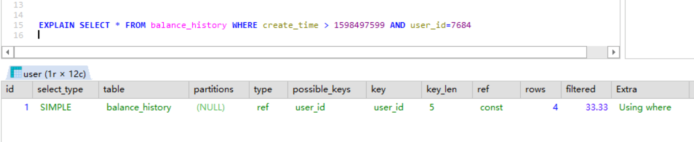

## Mysql 系列 - explain

通常我们在优化Mysql语句时会使用explain关键字，它是MySQL 提供的对 SELECT 语句进行分析并输出 SELECT 执行的详细信息的命令，其输出结果如下图：

### explain结果

| 字段          | 含义                                                         | 说明                             |
| ------------- | ------------------------------------------------------------ | -------------------------------- |
| id            | SELECT 查询的标识符，每个 SELECT 都会自动分配一个唯一的标识符 | id大的先执行，id相等由上到下执行 |
| select_type   | SELECT 查询的类型                                            |                                  |
| table         | 查询的表名                                                   |                                  |
| partitions    | 匹配的分区                                                   | 分库时使用                       |
| type          | join 类型                                                    |                                  |
| possible_keys | 此次查询中可能选用的索引                                     |                                  |
| key           | 此次查询中确切使用到的索引                                   |                                  |
| key_len       | 实际选择的索引的长度                                         |                                  |
| ref           | 哪个字段或常数与 key 一起被使用                              |                                  |
| rows          | 显示此查询共扫描了多少行，估计值                             |                                  |
| filtered      | 表示此查询条件所过滤的数据的百分比                           |                                  |
| Extra         | 额外的信息                                                   |                                  |

### select_type

| 取值               | 含义                                                         |
| ------------------ | ------------------------------------------------------------ |
| SIMPLE             | 此查询不包含 UNION 查询或子查询                              |
| PRIMARY            | 此查询是最外层的查询                                         |
| UNION              | 此查询是 UNION 的第二或随后的查询                            |
| DEPENDENT UNION    | UNION 中的第二个或后面的查询语句，取决于外面的查询           |
| UNION RESULT       | UNION 的结果                                                 |
| SUBQUERY           | 子查询中的第一个 SELECT                                      |
| DEPENDENT SUBQUERY | 子查询中的第一个 SELECT，取决于外面的查询，即子查询依赖于外层查询的结果 |

### type

| 取值   | 含义                                                         |
| ------ | ------------------------------------------------------------ |
| system | 表中只有一条数据，这个类型是特殊的 `const` 类型              |
| const  | 针对主键或唯一索引的等值查询扫描，最多只返回一行数据。const 查询速度非常快，因为它仅仅读取一次即可 |
| eq_ref | 此类型通常出现在多表的 join 查询，表示对于前表的每一个结果，都只能匹配到后表的一行结果，并且查询的比较操作通常是 `=`，查询效率较高 |
| ref    | 此类型通常出现在多表的 join 查询，针对于非唯一或非主键索引，或者是使用了最左前缀规则索引的查询 |
| range  | 使用索引范围查询，通过索引字段范围获取表中部分数据记录。这个类型通常出现在 =, <>, >, >=, <, <=, IS NULL, <=>, BETWEEN, IN() 操作中（当 `type` 是 `range` 时, 那么 EXPLAIN 输出的 `ref` 字段为 NULL，并且 `key_len` 字段是此次查询中使用到的索引的最长的那个） |
| index  | 全索引扫描(full index scan)，和 ALL 类型类似，只不过 ALL 类型是全表扫描，而 index 类型则仅仅扫描所有的索引，而不扫描数据 |
| all    | 全表扫描, 这个类型的查询是性能最差的查询之一                 |

效率比较：all< index < range< ref < eq_ref < const < system

### key_len

表示查询优化器使用了索引的字节数。这个字段可以评估组合索引是否完全被使用，或只有最左部分字段被使用到，key_len 的计算规则如下：

- 字符串
  - char(n)：n 字节长度
  - varchar(n)：如果是 utf8 编码, 则是 3 \*n + 2字节; 如果是 utf8mb4 编码, 则是 4\* n + 2 字节.
- 数值类型:
  - TINYINT：1字节
  - SMALLINT：2字节
  - MEDIUMINT：3字节
  - INT：4字节
  - BIGINT：8字节
- 时间类型
  - DATE：3字节
  - TIMESTAMP：4字节
  - DATETIME：8字节
- 字段属性：NULL 属性占用一个字节，如果一个字段是 NOT NULL 的，则没有此属性。

### rows

MySQL 查询优化器根据统计信息估算 SQL 要查找到结果集需要扫描读取的数据行数。这个值非常直观显示 SQL 的效率好坏，原则上 rows 越少越好。

### Extra

| 取值                  | 含义                                                         |
| --------------------- | ------------------------------------------------------------ |
| Using index           | 查询在索引树中就可查找所需数据, 不用扫描表数据文件           |
| Using index condition | 使用索引下推，延迟回表，且减少了需要回表的结果集             |
| Using temporary       | 查询有使用临时表，一般出现于排序，分组和多表 join 的情况，查询效率不高 |
| Using filesort        | MySQL 需额外的排序操作，不能通过索引顺序达到排序效果。数量小时使用内存排序，数量大时使用磁盘排序 |
| Using where           | 在存储引擎层检索出记录后，在server利用where条件进行过滤，并返回给客户端 |

Read More:

> [MySQL 性能优化神器 Explain 使用分析](https://segmentfault.com/a/1190000008131735)
>
> [mysql explain 详解](http://weikeqin.com/2020/02/05/mysql-explain/)