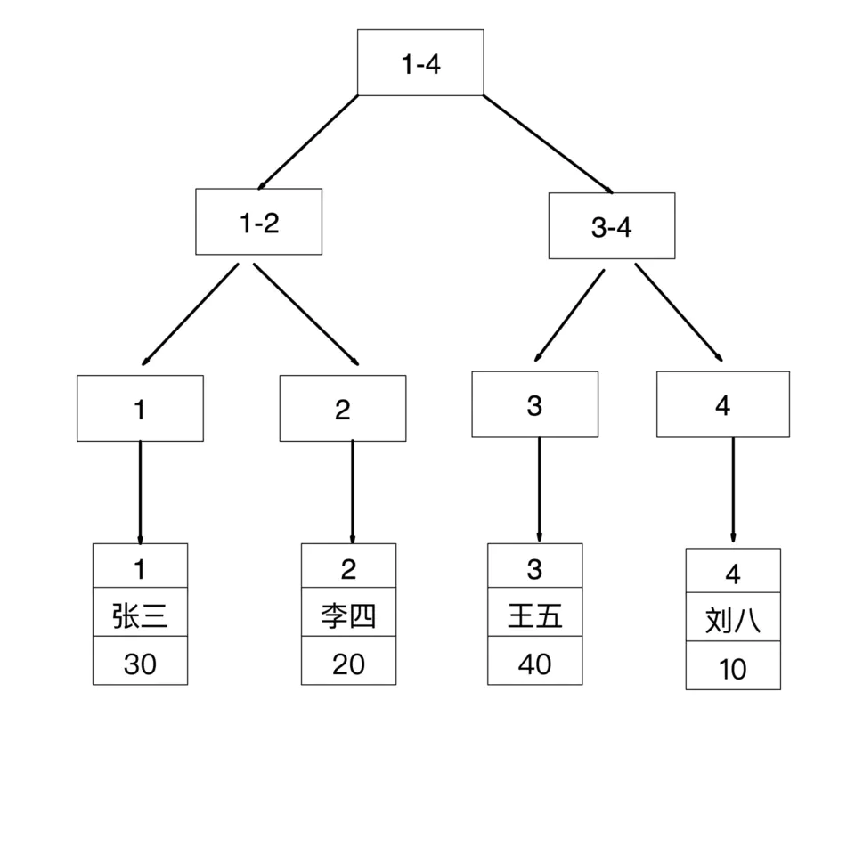
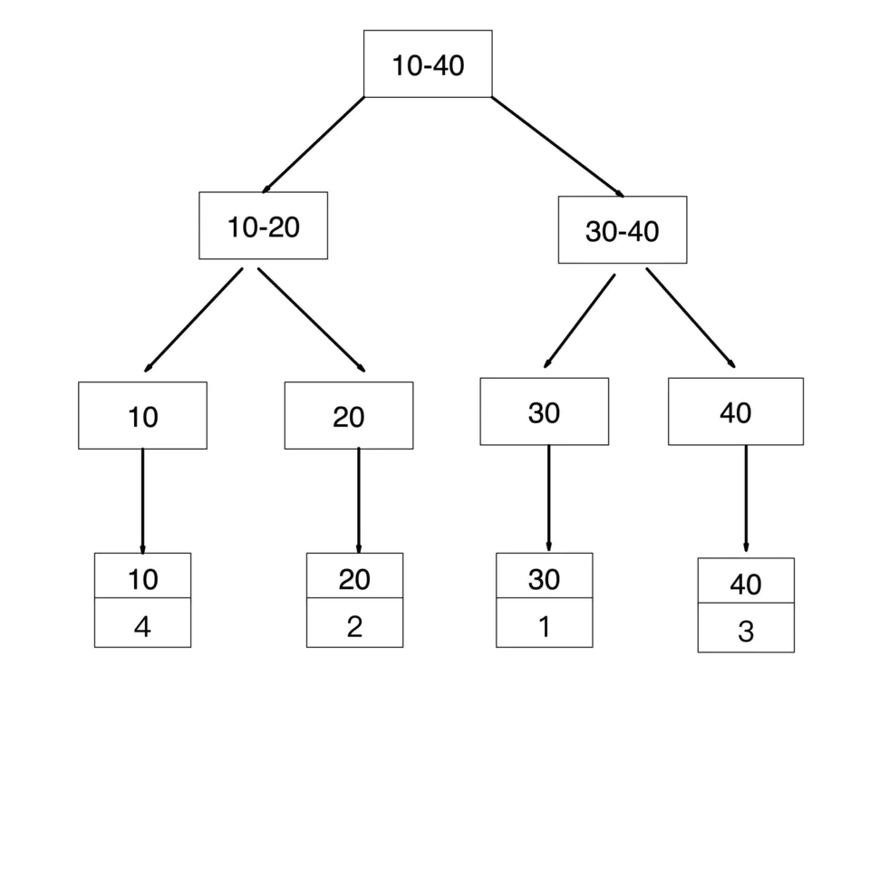
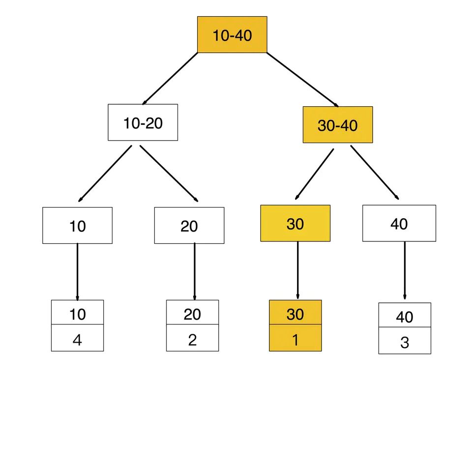
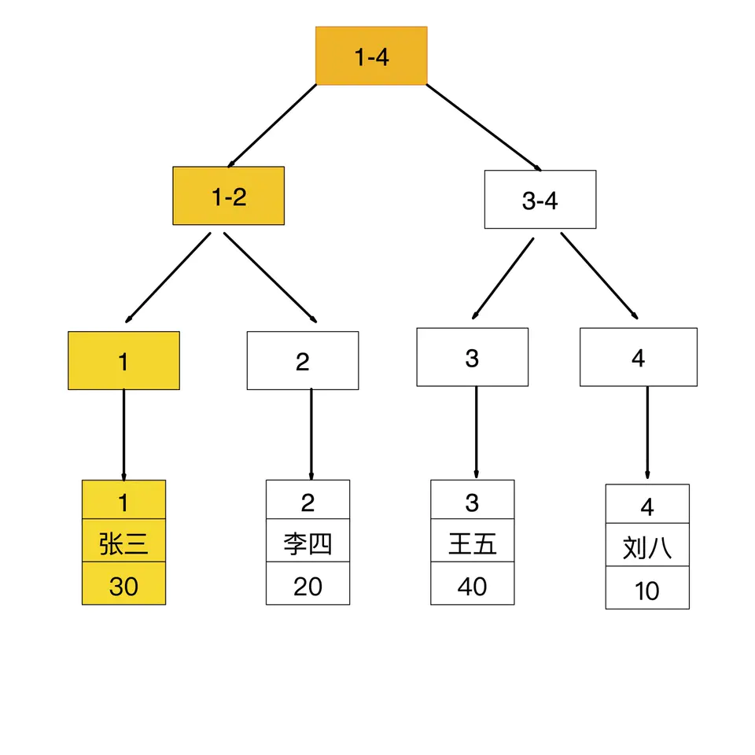
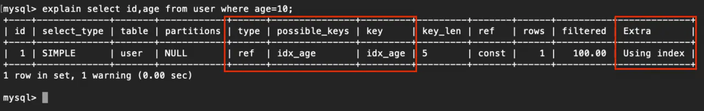
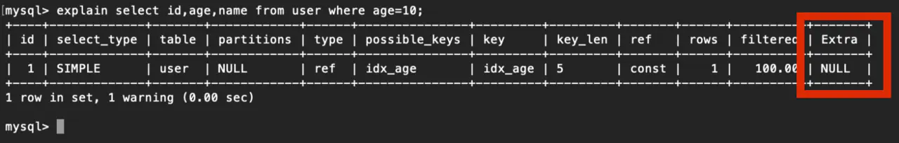
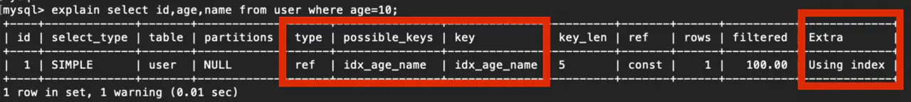

## Mysql 系列 - 回表查询和覆盖索引

#### 回表查询

通俗的讲就是，如果索引的列在 Select 所需获得的列中或者根据一次索引查询就能获得记录就不需要回表，如果 Select 所需获得列中有大量的非索引列，索引就需要到表中找到相应的列的信息，这就叫回表查询。

InnoDB聚集（聚簇）索引的叶子节点存储行记录，非叶子节点存储主键索引，因此， InnoDB必须要有且只有一个聚集索引：

（1）如果表定义了主键，则PK就是聚集索引；
（2）如果表没有定义主键，则第一个非空唯一索引（not NULL unique）列是聚集索引；
（3）否则，InnoDB会创建一个隐藏的row-id作为聚集索引；

#### 示例

建表如下：

```
mysql> create table user(
    -> id int(10) auto_increment,
    -> name varchar(30),
    -> age tinyint(4),
    -> primary key (id),
    -> index idx_age (age)
    -> )engine=innodb charset=utf8mb4;
```

其中，id 字段是聚簇索引（主键索引），age 字段是普通索引（二级索引）

表中数据如下：

```
mysql> select * from user;
+----+--------+------+
| id | name  | age |
+----+--------+------+
| 1 | 张三  |  30 |
| 2 | 李四  |  20 |
| 3 | 王五  |  40 |
| 4 | 刘八  |  10 |
+----+--------+------+
```

索引存储结构如下：

id是主键，聚簇索引结构如下



age是普通索引，非聚簇索引结构如下



如果查询条件为主键，则只需扫描一次B+树即可通过聚簇索引定位到要查找的行记录数据。如：`select * from user where id = 1`


如果查询条件为普通索引（非聚簇索引），需要扫描两次B+树，第一次扫描通过普通索引定位到聚簇索引的值，然后第二次扫描通过聚簇索引的值定位到要查找的行记录数据。 如：`select * from user where age = 30`

> 先通过普通索引 age=30 定位到主键值 id=1
>
> 再通过聚集索引 id=1 定位到行记录数据





#### 索引覆盖

只需要在一棵索引树上就能获取SQL所需的所有列数据，无需回表，速度更快。

常见的方法是将被查询的字段建立到联合索引里去。

实现：`select id,age from user where age = 10`

explain分析：因为age是普通索引，使用到了age索引，通过一次扫描B+树即可查询到相应的结果，这样就实现了覆盖索引



实现：`select id,age,name from user where age = 10`

explain分析：age是普通索引，但name列不在索引树上，所以通过age索引在查询到id和age的值后，需要进行回表再查询name的值。此时的Extra列的NULL表示进行了回表查询




因此，为了实现索引覆盖，需要建组合索引 `idx_age_name(age,name)`

```
drop index idx_age on user;
create index idx_age_name on user(`age`,`name`);
```

explain分析：此时字段age和name是组合索引idx_age_name，查询的字段id、age、name的值刚刚都在索引树上，只需扫描一次组合索引B+树即可，这就是实现了索引覆盖，此时的Extra字段为Using index表示使用了索引覆盖。




Read More:

> [MySQL 的覆盖索引与回表](https://juejin.cn/post/6844904062329028621)
>
> [回表与覆盖索引，索引下推](https://www.jianshu.com/p/d0d3de6832b9)
>
> [mysql-回表查询是什么](https://blog.csdn.net/CPLASF_/article/details/108799381)