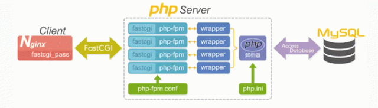

## PHP 系列 - FCGI 与 FPM

### 基本概念

#### CGI

**通用网关接口**（Common Gateway Interface/CGI）是一种重要的互联网技术，可以让一个客户端，从网页浏览器向执行在网络服务器上的程序请求数据。CGI 描述了服务器和请求处理程序之间传输数据的一种标准。

#### FCGI

**快速通用网关接口**（Fast Common Gateway Interface/FastCGI）是一种让交互程序与 Web 服务器通信的协议。多数流行的 HTTP server 都支持 FastCGI，包括 Apache、Nginx 和 lighttpd 等，同时，FastCGI 也被许多脚本语言所支持，其中就有 PHP。FastCGI 是早期通用网关接口（CGI）的增强版本。

FastCGI 致力于减少网页服务器与 CGI 程序之间互动的开销，从而使服务器可以同时处理更多的网页请求。

>  CGI 和 FastCGI 是一种通信协议规范，不是一个实体。

在平时讨论中我们应该用词规范。有些人说 CGI ，其实指的是实现 CGI 协议的程序，我们称之为 CGI 程序；有些人说 FCGI ，其实指的是实现 FCGI 协议的程序，我们称之为 FCGI 程序。

### CGI 程序

web server（比如说 Nginx）只是内容的分发者。比如，如果请求 `/index.html`，那么 web server 会去文件系统中找到这个文件，发送给浏览器，这里分发的是静态数据。如果现在请求的是 `/index.php`，根据配置文件，Nginx 知道这个不是静态文件，需要去找 PHP 解析器来处理，那么他会把这个请求简单处理后交给 PHP 解析器。Nginx 会传哪些数据给 PHP 解析器呢？比如：URL、查询字符串、POST 数据、HTTP header等。CGI 就是规定要传哪些数据、以什么样的格式传递给后方处理这个请求的协议。

当 web server 收到 `/index.php` 这个请求后，会启动对应的 CGI 程序，这里就是 PHP 的解析器。接下来 PHP 解析器会解析 php.ini 文件，初始化执行环境，然后处理请求，再以规定 CGI 规定的格式返回处理后的结果，退出进程。web server 再把结果返回给浏览器。

CGI 程序运行在独立的进程中，并对每个 Web 请求建立一个进程（每个请求都会解析 php.ini、初始化执行环境、处理请求），这种方法非常容易实现，但效率很差，难以扩展。面对大量请求，进程的大量建立和消亡使操作系统性能大大下降。此外，由于地址空间无法共享，也限制了资源重用。

### FCGI 程序

FCGI 协议是 CGI 协议的增强版本，是为了提高 CGI 程序的性能。那么CGI 程序的性能问题在哪呢？

就是"PHP解析器解析php.ini文件，初始化执行环境"这个工作。标准的CGI 程序对每个请求都会执行这些步骤，所以处理每个时间的时间会比较长。

那么 FCGI 程序是怎么做的呢？首先，FCGI 程序会先启一个 master，解析配置文件，初始化执行环境，然后再启动多个worker。当请求过来时，master 会传递给一个 worker，然后立即可以接受下一个请求。这样就避免了重复的劳动，效率自然是高。而且当 worker 不够用时，master 可以根据配置预先启动几个 worker 等着；当然空闲 worker 太多时，也会停掉一些，这样就提高了性能，也节约了资源。这就是 FCGI 程序的对进程的管理。

### PHP-CGI 与 PHP-FPM

**PHP-CGI 和 PHP-FPM 都是实现 FastCGI 协议 的程序，并且提供了进程管理的功能**

PHP-FPM 是一个 PHP 进程管理器，包含 master 进程和 worker 进程两种进程：master 进程只有一个，负责监听端口，接收来自 Web Server 的请求，而 worker 进程则一般有多个 (具体数量根据实际需要配置)，每个进程内部都嵌入了一个 PHP 解释器，是 PHP 代码真正执行的地方。

PHP-CGI 的问题在于 ：

- PHP-CGI 变更 php.ini 配置后需重启 PHP-CGI 才能让新的 php-ini 生效，不可以平滑重启 
- 直接杀死 PHP-CGI 进程，PHP 就不能运行了。(PHP-FPM和Spawn-FCGI就没有这个问题，守护进程会平滑从新生成新的子进程。） 

针对 PHP-CGI 的不足，PHP-FPM（PHP-Fast CGI Process Manager） 应运而生。PHP-FPM 的管理对象是 PHP-CGI。使用 PHP-FPM 来控制 PHP-CGI 的 FastCGI 进程。

### FCGI运行模式分析

FastCGI 的工作原理是：

1. Web Server 启动时载入 FastCGI 进程管理器（PHP-FPM）；
2. FastCGI 进程管理器自身初始化，启动多个 CGI 解释器进程 (在任务管理器中可见多个 php-cgi.exe )并等待来自 Web Server 的连接；
3. 当客户端请求到达 Web Server 时，FastCGI 进程管理器选择并连接到一个 CGI 解释器。Web server 将 CGI 环境变量和标准输入发送到 FastCGI 子进程 php-cgi.exe；
4. FastCGI 子进程完成处理后将标准输出和错误信息从同一连接返回 Web Server。当 FastCGI 子进程关闭连接时，请求便告处理完成。FastCGI 子进程接着等待并处理来自 FastCGI 进程管理器（运行在 WebServer中）的下一个连接。 在正常的CGI模式中，php-cgi.exe 在此便退出了。

如果使用正常的 CGI 协议，你可以想象请求处理有多慢。每一个 Web 请求 PHP 都必须重新解析 php.ini、重新载入全部 dll 扩展并重初始化全部数据结构。使用 FastCGI，所有这些 都只在进程启动时发生一次。一个额外的好处是，持续数据库连接可以工作。

FastCGI 的主要优点是把动态语言和 HTTP Server 分离开来，所以 Nginx 与 PHP/PHP-FPM 经常被部署在不同的服务器上，以分担前端 Nginx 服务器的压力，使 Nginx 专一处理静 态请求和转发动态请求，而 PHP/PHP-FPM 服务器专一解析PHP动态请求。

### 给张图

图中表示了 Nginx、FCGI、Wrapper、PHP 之间的关系。其中 fastcgi_pass 指定了 FastCGI 服务器监听端口与地址，Wrapper 是调用其他程序的一段辅助程序，整个的执行流程是：

- 用户将 HTTP 请求发送给 Nginx 服务器；
- Nginx  会根据用户访问的 URL 和后缀对请求进行判断，如果请求的是静态资源（HTML页面）会直接返回，如果请求的是动态资源，执行下一步；
- Nginx  会将请求交给 fastcgi 客户端，通过 fastcgi_pass 将用户的请求发送给 PHP-FPM；
- fastcgi_pass 将动态资源交给 PHP-FPM 后，PHP-FPM 会将资源转给 PHP 脚本解析服务器的 Wrapper；
- Wrapper 收到 PHP-FPM 转过来的请求后，Wrapper 会生成一个新的线程调用 PHP 动态程序解析服务器；
- PHP 会将查询到的结果返回给 Nginx ；
- Nginx  构造一个响应报文将结果返回给用户。

Read More:

> [PHP-FastCGI详解](http://www.cnblogs.com/JohnABC/p/3529786.html)   
>
> [搞不清FastCgi与PHP-fpm之间是个什么样的关系](https://segmentfault.com/q/1010000000256516)  
>
> [关于CGI 和 PHP-FPM需要弄清的](http://www.cleey.com/blog/single/id/848.html)  
>
> [理解CGI、FCGI、php-cgi、php-fpm的概念](http://blog.csdn.net/fan2012huan/article/details/53020064)  
>
> [Nginx-->进阶-->原理-->Nginx+php+fastcgi的原理与关系](http://www.cnblogs.com/mangguoxiansheng/p/5967745.html)  
>
> [Nginx+Php-fpm运行原理详解](https://segmentfault.com/a/1190000007322358) 

