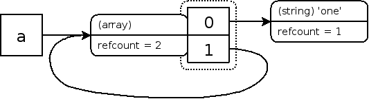

## PHP 系列 - 垃圾回收机制

### 概述

在5.2及更早版本的PHP中，没有专门的垃圾回收器GC（Garbage Collection），引擎在判断一个变量空间是否能够被释放的时候是依据这个变量的zval的refcount的值，如果refcount为0，那么变量的空间可以被释放，否则就不释放，这是一种非常简单的GC实现。

然而在这种简单的GC实现方案中，出现了意想不到的变量内存泄漏情况（[Bug](http://bugs.php.net/bug.php?id=33595)），引擎将无法回收这些内存，于是在PHP 5.3中出现了新的GC，新的GC有专门的机制负责清理垃圾数据，防止内存泄漏。

手册中相关内容：[垃圾回收机制](http://php.net/manual/zh/features.gc.php)  在介绍这个新的GC之前，读者必须先了解PHP中变量的内部存储相关知识，请先阅读  [PHP内核探索：变量的内部存储（值和类型）](https://runnerliu.github.io/2017/04/15/phpvarinternstore1/)  [PHP内核探索：变量的内部存储（引用和计数）](https://runnerliu.github.io/2017/04/15/phpvarinternstore2/)

### 什么算垃圾

首先我们需要定义一下“垃圾”的概念，新的GC负责清理的垃圾是指变量的容器zval还存在，但是又没有任何变量名指向此zval。因此GC判断是否为垃圾的一个重要标准是有没有变量名指向变量容器zval。
假设我们有一段PHP代码，使用了一个临时变量`$tmp`存储了一个字符串，在处理完字符串之后，就不需要这个`$tmp`变量了，`$tmp`变量对于我们来说可以算是一个“垃圾”了，但是对于GC来说，`$tmp`其实并不是一个垃圾，`$tmp`变量对我们没有意义，但是这个变量实际还存在，`$tmp`符号依然指向它所对应的zval，GC会认为PHP代码中可能还会使用到此变量，所以不会将其定义为垃圾。

那么如果我们在PHP代码中使用完`$tmp`后，调用unset删除这个变量，那么`$tmp`是不是就成为一个垃圾了呢。很可惜，GC仍然不认为`$tmp`是一个垃圾，因为`$tmp`在unset之后，refcount减少1变成了0(这里假设没有别的变量和`$tmp`指向相同的zval)，这个时候GC会直接将`$tmp`对应的zval的内存空间释放，`$tmp`和其对应的zval就根本不存在了。此时的`$tmp`也不是新的GC所要对付的那种“垃圾”。那么新的GC究竟要对付什么样的垃圾呢，下面我们将生产一个这样的垃圾。  

### 顽固垃圾的产生过程

如果读者已经阅读了变量内部存储相关的内容，想必对refcount和is\_ref这些变量内部的信息有了一定的了解。这里我们将结合手册中的一个例子来介绍垃圾的产生过程：

```
<?php
$a = array('one');
$a[] = &$a;
xdebug_debug_zval('a');
?>
```

以上例程的输出类似于：

```
a: (refcount=2, is_ref=1)=array (
   0 => (refcount=1, is_ref=0)='one',
   1 => (refcount=2, is_ref=1)=...
)
```

图示：



能看到数组变量 (a) 同时也是这个数组的第二个元素(1) 指向的变量容器中“refcount”为 2。上面的输出结果中的"..."说明发生了递归操作，显然在这种情况下意味着"..."指向原始数组。

跟刚刚一样，对一个变量调用unset，将删除这个符号，且它指向的变量容器中的引用次数也减1。所以，如果我们在执行完上面的代码后，对变量a调用unset，那么变量 a 和数组元素 "1" 所指向的变量容器的引用次数减1，从"2"变成"1"。下例可以说明：

```
(refcount=1, is_ref=1)=array (
   0 => (refcount=1, is_ref=0)='one',
   1 => (refcount=1, is_ref=1)=...
)
```

图示：


那么问题也就产生了，a已经不在符号表中了，用户无法再访问此变量，但是a之前指向的zval的refcount变为1而不是0，因此不能被回收，这样产生了内存泄露，这样，这么一个zval就成为了一个真是意义的垃圾了，新的GC要做的工作就是清理这种垃圾。

### 新的GC算法

在较新的PHP手册中有简单的介绍新的GC使用的垃圾清理算法，这个算法名为 [计数系统中的同步周期回收(Concurrent Cycle Collection in Reference Counted Systems)](http://researcher.watson.ibm.com/researcher/files/us-bacon/Bacon01Concurrent.pdf) ，这里不详细介绍此算法，根据手册中的内容来先简单的介绍一下思路：

首先我们有几个基本的准则：

1. 如果一个zval的refcount增加，那么此zval还在使用，不属于垃圾；
2. 如果一个zval的refcount减少到0， 那么zval可以被释放掉，不属于垃圾；
3. 如果一个zval的refcount减少之后大于0，那么此zval还不能被释放，此zval可能成为一个垃圾。

只有在准则3下，GC才会把zval收集起来，然后通过新的算法来判断此zval是否为垃圾。那么如何判断这么一个变量是否为真正的垃圾呢？

简单的说，就是对此zval中的每个元素进行一次refcount减1操作，操作完成之后，如果zval的refcount=0，那么这个zval就是一个垃圾。这个原理看起来很简单，但是又不是那么容易理解，起初笔者也无法理解其含义，直到挖掘了源代码之后才算是了解。如果你现在不理解没有关系，后面会详细介绍，这里先把这算法的几个步骤描叙一下，首先引用手册中的一张图：


A：为了避免每次变量的refcount减少的时候都调用GC的算法进行垃圾判断，此算法会先把所有前面准则3情况下的zval节点放入一个节点(root)缓冲区(root buffer)，并且将这些zval节点标记成紫色，同时算法必须确保每一个zval节点在缓冲区中之出现一次。当缓冲区被节点塞满的时候，GC才开始开始对缓冲区中的zval节点进行垃圾判断。

B：当缓冲区满了之后，算法以深度优先对每一个节点所包含的zval进行减1操作，为了确保不会对同一个zval的refcount重复执行减1操作，一旦zval的refcount减1之后会将zval标记成灰色。需要强调的是，这个步骤中，起初节点zval本身不做减1操作，但是如果节点zval中包含的zval又指向了节点zval（环形引用），那么这个时候需要对节点zval进行减1操作。

C：算法再次以深度优先判断每一个节点包含的zval的值，如果zval的refcount等于0，那么将其标记成白色(代表垃圾)，如果zval的refcount大于0，那么将对此zval以及其包含的zval进行refcount加1操作，这个是对非垃圾的还原操作，同时将这些zval的颜色变成黑色（zval的默认颜色属性）

D：遍历zval节点，将C中标记成白色的节点zval释放掉。

比如还是前面那个变成垃圾的数组a对应的zval，命名为zval\_a,  如果没有执行unset， zval\_a的refcount为2，分别由a和a中的索引1指向这个zval。  用算法对这个数组中的所有元素（索引0和索引1）的zval的refcount进行减1操作，由于索引1对应的就是zval\_a，所以这个时候zval\_a的refcount应该变成了1，这样zva\_a就不是一个垃圾。如果执行了unset操作，zval\_a的refcount就是1，由zval\_a中的索引1指向zval\_a，用算法对数组中的所有元素（索引0和索引1）的zval的refcount进行减1操作，这样zval\_a的refcount就会变成0，于是就发现zval\_a是一个垃圾了。 算法就这样发现了顽固的垃圾数据。

对于一个包含环形引用的数组，对数组中包含的每个元素的zval进行减1操作，之后如果发现数组自身的zval的refcount变成了0，那么可以判断这个数组是一个垃圾。

这个道理其实很简单，假设数组a的refcount等于m，a中有n个元素又指向a，如果m等于n，那么算法的结果是m减n，m-n=0，那么a就是垃圾，如果m>n，那么算法的结果m-n>0，所以a就不是垃圾了。

m=n代表什么？代表a的refcount都来自数组a自身包含的zval元素，代表a之外没有任何变量指向它，代表用户代码空间中无法再访问到a所对应的zval，代表a是泄漏的内存，因此GC将a这个垃圾回收了。

### 新的GC算法的性能

#### 防止泄漏节省内存

新的GC算法的目的就是为了防止循环引用的变量引起的内存泄漏问题，在PHP中GC算法，当节点缓冲区满了之后，垃圾分析算法会启动，并且会释放掉发现的垃圾，从而回收内存，在PHP手册上给了一段代码和内存使用状况图：

```
<?php
class Foo
{
    public $var = '3.1415962654';
}

$baseMemory = memory_get_usage();

for ( $i = 0; $i <= 100000; $i++ )
{
    $a = new Foo;
    $a->self = $a;
    if ( $i % 500 === 0 )
    {
        echo sprintf( '%8d: ', $i ), memory_get_usage() - $baseMemory, "/n";
    }
}
?>
```


这段代码的循环体中，新建了一个对象变量，并且用对象的一个成员指向了自己，这样就形成了一个循环引用，当进入下一次循环的时候，又一次给对象变量重新赋值，这样会导致之前的对象变量内存泄漏，在这个例子里面有两个变量泄漏了，一个是对象本身，另外一个是对象中的成员self，但是这两个变量只有对象会作为垃圾收集器的节点被放入缓冲区(因为重新赋值相当于对它进行了unset操作，满足前面的准则3)。在这里我们进行了100,000次循环，而GC在缓冲区中有10,000节点的时候会启动垃圾分析算法，所以这里一共会进行10次的垃圾分析算法。从图中可以清晰的看到，在5.3版本PHP中，每次GC的垃圾分析算法被触发后，内存会有一个明显的减少。而在5.2版本的PHP中，内存使用量会一直增加。

#### 运行效率影响

 启用了新的GC后，垃圾分析算法将是一个比较耗时的操作，手册中给了一段测试代码：

```
<?php
class Foo
{
    public $var = '3.1415962654';
}

for ( $i = 0; $i <= 1000000; $i++ )
{
    $a = new Foo;
    $a->self = $a;
}

echo memory_get_peak_usage(), "/n";
?>
```

然后分别在GC开启和关闭的情况下执行这段代码：

```
time php -dzend.enable_gc=0 -dmemory_limit=-1 -n example2.php
# and
time php -dzend.enable_gc=1 -dmemory_limit=-1 -n example2.php
```

最终在该机器上，第一次执行大概使用10.7秒，第二次执行大概使用11.4秒，性能大约降低7%，不过内存的使用量降低了98%，从931M降低到了10M。当然这并不是一个比较科学的测试方法，但是也能说明一定的问题。这种代码测试的是一种极端恶劣条件，实际代码中，特别是在WEB的应用中，很难出现大量循环引用，GC的分析算法的启动不会这么频繁，小规模的代码中甚至很少有机会启动GC分析算法。

#### 总结

当GC的垃圾分析算法执行的时候，PHP脚本的效率会受到一定的影响，但是小规模的代码一般不会有这个机会运行这个算法。如果一旦脚本中GC分析算法开始运行了，那么将花费少量的时间节省出来了大量的内存，是一件非常划算的事情。新的GC对一些长期运行的PHP脚本效果更好，比如PHP的DAEMON守护进程，或则PHP-GTK进程等等。


Read More:

> [PHP新的垃圾回收机制:Zend GC详解](http://blog.csdn.net/phpkernel/article/details/5734743)  
>
> [回收周期(Collecting Cycles)](http://php.net/manual/zh/features.gc.collecting-cycles.php)