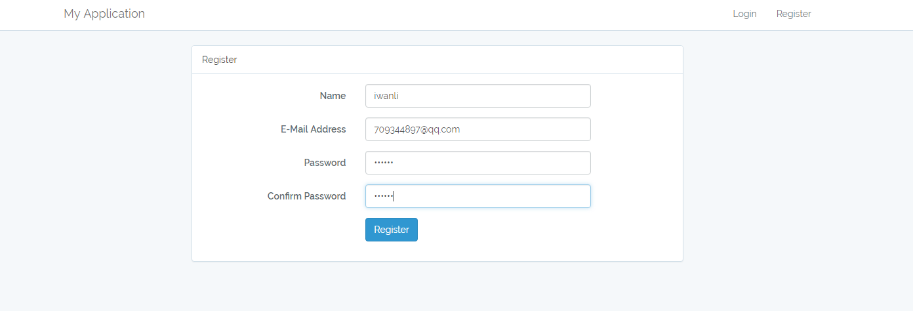
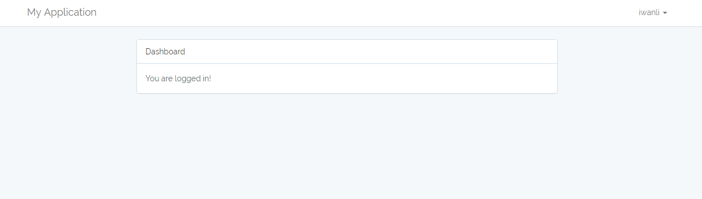
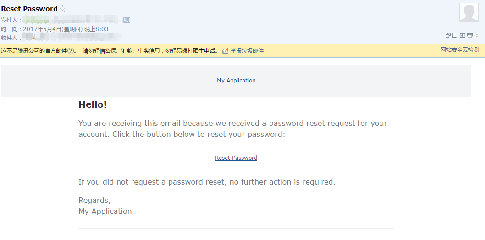

## Laravel 系列 - 用户登录实现及注册源码初探

### 简介

在底层代码中，`Laravel` 的认证组件由 `guards` 和 `providers` 组成，`Guard` 定义了用户在每个请求中如何实现认证，例如，`Laravel` 通过 `session` `guard`来维护 `Session` 存储的状态、`Cookie` 以及 `token` `guard`，`token` `guard` 是认证用户发送请求时带的`API token`。

`Provider` 定义了如何从持久化存储中获取用户信息，`Laravel` 底层支持通过 `Eloquent` 和数据库查询构建器两种方式来获取用户，如果需要的话，你还可以定义额外的 `Provider`。

相对于 `Laravel5.2` 而言，`Laravel5.3` 在底层代码中做了很多修改，方法更加简洁。虽然代码改了很多，但是原理都是一样的，我们只需要重写不同的方法而已。

### 默认认证

首先我们使用`Laravel 5.3`提供的开箱即用的认证：

```
php artisan make:auth
```

该Artisan命令会生成用户认证所需的路由、视图以及`HomeController`

认证的路由也一并生成好了，查看路由文件`routes/web.php`，会发现该文件已经被更新

```
Auth::routes();

Route::get('/home', 'HomeController@index');
```

其中`Auth::routes()`定义了登录注册及找回密码路由，`/home` 为用户认证成功后跳转的路由。

### 验证

接下来我们先实现前台用户登录，也就是Laravel自带的Users用户表登录。通过生成的默认登录认证，已经写好了所有代码，剩下要做的就是使用迁移命令创建用户认证相关表：

```
php artisan migrate
```

执行命令后会生成 `users` 表和 `password_resets` 表，分别为用户表和密码重置表。然后我们就可以在浏览器中输入http://myapp.com/register 来注册新用户



我们创建一个用户，注册成功后直接跳转 `/home`，并且刚注册的用户名也已经显示出来了



### 发送邮件重置密码

Laravel 已经为我们提供了邮件重置密码的方式，只需要简单的设置即可。

在`config/mail.php` 中配置邮件发送方

```
'from' => [
        'address' => 'liuyangplus@163.com',
        'name' => 'Laravel Reset Password',
    ],
```

在根目录的`.env` 文件中配置

```
MAIL_DRIVER=smtp
MAIL_HOST=smtp.163.com
MAIL_PORT=587
MAIL_USERNAME=youremail@163.com
MAIL_PASSWORD=youremailpassword
MAIL_ENCRYPTION=ssl
```

**注意：**如果想使用其他邮箱，最好将`'from'`中的`address`和`MAIL_HOST` `MAIL_USERNAME` 邮箱类型一致。



以上就是发送邮件重置密码成功的邮件，其实我们也可以通过添加邮件发送类来自定义邮件的主题、内容等，这部分内容以后再添加。

### 用户认证源码初探

我们知道 Laravel 提供了开箱即用的用户认证过程，下面为了深入了解具体的用户认证实现，我们将深入 Laravel 的源码，探究用户验证是怎么处理的。

在实现用户认证过程中，我们首先执行了如下命令

```
php artisan make:auth
```

该命令会在项目里添加以下文件（目录）

```
app/Http/Controller/HomeController.PHP 
resources/views/auth/ 
resources/views/auth/login.blade.php 
resources/views/auth/passwords/ 
resources/views/auth/passwords/email.blade.php 
resources/views/auth/passwords/reset.blade.php 
resources/views/auth/register.blade.php 
resources/views/home.blade.php 
resources/views/layouts/ 
resources/views/layouts/app.blade.php
```

除了一个 `HomeController` 是处理用户登陆之后的逻辑，其他都是一些视图，用于显示相应的页面。

在 `routes/web.php` 里添加了以下内容

```
Auth::routes();

Route::get('/home', 'HomeController@index');
```

`Auth::routes()` 是登陆、注册需要的一些路由；下面是定义一个 `/home` 路由，交给 `HomeController@index` 处理。

那么，就从路由开始我们的探究之旅吧。

#### 路由

 `Auth::routes()`定义在 `vendor/laravel/framework/src/Illuminate/Support/Facades/Auth.php`

```
public static function routes()
    {
        static::$app->make('router')->auth();
    }
```

这里由 IOC 容器解析了一个 Illuminate\Routing\Router 类的实例，再调用里面的 `auth()` 方法。

我们再来看看 auth() 方法，定义在 `vendor/laravel/framework/src/Illuminate/Routing/Router.php`

```
public function auth()
    {
        // Authentication Routes...
        $this->get('login', 'Auth\LoginController@showLoginForm')->name('login');
        $this->post('login', 'Auth\LoginController@login');
        $this->post('logout', 'Auth\LoginController@logout');

        // Registration Routes...
        $this->get('register', 'Auth\RegisterController@showRegistrationForm');
        $this->post('register', 'Auth\RegisterController@register');

        // Password Reset Routes...
        $this->get('password/reset', 'Auth\ForgotPasswordController@showLinkRequestForm');
        $this->post('password/email', 'Auth\ForgotPasswordController@sendResetLinkEmail');
        $this->get('password/reset/{token}', 'Auth\ResetPasswordController@showResetForm');
        $this->post('password/reset', 'Auth\ResetPasswordController@reset');
    }
```

这里定义了 登陆 、 注销 、注册 和密码重置的路由。我们先看注册部分。

#### 注册

`App\Http\Controllers\Auth\RegisterController` 负责注册的逻辑，这里 use 了`Illuminate\Foundation\Auth\RegistersUsers` 这个 trait ，包含注册时通用的一些逻辑。

路由 `get('/register')` 所绑定的方法 `Auth\RegisterController@showRegistrationForm` 就定义在这个 trait 里

```
public function showRegistrationForm()
    {
        return view('auth.register');
    }
```

很简单，返回一个 `auth.register` 视图。

`auth.register` 视图获取用户的输入： `name`，`email`，`password`，然后 POST 提交到` /register`。

再来看看路由 `post('/register')` 所绑定的方法 `Auth\RegisterController@register`。

同样， `register` 方法定义在 `Illuminate\Foundation\Auth\RegistersUsers` 里

```
public function register(Request $request)
    {
        $this->validator($request->all())->validate();

        $this->guard()->login($this->create($request->all()));

        return redirect($this->redirectPath());
    }
```

首先使用请求传入的表单调用 `validator()` ，返回一个验证对象，再调用 `validate()` 验证表单内容的合法性。

`validator()` 定义在 `App\Http\Controllers\Auth\RegisterController` 里

```
protected function validator(array $data)
    {
        return Validator::make($data, [
            'name' => 'required|max:255',
            'email' => 'required|email|max:255|unique:users',
            'password' => 'required|min:6|confirmed',
        ]);
    }
```

> 在这里给出了输入表单的验证规则，如果我们的用户注册需要的表单与这几个字段不一致（例如需要添加一个手机号），就在这里修改。

返回的 `Validator` 对象会在 `register()` 方法里验证。

再回到 `register()` 方法， 往下走 `$this->guard()->login($this->create($request->all()));`。

`$this->guard()` 这里会调用 `Illuminate\Foundation\Auth\RegistersUsers` 里的 `guard()`

```
protected function guard()
    {
        return Auth::guard();
    }
```

这里无参数调用 `Auth::guard()` 返回一个默认的 guard，看一下 `config/auth.php`

```
'guards' => [
        'web' => [
            'driver' => 'session',
            'provider' => 'users',
        ],

        'admin' => [
            'driver' => 'session',
            'provider' => 'admins',
        ],

        'api' => [
            'driver' => 'token',
            'provider' => 'users',
        ],
    ],
```

默认的 guard 是 web ； web 这个 guard 采用 session 驱动， 数据提供者是 users ；users 数据提供者使用 eloquent 驱动， 使用 `App\User::class` 模型。

接下来调用 guard 的 `login($this->create($request->all()))`。

首先是 `$this->create()` ，这个方法定义在 `App\Http\Controllers\Auth\RegisterController` 里

```
protected function create(array $data)
    {
        return User::create([
            'name' => $data['name'],
            'email' => $data['email'],
            'password' => bcrypt($data['password']),
        ]);
    }
```

使用 `User` 模型对输入的内容新增一条记录，并返回这个模型的对象。

> 同样，如果需要修改注册时使用的字段，也是改写这个方法。

生成的 `User` 对象交给 guard 的 `login()` 方法，做一系列登录的操作，具体怎么做的，还是放到登陆验证里再详细说明。

最后， `return redirect($this->redirectPath());` 完成了注册、登陆的操作，最后跳转到我们在 `App\Http\Controllers\Auth\RegisterController` 里设置的 `protected $redirectTo = '/home';` 目标URL。

可以看一下 `$this->redirectPath()` 方法怎么写的，在 `Illuminate\Foundation\Auth\RedirectsUsers` 这个 trait 里

```
public function redirectPath()
    {
        return property_exists($this, 'redirectTo') ? $this->redirectTo : '/home';
    }
```

如果定义了 `$redirectTo` 这个属性，就按照这个属性返回；如果没有，返回 `'/home'`。

> 这里把这个方法写成 trait 是因为这个方法还会在 `App\Http\Controllers\Auth\LoginController` 登陆控制器里使用，所以就把 `redirectPath()` 这个方法提出来做成一个 trait，严格遵守 DRY 原则。


Read More:

> [Laravel 5.3 用户验证源码探究 （一） 路由与注册](http://blog.csdn.net/realghost/article/details/52558962)  [Laravel 5.3 多用户表登录实现](http://laravelacademy.org/post/5925.html)