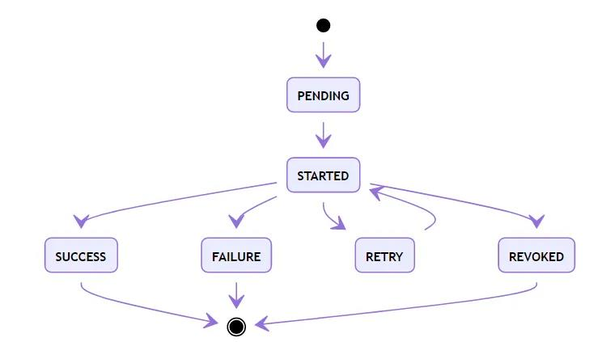

## Python 库 - celery

作为一个分布式异步计算框架，Celery虽然常用于Web框架中，但也可以单独使用。常规搭配的消息队列是RabbitMQ、Redis。

#### 目录结构

```
$ tree your_project
your_project
├── __init__.py
├── celery.py
├── config.py
└── tasks.py

0 directories, 4 files
```

其中`celery.py`是主文件，定义celery app，`config.py`是celery的配置，`tasks.py` 是异步任务的具体实现。

`celery.py`文件内容

```
from __funture__ import absolute_import
from celery import Celery, platform

platform.C_FORCE_ROOT = true

app = Celery('your project name')
app.config_from_object(config)
```

`config.py`文件内容可参考下一节

`tasks.py`文件内容

```
from __funture__ import absolute_import

from .app import app

@app.task
def add(x, y):
    return x + y
    
@app.task
def sub(x, y):
    return x - y
```

运行命令

```
nohup /usr/local/python3.6/bin/python3.6 -m celery worker --loglevel=DEBUG --app=${PROGRAM_NAME} --queues=$1 --hostname=$2 --pidfile=$3 1>/dev/null 2>/dev/null &
```

其中运行可参考后续章节。

#### 运行原理

一次Task从触发到完成，序列图如下：


其中，`main`代表业务代码主进程。它可能是Django、Flask这类Web服务，也可能是一个其它类型的进程。`worker`就是指Celery的Worker。

`main`发送消息后，会得到一个`AsyncResult`，其中包含`task_id`。仅通过`task_id`，也可以自己构造一个`AsyncResult`，查询相关信息。其中，代表运行过程的，主要是`state`。

`worker`会持续保持对Redis（或其它消息队列，如RabbitMQ）的关注，查询新的消息。如果获得新消息，将其消费后，开始运行`do_sth`。

运行完成会把返回值对应的结果，以及一些运行信息，回写到Redis（或其它backend，如Django数据库等）上。在系统的任何地方，通过对应的`AsyncResult(task_id)`就可以查询到结果。

#### celery task的状态



其中，除`SUCCESS`外，还有失败（`FAILURE`）、取消（`REVOKED`）两个结束状态。而`RETRY`则是在设置了重试机制后，进入的临时等待状态。

另外，如果保存在Redis的结果信息被清理（默认仅保存1天），那么任务状态又会变成`PENDING`。这在设计上是个巨大的问题，使用时要做对应容错。

#### celery常用配置

```
# 指定任务接受的内容类型(序列化)
# pickle/json/yaml/msgpack
CELERY_ACCEPT_CONTENT = ['json']

# 时区
CELERY_TIMEZONE = 'Asia/Shanghai'

# 调度任务
CELERY_INCLUDE = ['celerys.task']

# 调度器 
CELERYBEAT_SCHEDULER = 'celery.beat:PersistentScheduler'

# 调度器存储最后运行定时任务的时间
CELERYBEAT_SCHEDULE_FILENAME = 'log/celery.db'

# 消息代理
BROKER_URL = LBT_CONFIG_OTHER['BROKER_URL']

# 广播前缀设置，由仅活动的虚拟机接收任务消息
BROKER_TRANSPORT_OPTIONS = {'fanout_prefix': True}

# 结果存储地址
CELERY_RESULT_BACKEND = BROKER_URL

# 任务执行结果序列化方式
CELERY_RESULT_SERIALIZER = 'json'

# 结果是否持久化，默认关闭
CELERY_RESULT_PERSISTENT = False

# 任务过期时间，单位秒
CELERY_TASK_RESULT_EXPIRES = 60 * 60

# 任务序列化方式
CELERY_TASK_SERIALIZER = 'json'

# 任务执行最大时间，单位秒，超过会将worker杀死
CELERY_TASK_TIME_LIMIT = 60 * 60

# 不关心任务执行结果，无需持久化结果
CELERY_TASK_IGNORE_RESULT = True

# 并发worker数量，默认为cpu核数
CELERYD_CONCURRENCY = 6

# worker被杀死前执行的最大任务数
CELERYD_MAX_TASKS_PER_CHILD = 1024

# redis最大连接数
CELERY_REDIS_MAX_CONNECTIONS = 1024
```

更多配置参数请移步[Configuration and defaults](https://docs.celeryproject.org/en/stable/userguide/configuration.html)

#### worker命令行参数

```
Global Options:
  -A APP, --app APP
  -b BROKER, --broker BROKER
  --result-backend RESULT_BACKEND
  --loader LOADER
  --config CONFIG
  --workdir WORKDIR     Optional directory to change to after detaching.
  --no-color, -C
  --quiet, -q

Worker Options:
  -n HOSTNAME, --hostname HOSTNAME
                        Set custom hostname (e.g., 'w1@%h'). Expands: %h
                        (hostname), %n (name) and %d, (domain).
  -D, --detach          Start worker as a background process.
  -S STATEDB, --statedb STATEDB
                        Path to the state database. The extension '.db' may be
                        appended to the filename. Default: None
  -l LOGLEVEL, --loglevel LOGLEVEL
                        Logging level, choose between DEBUG, INFO, WARNING,
                        ERROR, CRITICAL, or FATAL.
  -O OPTIMIZATION
  --prefetch-multiplier PREFETCH_MULTIPLIER
                        Set custom prefetch multiplier value for this worker
                        instance.

Pool Options:
  -c CONCURRENCY, --concurrency CONCURRENCY
                        Number of child processes processing the queue. The
                        default is the number of CPUs available on your
                        system.
  -P POOL, --pool POOL  Pool implementation: prefork (default), eventlet,
                        gevent, threads or solo. 注意：threads只能在4.4.0以上版本使用
  -E, --task-events, --events
                        Send task-related events that can be captured by
                        monitors like celery events, celerymon, and others.
  --time-limit TIME_LIMIT
                        Enables a hard time limit (in seconds int/float) for
                        tasks.
  --soft-time-limit SOFT_TIME_LIMIT
                        Enables a soft time limit (in seconds int/float) for
                        tasks.
  --max-tasks-per-child MAX_TASKS_PER_CHILD, --maxtasksperchild MAX_TASKS_PER_CHILD
                        Maximum number of tasks a pool worker can execute
                        before it's terminated and replaced by a new worker.
  --max-memory-per-child MAX_MEMORY_PER_CHILD, --maxmemperchild MAX_MEMORY_PER_CHILD
                        Maximum amount of resident memory, in KiB, that may be
                        consumed by a child process before it will be replaced
                        by a new one. If a single task causes a child process
                        to exceed this limit, the task will be completed and
                        the child process will be replaced afterwards.
                        Default: no limit.

Queue Options:
  --purge, --discard    Purges all waiting tasks before the daemon is started.
                        **WARNING**: This is unrecoverable, and the tasks will
                        be deleted from the messaging server.
  --queues QUEUES, -Q QUEUES
                        List of queues to enable for this worker, separated by
                        comma. By default all configured queues are enabled.
                        Example: -Q video,image
  --exclude-queues EXCLUDE_QUEUES, -X EXCLUDE_QUEUES
                        List of queues to disable for this worker, separated
                        by comma. By default all configured queues are
                        enabled. Example: -X video,image.
  --include INCLUDE, -I INCLUDE
                        Comma separated list of additional modules to import.
                        Example: -I foo.tasks,bar.tasks

Features:
  --without-gossip      Don't subscribe to other workers events.
  --without-mingle      Don't synchronize with other workers at start-up.
  --without-heartbeat   Don't send event heartbeats.
  --heartbeat-interval HEARTBEAT_INTERVAL
                        Interval in seconds at which to send worker heartbeat
  --autoscale AUTOSCALE
                        Enable autoscaling by providing max_concurrency,
                        min_concurrency. Example:: --autoscale=10,3 (always
                        keep 3 processes, but grow to 10 if necessary)

Daemonization Options:
  -f LOGFILE, --logfile LOGFILE
                        Path to log file. If no logfile is specified, stderr
                        is used.
  --pidfile PIDFILE     Optional file used to store the process pid. The
                        program won't start if this file already exists and
                        the pid is still alive.
  --uid UID             User id, or user name of the user to run as after
                        detaching.
  --gid GID             Group id, or group name of the main group to change to
                        after detaching.
  --umask UMASK         Effective umask(1) (in octal) of the process after
                        detaching. Inherits the umask(1) of the parent process
                        by default.
  --executable EXECUTABLE
                        Executable to use for the detached process.

Embedded Beat Options:
  -B, --beat            Also run the celery beat periodic task scheduler.
                        Please note that there must only be one instance of
                        this service. .. note:: -B is meant to be used for
                        development purposes. For production environment, you
                        need to start celery beat separately.
  -s SCHEDULE_FILENAME, --schedule-filename SCHEDULE_FILENAME, --schedule SCHEDULE_FILENAME
                        Path to the schedule database if running with the -B
                        option. Defaults to celerybeat-schedule. The extension
                        ".db" may be appended to the filename. Apply
                        optimization profile. Supported: default, fair
  --scheduler SCHEDULER
                        Scheduler class to use. Default is
                        celery.beat.PersistentScheduler
```

