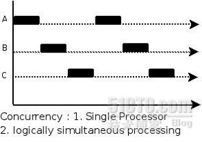

## Python 系列 - 计算密集型任务和 I/O 密集型任务

### I/O密集型任务 VS 计算密集型任务

所谓 I/O 密集型任务，是指磁盘 I/O、网络 I/O 占主要的任务，计算量很小。比如请求网页、读写文件等。当然我们在Python中可以利用 sleep 达到 I/O 密集型任务的目的。

所谓计算密集型任务，是指 CPU 计算占主要的任务，CPU 一直处于满负荷状态。比如在一个很大的列表中查找元素（当然这不合理），复杂的加减乘除等。

### 多线程 VS 多进程

Python中比较常见的并发方式主要有两种：多线程和多进程。

#### GIL

GIL 的全称是 Global Interpreter Lock (全局解释器锁)，来源是 python 设计之初的考虑，为了数据安全所做的决定。在Python多线程下，每个线程的执行方式：

- 获取GIL ；
- 执行代码直到sleep或者是python虚拟机将其挂起；
- 释放GIL。

可见，某个线程想要执行，必须先拿到 GIL，我们可以把 GIL 看作是“通行证”，并且在一个 Python 进程中，GIL 只有一个。拿不到通行证的线程，就不允许进入 CPU 执行。

**注意：**多核多线程不一定比单核多线程更好。原因是单核下多线程，每次释放 GIL，唤醒的那个线程都能获取到 GIL 锁，所以能够无缝执行，但多核下，CPU0 释放 GIL 后，其他 CPU 上的线程都会进行竞争，但 GIL 可能会马上又被 CPU0 拿到，导致其他几个 CPU 上被唤醒后的线程会醒着等待到切换时间后又进入待调度状态，这样会造成线程颠簸，导致效率更低。

#### 多线程

多线程即在一个进程中启动多个线程执行任务。一般来说使用多线程可以达到并行的目的，但由于 Python 中使用了全局解释锁 GIL 的概念，导致 Python 中的多线程并不是并行执行，而是“交替执行”。类似于下图：（图片转自网络，侵删）



所以 Python 中的多线程适合 I/O 密集型任务，而不适合计算密集型任务。

Python 提供两组多线程接口，一是 thread 模块 _thread，提供低等级接口。二是 threading 模块，提供更容易使用的基于对象的接口，可以继承 Thread 对象来实现线程，此外其还提供了其它线程相关的对象，例如 Timer，Lock 等。

#### 多进程

由于 Python 中 GIL 的原因，对于计算密集型任务，Python 下比较好的并行方式是使用多进程，这样可以非常有效的使用CPU 资源。当然同一时间执行的进程数量取决你电脑的 CPU 核心数。


Python 中的进程模块为 mutliprocess 模块，提供了很多容易使用的基于对象的接口。另外它提供了封装好的管道和队列，可以方便的在进程间传递消息。Python 还提供了进程池 Pool 对象，可以方便的管理和控制线程。

### Example

这里通过一个实例，说明多线程适合IO密集型任务，多进程适合计算密集型任务。

首先定义一个队列，并定义初始化队列的函数：

```
# 定义全局变量Queue，与Queue.Queue()的不同之处在于，multiprocessing.Queue()支持跨进程使用
g_queue = multiprocessing.Queue()

def init_queue():
    print("init g_queue start")
    while not g_queue.empty():
        g_queue.get()
    for _index in range(10):
        g_queue.put(_index)
    print("init g_queue end")
    return
```

然后定义 I/O 密集型任务和计算密集型任务，分别从队列中获取任务数据：

```
# 定义一个IO密集型任务：利用time.sleep()
def task_io(task_id):
    print("IOTask[%s] start" % task_id)
    while not g_queue.empty():
        time.sleep(1)
        try:
            data = g_queue.get(block=True, timeout=1)
            print("IOTask[%s] get data: %s" % (task_id, data))
        except Exception as ex:
            print("IOTask[%s] error: %s" % (task_id, str(ex)))
    print("IOTask[%s] end" % task_id)
    return


g_search_list = list(range(10000))


# 定义一个计算密集型任务：利用一些复杂加减乘除、列表查找等
def task_cpu(task_id):
    print("CPUTask[%s] start" % task_id)
    while not g_queue.empty():
        count = 0
        for i in range(10000):
            count += pow(3 * 2, 3 * 2) if i in g_search_list else 0
        try:
            data = g_queue.get(block=True, timeout=1)
            print("CPUTask[%s] get data: %s" % (task_id, data))
        except Exception as excep:
            print("CPUTask[%s] error: %s" % (task_id, str(excep)))
    print("CPUTask[%s] end" % task_id)
    return task_id

```

准备完上述代码之后，进行试验：

```
if __name__ == '__main__':
    print("cpu count:", multiprocessing.cpu_count(), "\n")

    print("========== 直接执行IO密集型任务 ==========")
    init_queue()
    time_0 = time.time()
    task_io(0)
    print("结束：", time.time() - time_0, "\n")

    print("========== 多线程执行IO密集型任务 ==========")
    init_queue()
    time_0 = time.time()
    thread_list = [threading.Thread(target=task_io, args=(i,)) for i in range(4)]
    for t in thread_list:
        t.start()
    for t in thread_list:
        if t.is_alive():
            t.join()
    print("结束：", time.time() - time_0, "\n")

    print("========== 多进程执行IO密集型任务 ==========")
    init_queue()
    time_0 = time.time()
    process_list = [multiprocessing.Process(target=task_io, args=(i,)) for i in range(multiprocessing.cpu_count())]
    for p in process_list:
        p.start()
    for p in process_list:
        if p.is_alive():
            p.join()
    print("结束：", time.time() - time_0, "\n")

    print("========== 直接执行计算密集型任务 ==========")
    init_queue()
    time_0 = time.time()
    task_cpu(0)
    print("结束：", time.time() - time_0, "\n")

    print("========== 多线程执行计算密集型任务 ==========")
    init_queue()
    time_0 = time.time()
    thread_list = [threading.Thread(target=task_cpu, args=(i,)) for i in range(4)]
    for t in thread_list:
        t.start()
    for t in thread_list:
        if t.is_alive():
            t.join()
    print("结束：", time.time() - time_0, "\n")

    print("========== 多进程执行计算密集型任务 ==========")
    init_queue()
    time_0 = time.time()
    process_list = [multiprocessing.Process(target=task_cpu, args=(i,)) for i in range(multiprocessing.cpu_count())]
    for p in process_list:
        p.start()
    for p in process_list:
        if p.is_alive():
            p.join()
    print("结束：", time.time() - time_0, "\n")
```

结果如下：

```
========== 直接执行IO密集型任务 ==========
结束： 10.041141033172607 
========== 多线程执行IO密集型任务 ==========
结束： 5.073023557662964 
========== 多进程执行IO密集型任务 ==========
结束： 1.1165637969970703 

========== 直接执行计算密集型任务 ==========
结束： 36.41951608657837 
========== 多线程执行计算密集型任务 ==========
结束： 47.48710823059082 
========== 多进程执行计算密集型任务 ==========
结束： 0.82016921043396 
```

在执行计算密集型任务时，多进程的方式明显比多线程更好。


Read More:

> [Python进阶：聊聊IO密集型任务、计算密集型任务，以及多线程、多进程](https://zhuanlan.zhihu.com/p/24283040) 
>
>  [为什么在python里推荐使用多进程而不是多线程？--转同事的一篇文章](http://blog.chinaunix.net/uid-12014716-id-5691776.html)  
>
> [Python编程（二）：Python进程、线程那点事儿](https://zhuanlan.zhihu.com/p/20167077?columnSlug=auxten)  