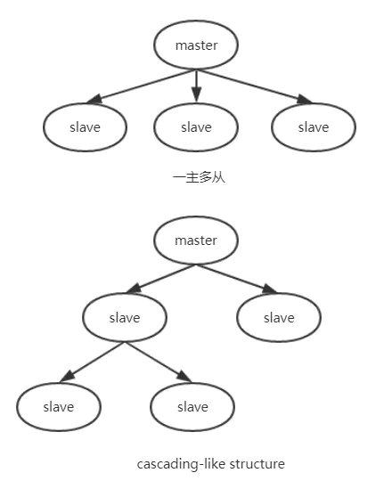
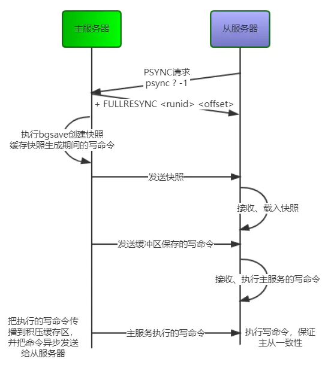
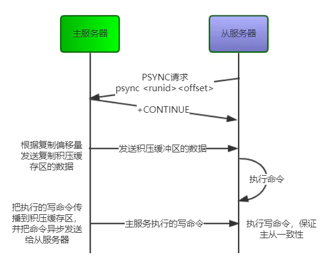
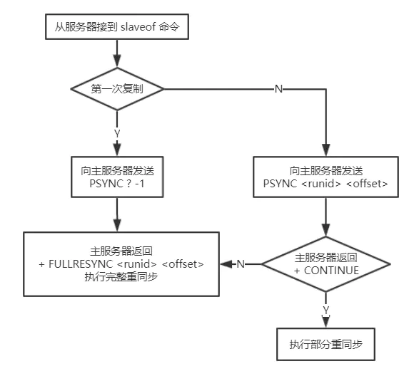

## Redis 系列 - 主从同步

Redis的持久化功能在一定程度上保证了数据的安全性，即便是服务器宕机的情况下，也可以保证数据的丢失非常少。通常，为了避免服务的单点故障，会把数据复制到多个副本放在不同的服务器上，且这些拥有数据副本的服务器可以用于处理客户端的读请求，扩展整体的性能，一旦涉及到了分布式部署，就一定会考虑到数据一致性问题，今天我们来聊聊Redis的主从同步机制。

### 什么是主从同步

我们可以通过`slaveof <host> <port>`命令，或者通过配置`slaveof`选项，来使当前的服务器（slave）复制指定服务器（master）的内容，被复制的服务器称为主服务器（master），对主服务器进行复制操作的为从服务器（slave）。

主服务器master可以进行读写操作，当主服务器的数据发生变化，master会发出命令流来保持对salve的更新，而从服务器slave通常是只读的（可以通过`slave-read-only`指定），在主从复制模式下，即便master宕机了，slave是不能变为主服务器进行写操作的。

一个master可以有多个slave，即一主多从；而slave也可以接受其他slave的连接，形成“主从链”层叠状结构（cascading-like structure），自 Redis 4.0 起，所有的sub-slave也会从master收到完全一样的复制流。如下图：



主从复制的优点：

- 数据冗余，实现数据的热备份；
- 故障恢复，避免单点故障带来的服务不可用；
- 读写分离，负载均衡。主节点负载读写，从节点负责读，提高服务器并发量；
- 高可用基础，是哨兵机制和集群实现的基础。

### 主从同步的配置

使用和配置主从复制是比较简单的，在从服务器slave的配置文件中设置`slaveof`选项，或者直接使用`slaveof <masterip> <masterport>`命令。

这里我使用3台虚拟机来搭建一下，主服务器的ip为`192.168.249.20`，两个从服务器的ip分别为`192.168.249.21`和`192.168.249.21`，端口号都为`6379`，主服务器并不需要额外多配置什么，这里我们先把三台服务器的都需要改的地方列一下：

````
# 设置为后台运行
daemonize yes
# 保存pid的文件，如果是在一台机器搭建主从，需要区分一下
pidfile /var/run/redis_6379.pid
# 绑定的主机地址，这里注释掉，开放ip连接
#bind 127.0.0.1
# 指定日志文件
logfile "6379.log"
````

在从服务器中添加配置`slaveof <masterport> <masterport>`选项，在5.0版本中使用了`replicaof`代替了`slaveof`（[Changing Redis master-slave replication terms with something else](https://link.juejin.cn/?target=https%3A%2F%2Fgithub.com%2Fantirez%2Fredis%2Fissues%2F5335)），`slaveof`还可以继续使用，不过建议使用`replicaof`。如果是使用命令行来复制的话，重启之后会无效。

```
# replicaof <masterip> <masterport>
replicaof 192.168.249.20 6379
```

配置好`redis.conf`之后，我们分别启动3台服务器，可以用户命令`info replication`查看复制信息：

```
192.168.249.20:6379> info replication
# Replication
role:master
connected_slaves:2
slave0:ip=192.168.249.22,port=6379,state=online,offset=700,lag=0
slave1:ip=192.168.249.21,port=6379,state=online,offset=700,lag=0
master_replid:b80a4720c0001efb62940f5ad6abaf9cdaf7a813
master_replid2:0000000000000000000000000000000000000000
master_repl_offset:700
second_repl_offset:-1
repl_backlog_active:1
repl_backlog_size:1048576
repl_backlog_first_byte_offset:1
repl_backlog_histlen:700

192.168.249.21:6379> info replication
# Replication
role:slave
master_host:192.168.249.20
master_port:6379
master_link_status:up
master_last_io_seconds_ago:3
master_sync_in_progress:0
slave_repl_offset:854
slave_priority:100
slave_read_only:1
connected_slaves:0
master_replid:b80a4720c0001efb62940f5ad6abaf9cdaf7a813
master_replid2:0000000000000000000000000000000000000000
master_repl_offset:854
second_repl_offset:-1
repl_backlog_active:1
repl_backlog_size:1048576
repl_backlog_first_byte_offset:57
repl_backlog_histlen:798

192.168.249.22:6379> info replication
# Replication
role:slave
master_host:192.168.249.20
master_port:6379
master_link_status:up
master_last_io_seconds_ago:6
master_sync_in_progress:0
slave_repl_offset:854
slave_priority:100
slave_read_only:1
connected_slaves:0
master_replid:b80a4720c0001efb62940f5ad6abaf9cdaf7a813
master_replid2:0000000000000000000000000000000000000000
master_repl_offset:854
second_repl_offset:-1
repl_backlog_active:1
repl_backlog_size:1048576
repl_backlog_first_byte_offset:1
repl_backlog_histlen:854
```

接下来我们可以在主服务器中写入数据，然后可以在其他的从服务器中读取数据：

```
192.168.249.20:6379> set test 'Hello World'
OK
192.168.249.21:6379> get test
"Hello World"
192.168.249.22:6379> get test
"Hello World"
```

然后我们试着在从服务器中写入数据，会提示不能在只读的从服务器中写入数据：

```
192.168.249.21:6379> set test2 hello
(error) READONLY You can't write against a read only replica.
```

> 如果我们需要slave对master的复制进行验证，可以在master中配置`requirepass <password>`选项设置密码
>
> 那么需要在从服务器中使用该密码，可以使用命令`config set masterauth <password>`，或者在配置文件中设置`masterauth <password>`

### 主从同步的实现原理

Redis的主从复制过程大体上分3个阶段：**建立连接**、**数据同步**、**命令传播**

#### 建立连接

这个阶段主要是从服务器发出`slaveof`命令之后，与主服务器如何建立连接，为数据同步做准备的过程。

- 在`slaveof`命令执行之后，从服务器根据设置的master的ip地址和端口，创建连向主服务器的socket套接字连接，连接成功后，从服务器会为这个套接字关联一个专门的处理器，用于处理后续的复制工作；
- 建立连接之后，从服务器会向主服务器发送`ping`命令，确认主服务器是否可用，以及当前是否可用接受处理命令。如果收到主服务器的`pong`回复说明是可用的，否则有可能是网络超时或主服务器阻塞，从服务器会断开连接发起重连；
- 身份验证。如果主服务器设置了`requirepass`选项，那么从服务器必须配置`masterauth`选项，且保证密码一致才能通过验证；
- 身份验证完成之后，从服务器会发送自己的监听端口，主服务器会保存下来。

```
192.168.249.20:6379> info replication
...
slave0:ip=192.168.249.22,port=6379,state=online,offset=700,lag=0
slave1:ip=192.168.249.21,port=6379,state=online,offset=700,lag=0
...
```

#### 数据同步

在主从服务器建立连接确认各自身份之后，就开始数据同步，从服务器向主服务器发送`PSYNC`命令，执行同步操作，并把自己的数据库状态更新至主服务器的数据库状态

Redis的主从同步分为：**完整重同步（full resynchronization）**、**部分重同步（partial resynchronization）**

##### 完整重同步

有两种情况下是完整重同步：

- slave连接上master第一次复制的时候；
- 如果当主从断线，重新连接复制的时候有可能是完整重同步。

下面是完整重同步的步骤：



- 从服务器连接主服务器，发送SYNC命令；

- 主服务器接收到SYNC命名后，开始执行`bgsave`命令生成RDB文件并使用缓冲区记录此后执行的所有写命令；

- 主服务器`basave`执行完后，向所有从服务器发送快照文件，并在发送期间继续记录被执行的写命令；

- 从服务器收到快照文件后丢弃所有旧数据，载入收到的快照；

- 主服务器快照发送完毕后开始向从服务器发送缓冲区中的写命令；

- 从服务器完成对快照的载入，开始接收命令请求，并执行来自主服务器缓冲区的写命令。

##### 部分重同步

部分重同步是用于处理断线后重复制的情况，先介绍几个用于部分重同步的部分：

- `runid`(replication ID)，主服务器运行id，Redis实例在启动时，随机生成一个长度40的唯一字符串来标识当前节点；

- `offset`，复制偏移量。主服务器和从服务器各自维护一个复制偏移量，记录传输的字节数。当主节点向从节点发送N个字节数据时，主节点的offset增加N，从节点收到主节点传来的N个字节数据时，从节点的offset增加N；

- `replication backlog buffer`，复制积压缓冲区。是一个固定长度的FIFO队列，大小由配置参数`repl-backlog-size`指定，默认大小1MB。需要注意的是该缓冲区由master维护并且有且只有一个，所有slave共享此缓冲区，其作用在于备份最近主库发送给从库的数据。

当slave连接到master，会执行`PSYNC <runid> <offset>`发送记录旧的master的`runid`（replication ID）和偏移量`offset`，这样master能够只发送slave所缺的增量部分。但是如果master的复制积压缓存区没有足够的命令记录，或者slave传的`runid`(replication ID)不对，就会进行**完整重同步**，即slave会获得一个完整的数据集副本。



PSYNC命令执行完整重同步和部分重同步的流程图：



#### 命令传播

当完成数据同步之后，主从服务器的数据暂时达到一致状态，当主服务器执行了客户端的写命令之后，主从的数据便不再一致。为了能够使主从服务器的数据保持一致性，主服务器会对从服务器执行命令传播操作，即每执行一个写命令就会向从服务器发送同样的写命令。

在命令传播阶段，从服务器会默认以每秒一次的频率向主服务器发送**心跳检测**。

```
REPLCONF ACK <replication_offset>
```

其中`replication_offset`是当前从服务器的复制偏移量，该命令的作用有三个：

- 检测主从服务器的网络连接状态；
- 辅助实现`min-slaves`选项；
- 检测命令丢失。

##### 延迟与不一致

需要注意的是，命令传播是异步的过程，即主节点发送写命令后并不会等待从节点的回复；因此实际上主从节点之间很难保持实时的一致性，延迟在所难免。数据不一致的程度，与主从节点之间的网络状况、主节点写命令的执行频率、以及主节点中的 `repl-disable-tcp-nodelay` 配置等有关。

```
repl-disable-tcp-nodelay no; TCP会立马将主节点的数据发送给从节点，带宽增加但延迟变小
repl-disable-tcp-nodelay yes; TCP会对包进行合并从而减少带宽，但发送的频率会降低，从节点数据延迟增加，一致性变差；具体发送频率与Linux内核的配置有关，默认配置为40ms
```

一般来说，只有当应用对Redis数据不一致的容忍度较高，且主从节点之间网络状况不好时，才会设置为yes，多数情况使用默认值no。


Read More:

> [Redis主从复制的配置和实现原理](https://juejin.cn/post/6844903943764443149)
>
> [深入学习Redis（3）：主从复制](https://www.cnblogs.com/kismetv/p/9236731.html)