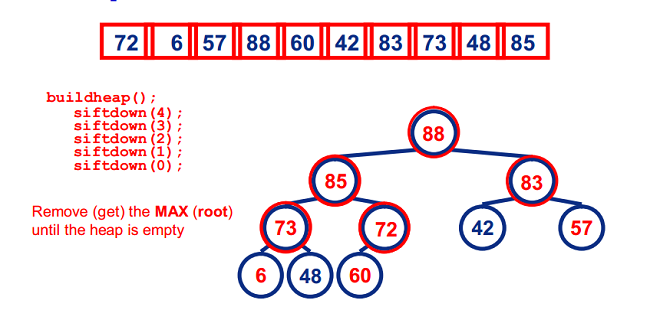
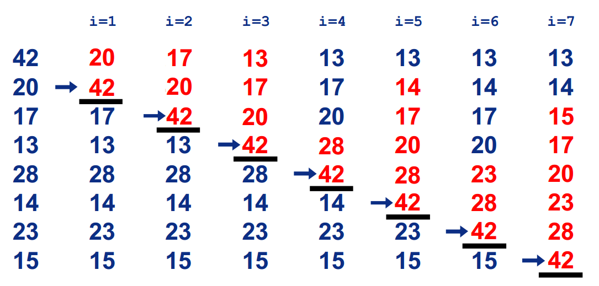
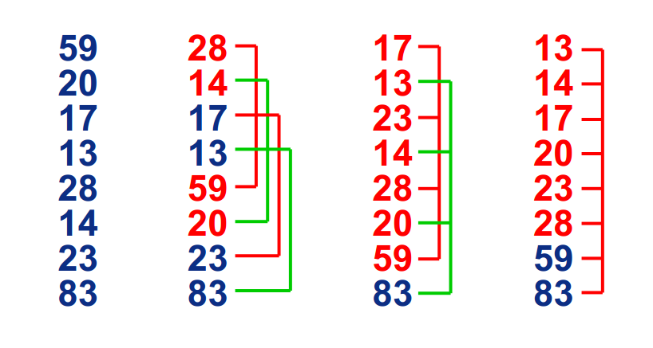
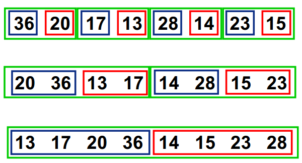

## 排序算法总结

各种排序算法稳定性以及时间复杂度总结：

| 类别   | 排序方法   | 平均时间复杂度   | 最好情况       | 最坏情况      | 空间复杂度    | 稳定性  |
| ---- | ------ | --------- | ---------- | --------- | -------- | ---- |
| 交换排序 | 冒泡排序   | O(n^2)    | O(n)       | O(n^2)    | O(1)     | 稳定   |
| 交换排序 | 快排     | O(nlogn)  | O(nlogn)   | O(n^2)    | O(nlogn) | 不稳定  |
| 选择排序 | 直接选择排序 | O(n^2)    | O(n^2)     | O(n^2)    | O(1)     | 不稳定  |
| 选择排序 | 堆排序    | O(nlogn)  | O(nlogn)   | O(nlogn)  | O(1)     | 不稳定  |
| 插入排序 | 直接插入排序 | O(n^2)    | O(n)       | O(n^2)    | O(1)     | 稳定   |
| 插入排序 | 希尔排序   | O(n^1.5)  | O(n)       | O(n^2)    | O(1)     | 不稳定  |
| 未分类  | 归并排序   | O(nlogn)  | O(nlogn)   | O(nlogn)  | O(n)     | 稳定   |
| 未分类  | 基数排序   | O(d(n+r)) | O(d(n+rd)) | O(d(n+r)) | O(rd+n)  | 稳定   |

**Note**：logn代表以2为底n的对数。

当原表有序或基本有序时，**直接插入排序**和**冒泡排序**将大大减少比较次数和移动记录的次数，时间复杂度可降至O(n)；而**快速排序**则相反，当原表基本有序时，将蜕化为冒泡排序，时间复杂度提高为O(n^2)；原表是否有序，对**直接选择排序**、**堆排序**、**归并排序**和**基数排序**的时间复杂度影响不大。

### **排序算法的稳定性说明**

若待排序的序列中，存在多个具有相同关键字的记录，经过排序，这些记录的相对次序保持不变，则称该算法是稳定的；若经排序后，记录的相对次序发生了改变，则称该算法是不稳定的。 Example：

如果 Ai = Aj 且 Ai 原来在位置前，排序后Ai 还是要在 Aj 位置前。

稳定性的好处：排序算法如果是稳定的，那么从一个键上排序，然后再从另一个键上排序，第一个键排序的结果可以为第二个键排序所用。基数排序就是这样，先按低位排序，逐次按高位排序，低位相同的元素，其顺序在高位也相同时是不会改变的。另外，如果排序算法稳定，可以避免多余的比较；Example：


对于不稳定的算法我们可以这样改进：

在每个输入元素加一个 index，表示初始时的数组索引，当不稳定的算法排好序后，对于相同的元素对 index 排序即可。

#### 冒泡排序

冒泡排序就是把小的元素往前调或者把大的元素往后调。比较是相邻的两个元素比较，交换也发生在这两个元素之间。所以，如果两个元素相等，是不会再把他们交换的；如果两个相等的元素没有相邻，那么即使通过前面的两两交换把两个相邻起来，这时候也不会交换，所以相同元素的前后顺序并没有改变，所以冒泡排序是一种稳定排序算法。

#### 快排

快速排序有两个方向，左边的i下标一直往右走，当 a[i] <= a[center_index]，其中 center_index 是中枢元素的数组下标，一般取为数组第0个元素。而右边的j下标一直往左走，当 a[j] > a[center_index]。如果i和j都走不动了，i <= j，交换 a[i] 和 a[j]，重复上面的过程，直到i > j。 交换a[j]和a[center_index]，完成一趟快速排序。在中枢元素和 a[j] 交换的时候，很有可能把前面的元素的稳定性打乱，比如序列为5 3 3 4 3 8 9 10 11，现在中枢元素5和3（第5个元素，下标从1开始计）交换就会把元素3的稳定性打乱，所以快速排序是一个不稳定的排序算法，不稳定发生在中枢元素和 a[j] 交换的时刻。

#### 直接选择排序

选择排序是给每个位置选择当前元素最小的，比如给第一个位置选择最小的，在剩余元素里面给第二个元素选择第二小的，依次类推，直到第n-1个元素，第 n 个元素不用选择了，因为只剩下它一个最大的元素了。那么，在一趟选择，如果当前元素比一个元素小，而该小的元素又出现在一个和当前元素相等的元素后面，那么交换后稳定性就被破坏了。序列5 8 5 2 9，我们知道第一遍选择第1个元素5会和2交换，那么原序列中2个5的相对前后顺序就被破坏了，所以选择排序不是一个稳定的排序算法。

#### 堆排序

我们知道堆的结构是节点 i 的孩子为2 * i和2 * i + 1节点，大顶堆要求父节点大于等于其2个子节点，小顶堆要求父节点小于等于其2个子节点。在一个长为n 的序列，堆排序的过程是从第n / 2开始和其子节点共3个值选择最大（大顶堆）或者最小（小顶堆），这3个元素之间的选择当然不会破坏稳定性。但当为n / 2 - 1， n / 2 - 2， ... 1这些个父节点选择元素时，就会破坏稳定性。有可能第n / 2个父节点交换把后面一个元素交换过去了，而第n / 2 - 1个父节点把后面一个相同的元素没 有交换，那么这2个相同的元素之间的稳定性就被破坏了。所以，堆排序不是稳定的排序算法。

#### 直接插入排序

插入排序是在一个已经有序的小序列的基础上，一次插入一个元素。当然，刚开始这个有序的小序列只有1个元素，就是第一个元素。比较是从有序序列的末尾开始，也就是想要插入的元素和已经有序的最大者开始比起，如果比它大则直接插入在其后面，否则一直往前找直到找到它该插入的位置。如果碰见一个和插入元素相等的，那么插入元素把想插入的元素放在相等元素的后面。所以，相等元素的前后顺序没有改变，从原无序序列出去的顺序就是排好序后的顺序，所以插入排序是稳定的。

#### 希尔排序

希尔排序是按照不同步长对元素进行插入排序，当刚开始元素很无序的时候，步长最大，所以插入排序的元素个数很少，速度很快；当元素基本有序了，步长很小， 插入排序对于有序的序列效率很高。所以，希尔排序的时间复杂度会比O(n^2)好一些。由于多次插入排序，我们知道一次插入排序是稳定的，不会改变相同元素的相对顺序，但在不同的插入排序过程中，相同的元素可能在各自的插入排序中移动，最后其稳定性就会被打乱，所以希尔排序是不稳定的。

#### 归并排序

归并排序是把序列递归地分成短序列，递归出口是短序列只有1个元素（认为直接有序）或者2个序列（1次比较和交换），然后把各个有序的段序列合并成一个有序的长序列，不断合并直到原序列全部排好序。可以发现，在1个或2个元素时，1个元素不会交换，2个元素如果大小相等也没有人故意交换，这不会破坏稳定性。那么，在短的有序序列合并的过程中，稳定是否受到破坏？没有，合并过程中我们可以保证如果两个当前元素相等时，我们把处在前面的序列的元素保存在结果序列的前面，这样就保证了稳定性。所以，归并排序也是稳定的排序算法。

#### 基数排序

基数排序是按照低位先排序，然后收集；再按照高位排序，然后再收集；依次类推，直到最高位。有时候有些属性是有优先级顺序的，先按低优先级排序，再按高优先级排序，最后的次序就是高优先级高的在前，高优先级相同的低优先级高的在前。基数排序基于分别排序，分别收集，所以其是稳定的排序算法。

### 排序算法

#### 冒泡排序

**基本思想**

两个数比较大小，较大的数下沉，较小的数冒起来。

**过程**

比较相邻的两个数据，如果第二个数小，就交换位置；

从后向前两两比较，一直到比较最前两个数据。最终最小数被交换到起始的位置，这样第一个最小数的位置就排好了；
继续重复上述过程，依次将第2、3、......、n-1 个最小数排好位置。


**PHP代码实现**、

```
public function MaoPao($sort_array){
        for ($i = 0; $i < count($sort_array); $i++) {
            for ($j = 0; $j < count($sort_array) - $i - 1; $j++) {
                if ($sort_array[$j] > $sort_array[$j + 1]){
                    $tmp = $sort_array[$j];
                    $sort_array[$j] = $sort_array[$j + 1];
                    $sort_array[$j + 1] = $tmp;
                }
            }
        }
        return $sort_array;
    }
```

**优化**

冒泡排序的问题在于，数据的顺序排好之后，冒泡算法仍然会继续进行下一轮的比较，直到 count($sort_array)-1 次，后面的比较是没有意义的。

解决办法：我们可以设置标志位flag，如果发生了交换flag设置为true；如果没有交换就设置为false。这样当一轮比较结束后如果flag仍为false，即：这一轮没有发生交换，说明数据的顺序已经排好，没有必要继续进行下去。

```
public function MaoPao($sort_array){
        for ($i = 0; $i < count($sort_array); $i++) {
            $flag = 0;
            for ($j = 0; $j < count($sort_array) - $i - 1; $j++) {
                if ($sort_array[$j] > $sort_array[$j + 1]){
                    $tmp = $sort_array[$j];
                    $sort_array[$j] = $sort_array[$j + 1];
                    $sort_array[$j + 1] = $tmp;
                    $flag = 1;
                }
            }
            if ($flag == 0){
                break;
            }
        }
        return $sort_array;
    }
```

#### 快排

**基本思想**：分治

先从数列中取出一个数作为key值；
将比这个数小的数全部放在它的左边，大于或等于它的数全部放在它的右边；
对左右两个小数列重复第二步，直至各区间只有1个数。

**PHP代码实现**

```
public function Fast($sort_array){
        $left_array = array();
        $right_array = array();
        $index = 1;
        if (!is_array($sort_array)){
            return false;
        }
        if (count($sort_array) <= 1){
          return $sort_array;
        }
        while ($index < count($sort_array)){
            if ($sort_array[$index] > $sort_array[0]){
                $right_array[] = $sort_array[$index];
            } elseif ($sort_array[$index] <= $sort_array[0]){
                $left_array[] = $sort_array[$index];
            }
            $index++;
        }
        $left_array = $this->Fast($left_array);
        $right_array = $this->Fast($right_array);
        return array_merge($left_array, array($sort_array[0]), $right_array);
    }
```

#### 直接选择排序

**基本思想**

在长度为 n 的无序数组中，第一次遍历 n-1 个数，找到最小的数值与第一个元素交换；

第二次遍历 n-2 个数，找到最小的数值与第二个元素交换；

......

第 n-1 次遍历，找到最小的数值与第 n-1 个元素交换，排序完成。

**过程**


**PHP代码实现**

```
public function Select($sort_array){
        for ($i = 0; $i < count($sort_array); $i++){
            $min = $i;
            for ($j = $i + 1; $j < count($sort_array); $j++){
                if ($sort_array[$min] > $sort_array[$j]){
                    $min = $j;
                }
            }
            $tmp = $sort_array[$min];
            $sort_array[$min] = $sort_array[$i];
            $sort_array[$i] = $tmp;
        }
        return $sort_array;
    }
```

#### 堆排序

**基本思想**



**过程**

图示： （88,85,83,73,72,60,57,48,42,6）


**PHP代码实现**

```
public function DuiPaiXu($sort_array){
        $this->buildHeap($sort_array);
        $count = count($sort_array);
        while ($count > 1) {
            $this->swap($sort_array, $count - 1, 0);
            $count--;
            $this->adjustHeap($sort_array, $count, 0);
        }
        return $sort_array;
    }
 public function buildHeap(&$arr){
        $node = floor(count($arr) / 2) - 1;
        for ($i = $node; $i >= 0; $i--) {
            $this->adjustHeap($arr, count($arr), $i);
        }
    }
public function adjustHeap(&$arr, $maxLen, $node){
        $left_child = 2 * $node + 1;
        $right_child = 2 * $node + 2;
        $max = $node;
        while ($left_child < $maxLen || $right_child < $maxLen) {
            if ($left_child < $maxLen && $arr[$left_child] > $arr[$max]) {
                $max = $left_child;
            }
            if ($right_child < $maxLen && $arr[$right_child] > $arr[$max]) {
                $max = $right_child;
            }
            if ($max != $node) {
                $this->swap($arr, $max, $node);
                $node   = $max;
                $left_child = 2 * $node + 1;
                $right_child = 2 * $node + 2;
            } else {
                break;
            }
        }
    }
public function swap(&$arr, $m, $n){
        $arr[$m] = $arr[$m] ^ $arr[$n];
        $arr[$n] = $arr[$n] ^ $arr[$m];
        $arr[$m] = $arr[$m] ^ $arr[$n];
    }
```

#### 直接插入排序

**基本思想**

在要排序的一组数中，假定前 n-1 个数已经排好序，现在将第 n 个数插到前面的有序数列中，使得这 n 个数也是排好顺序的。如此反复循环，直到全部排好顺序。

**过程**




**PHP代码实现**

```
public function ChaRu($sort_array){
        for ($i = 2; $i < count($sort_array); $i++){
            $j = $i - 1;
            $key = $sort_array[$i];
            while ($j >= 0 && $sort_array[$j] > $key){
                $sort_array[$j + 1] = $sort_array[$j];
                $j--;
            }
            $sort_array[$j + 1] = $key;
        }
        return $sort_array;
    }
```

#### 希尔排序

**基本思想**

在要排序的一组数中，根据某一增量分为若干子序列，并对子序列分别进行插入排序。然后逐渐将增量减小,并重复上述过程。直至增量为1,此时数据序列基本有序,最后进行插入排序。

**过程**



**PHP代码实现**

```
public function XiErPaiXu($sort_array){
        if (!is_array($sort_array))
            return false;
        $n = count($sort_array);
        for ($gap = floor($n / 2); $gap > 0; $gap = floor($gap /= 2)) {
            for ($i = $gap; $i < $n; ++$i) {
                for ($j = $i - $gap; $j >= 0 && $sort_array[$j + $gap] < $sort_array[$j]; $j -= $gap) {
                    $temp = $sort_array[$j];
                    $sort_array[$j] = $sort_array[$j + $gap];
                    $sort_array[$j + $gap] = $temp;
                }
            }
        }
        return $sort_array;
    }
```

#### 归并排序

**基本思想**

归并排序是建立在归并操作上的一种有效的排序算法。该算法是采用分治法的一个非常典型的应用。

首先考虑下如何将2个有序数列合并。这个非常简单，只要从比较2个数列的第一个数，谁小就先取谁，取了后就在对应数列中删除这个数。然后再进行比较，如果有数列为空，那直接将另一个数列的数据依次取出即可。

解决了上面的合并有序数列问题，再来看归并排序，其的基本思路就是将数组分成2组A，B，如果这2组组内的数据都是有序的，那么就可以很方便的将这2组数据进行排序。如何让这2组组内数据有序了？
可以将A，B组各自再分成2组。依次类推，当分出来的小组只有1个数据时，可以认为这个小组组内已经达到了有序，然后再合并相邻的2个小组就可以了。这样通过**先递归的分解数列**，**再合并数列**就完成了归并排序。

**过程**



**PHP代码实现**

```
public function GuiBing($sort_array){
        $len = count($sort_array);
        if($len <= 1)
            return $sort_array;
        $mid = intval($len/2);
        $left_arr = array_slice($sort_array, 0, $mid);
        $right_arr = array_slice($sort_array, $mid);
        $left_arr = $this->GuiBing($left_arr);
        $right_arr = $this->GuiBing($right_arr);
        $sort_array = $this->GuiBing_child($left_arr, $right_arr);
        return $sort_array;
    }

public function GuiBing_child($arrA, $arrB){
        $arrC = array();
        while(count($arrA) && count($arrB)){
            $arrC[] = $arrA['0'] < $arrB['0'] ? array_shift($arrA) : array_shift($arrB);
        }
        return array_merge($arrC, $arrA, $arrB);
    }
```

#### 基数排序

**基本思想**

我们知道，任何一个阿拉伯数，它的各个位数上的基数都是以0~9来表示的。假设我们有编号0~9的10个桶，遍历需要进行排序的各个值的个位，然后根据个位的数值放进相应的桶中，分类后，我们在从各个桶中，将这些数按照从编号0到编号9的顺序依次将所有数取出来。这时，得到的序列就是个位数上呈递增趋势的序列。 接下来，可以对十位数、百位数也按照这种方法进行排序，最后就能得到排序完成的序列。

基数排序适用于对位数较少的排序，位数较长会浪费空间。

基数排序的平均时间复杂度为O(d(n+r))，其中 d 表示位数，r为基数（d的取值范围）。

LSD的基数排序适用于位数小的数列，如果位数多的话，使用MSD的效率会比较好。MSD的方式与LSD相反，是由高位数为基底开始进行分配，但在分配之后并不马上合并回一个数组中，而是在每个“桶子”中建立“子桶”，将每个桶子中的数值按照下一数位的值分配到“子桶”中。在进行完最低位数的分配后再合并回单一的数组中。

本文介绍的是LSD模式。

**过程**


**PHP代码实现**

```
public function GetNumInPos($num, $pos){
        $temp = 1;
        for ($i = 0; $i < $pos - 1; $i++)
            $temp *= 10;
        return ($num / $temp) % 10;
    }
public function JiShu($sort_array, $pos) {
        $l = count($sort_array);
        $bucket = array();
        for($i = 0; $i < 10; $i++)
            $bucket[$i] = array(0);

        for($p = 1; $p <= $pos; $p++) {
            for($i = 0; $i < $l; $i++) {
                $n = $this->GetNumInPos($sort_array[$i], $p);
                $index = ++$bucket[$n][0];
                $bucket[$n][$index] = $sort_array[$i];
            }
            for($i=0, $j=0; $i<10; $i++) {
                for($num = 1; $num<=$bucket[$i][0]; $num++) {
                    $sort_array[$j++] = $bucket[$i][$num];
                }
                $bucket[$i][0] = 0;
            }
        }
        return $sort_array;
    }
```


Read More:

> [排序算法总结](http://www.runoob.com/w3cnote/sort-algorithm-summary.html)  
>
> [八大排序算法](http://blog.csdn.net/hguisu/article/details/7776068)  
>
> [九大排序算法再总结](http://blog.csdn.net/xiazdong/article/details/8462393)  
>
> [稳定排序和不稳定排序](http://www.cnblogs.com/codingmylife/archive/2012/10/21/2732980.html)  
>
> [基数排序](http://baike.baidu.com/link?url=jd48mIg-3sWzLsPo9c5TgY2BjZGzlDn8SR5c6Zp_SF0feCIUUI6rZw5ITJVAezCshxLCBXFF5QFCaeixlW8oQe9siEyEj2PX2ciyZ5DQsmPEFmzH5_j86ISkUy6XiGJ6#1)  
>
> [排序八 基数排序](http://www.cnblogs.com/jingmoxukong/p/4311237.html) 