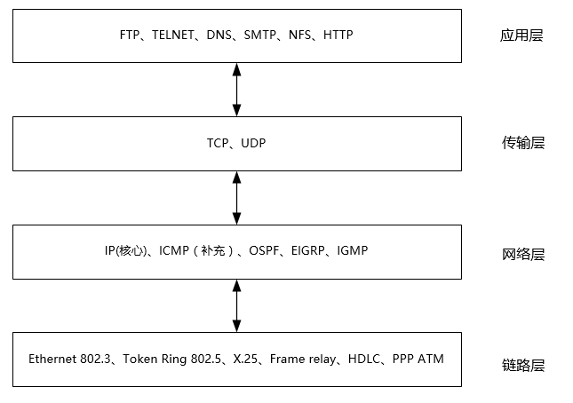
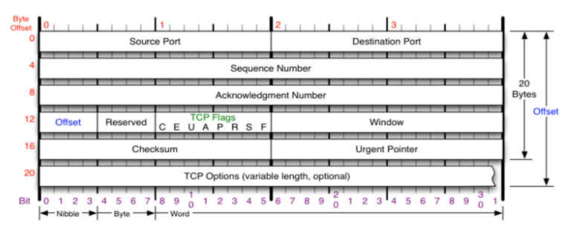
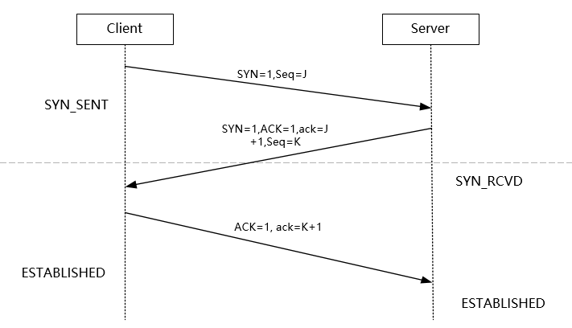
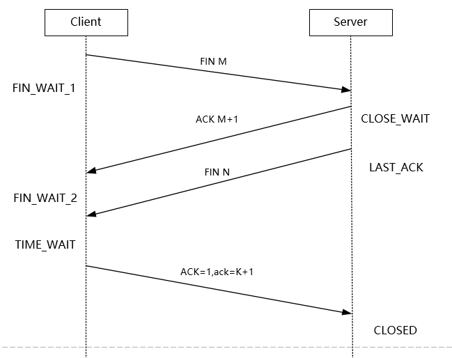
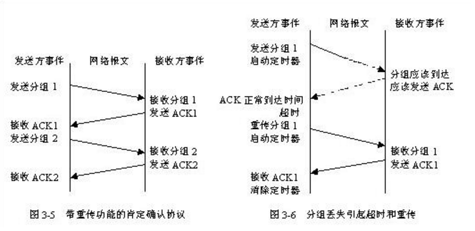
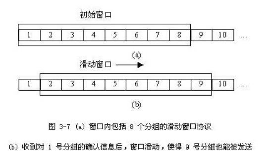

## TCP/IP协议

写这篇文章的主要动机是，自己在做项目的时候用到了网络编程的内容，然后自己简单学习了一下TCP/IP的东西，属于很基础的那种，在实习面试中，面试官也是问到了这块内容，但是自己理解比较浅，所以回答的也不是很好。想着系统的学习一下网络编程中TCP/IP协议这块，本篇作为入门，简单介绍一下TCP/IP协议。

### 名词解释

TCP/IP：**Transmission Control Protocol/Internet Protocol** 的简写，中译名为**传输控制协议/因特网互联协议**，又名网络通讯协议，是Internet最基本的协议、Internet国际互联网络的基础，由网络层的IP协议和传输层的TCP协议组成。是一种**面向连接的**、**可靠的**、**基于字节流的**传输层（Transport layer）通信协议。是专门为了在不可靠的互联网络上提供一个可靠的端到端字节流而设计的。互联网络与单个网络不同，因为互联网络的不同部分可能有着截然不同的拓扑、带宽、延迟、分组大小和其他参数。TCP的设计目标是能够动态的适应互联网络的这些特性，而且当面对多种失败的时候仍然能够健壮。

>  TCP/IP协议不是TCP和IP这两个协议的合称，而是指因特网整个TCP/IP协议族。

### 参考模型

了解TCP/IP参考模型之前，先来看一下OSI模型。

#### OSI参考模型

OSI模型是ISO的建议，是为了使各层上的协议国际标准化而发展起来的。OSI参考模型全称是开放系统互连参考模型(Open System Interconnection Reference Model)。这一参考模型共分为七层：物理层、数据链路层、网络层、传输层、会话层、表示层和应用层。

| 层次    | 说明                                       |
| ----- | ---------------------------------------- |
| 物理层   | 处理机械的、电气的和过程的接口，以及物理层下的物理传输介质等           |
| 数据链路层 | 加强物理层的功能，使其对网络层显示为一条无错的线路                |
| 网络层   | 确定分组从源端到目的端的路由选择。路由可以选用网络中固定的静态路由表，也可以在每一次会话时决定，还可以根据当前的网络负载状况，灵活地为每一个分组分别决定。 |
| 传输层   | 从会话层接收数据，并传输给网络层，同时确保到达目的端的各段信息正确无误，而且使会话层不受硬件变化的影响 |
| 会话层   | 允许不同机器上的用户之间建立会话关系，既可以进行类似传输层的普通数据传输，也可以被用于远程登录到分时系统或在两台机器间传递文件 |
| 表示层   | 用于完成一些特定的功能，这些功能由于经常被请求，因此人们希望有通用的解决办法，而不是由每个用户各自实现 |
| 应用层   | 包含了大量人们普遍需要的协议。不同的文件系统有不同的文件命名原则和不同的文本行表示方法等，不同的系统之间传输文件还有各种不兼容问题，这些都将由应用层来处理。此外，应用层还有虚拟终端、电子邮件和新闻组等各种通用和专用的功能 |

#### TCP/IP参考模型

TCP/IP参考模型共分为四层：网络访问层、互联网层、传输层和应用层。

| 层次    | 说明                                       |
| ----- | ---------------------------------------- |
| 应用层   | 包含所有的高层协议，包括：虚拟终端协议(TELNET)、文件传输协议(FTP)、电子邮件传输协议(SMTP)、域名服务(DNS)、网上新闻传输协议(NNTP)和超文本传送协议(HTTP)等 |
| 传输层   | 源端和目的端机器上的对等实体可以进行会话。在这一层定义了两个端到端的协议：传输控制协议(TCP)和用户数据报协议(UDP)。TCP是面向连接的协议，它提供可靠的报文传输和对上层应用的连接服务。为此，除了基本的数据传输外，它还有可靠性保证、流量控制、多路复用、优先权和安全性控制等功能。UDP是面向无连接的不可靠传输的协议，主要用于不需要TCP的排序和流量控制等功能的应用程序。 |
| 互联网层  | 整个体系结构的关键部分，其功能是使主机可以把分组发往任何网络，并使分组独立地传向目标，TCP/IP参考模型的互联网层和OSI参考模型的网络层在功能上非常相似。 |
| 网络访问层 | 指出主机必须使用某种协议与网络相连                        |

### TCP/IP协议层次

#### 链路层

链路层是负责接收IP数据包并通过网络发送，或者从网络上接收物理帧，抽出IP数据包，交给IP层。

ARP是正向地址解析协议，通过已知的IP，寻找对应主机的MAC地址。
RARP是反向地址解析协议，通过MAC地址确定IP地址。比如无盘工作站还有DHCP服务。

**ARP、RARP属于网络层协议，工作在链路层**

#### 网络层

负责相邻计算机之间的通信。其功能包括三方面。

>  处理来自传输层的分组发送请求，收到请求后，将分组装入IP数据报，填充报头，选择去往信宿机的路径，然后将数据报发往适当的网络接口。

>  处理输入数据报：首先检查其合法性，然后进行寻径--假如该数据报已到达信宿机，则去掉报头，将剩下部分交给适当的传输协议；假如该数据报尚未到达信宿，则转发该数据报。

>  处理路径、流控、拥塞等问题。

#### 传输层

提供应用程序间的通信。其功能包括：格式化信息流；提供可靠传输。

为实现可靠传输，传输层协议规定接收端必须发回确认，并且假如分组丢失，必须重新发送，即耳熟能详的“三次握手”过程，从而提供可靠的数据传输。

#### 应用层

向用户提供一组常用的应用程序，比如电子邮件、文件传输访问、远程登录等。远程登录TELNET使用TELNET协议提供在网络其它主机上注册的接口。TELNET会话提供了基于字符的虚拟终端。文件传输访问FTP使用FTP协议来提供网络内机器间的文件拷贝功能。

FTP 是文件传输协议，一般上传下载用FTP服务，数据端口是20H，控制端口是21H。

Telnet 服务是用户远程登录服务，使用23H端口，使用明码传送，保密性差、简单方便。

DNS 是域名解析服务，提供域名到IP地址之间的转换，使用端口53。

SMTP 是简单邮件传输协议，用来控制信件的发送、中转，使用端口25。

NFS 是网络文件系统，用于网络中不同主机间的文件共享。

HTTP 是超文本传输协议，用于实现互联网中的WWW服务，使用端口80。

### TCP协议

#### TCP头格式

**端口号[16bit]**

网络实现的是不同主机的进程间通信。在一个操作系统中，有很多进程，当数据到来时要提交给哪个进程进行处理呢？这就需要用到端口号。在TCP头中，有源端口号(Source Port)和目标端口号(Destination Port)。源端口号标识了发送主机的进程，目标端口号标识接受方主机的进程。

**序号[32bit]**

序号分为发送序号SN (Sequence Number)和确认序号ACK (Acknowledgment Number)。

发送序号：用来标识从 TCP源端向 TCP目的端发送的数据字节流，它表示在这个报文段中的第一个数据字节的顺序号。

如果将字节流看作在两个应用程序间的单向流动，则 TCP用顺序号对每个字节进行计数。序号是 32bit的无符号数，序号到达 2^32-1后又从 0开始。当建立一个新的连接时， SYN标志变 1，顺序号字段包含由这个主机选择的该连接的初始顺序号 ISN (Initial Sequence Number)。

确认序号：包含发送确认的一端所期望收到的下一个顺序号。因此，确认序号应当是上次已成功收到数据字节顺序号加 1。只有 ACK标志为 1时确认序号字段才有效。 TCP为应用层提供全双工服务，这意味数据能在两个方向上独立地进行传输。因此，连接的每一端必须保持每个方向上的传输数据顺序号。

**偏移[4bit]**

这里的偏移实际指的是TCP首部的长度，它用来表明TCP首部中32 bit字的数目，通过它可以知道一个TCP包它的用户数据是从哪里开始的。这个字段占4bit，如4bit的值是0101，则说明TCP首部长度是5 \* 4 = 20字节。 所以TCP的首部长度最大为15 \* 4 = 60字节。然而没有可选字段，正常长度为20字节。

**Reserved [6bit]**

目前没有使用，它的值都为0

**标志[6bit]**

在TCP首部中有6个标志比特。他们中的多个可同时被置为1 。

URG         紧急指针(urgent pointer)有效

ACK          确认序号有效

PSH          指示接收方应该尽快将这个报文段交给应用层而不用等待缓冲区装满

RST           一般表示断开一个连接

SYN          同步序号用来发起一个连接

FIN            发送端完成发送任务(即断开连接)

**窗口大小(window)[16bit]**

窗口的大小，表示源方法最多能接受的字节数。

**校验和[16bit]**

校验和覆盖了整个的TCP报文段:TCP首部和TCP数据。这是一个强制性的字段，一定是由发端计算和存储，并由收端进行验证。

**紧急指针[16bit]**

只有当URG标志置为1时紧急指针才有效。紧急指针是一个正的偏移量，和序号字段中的值相加表示紧急数据最后一个字节的序号。TCP的紧急方式是发送端向另一端发送紧急数据的一种方式。

**TCP选项**

是可选的。

#### 三次握手建立连接

**第一次握手**：Client将标志位SYN置为1，随机产生一个值seq=J，并将该数据包发送给Server，Client进入SYN_SENT状态，等待Server确认。

**第二次握手**：Server收到数据包后由标志位SYN=1知道Client请求建立连接，Server将标志位SYN和ACK都置为1，ack=J+1，随机产生一个值seq=K，并将该数据包发送给Client以确认连接请求，Server进入SYN_RCVD状态。

**第三次握手**：Client收到确认后，检查ack是否为J+1，ACK是否为1，如果正确则将标志位ACK置为1，ack=K+1，并将该数据包发送给Server，Server检查ack是否为K+1，ACK是否为1，如果正确则连接建立成功，Client和Server进入ESTABLISHED状态，完成三次握手，随后Client与Server之间可以开始传输数据了。

#### 三次握手连接成功的标准

客户端发完第三次ACK，就立马成为established状态，即使第三次ACK丢失，客户端并不关心，可以发送数据，格式为ACK+Data，当到达服务器时，服务器状态虽然为SYN_RCVD，它依然可以将Data缓存下来，客户端捎带过来的ACK，这个ACK就是对服务器SYN+ACK又一次确认，所以服务器端立马切换为established状态，然后将缓存下来的客户端Data提交给应用程序。

所以客户端只要发送了三次握手的ACK即认为自己为established状态，对应的就是connect成功返回，同时可以接受用户数据。

而服务器端没有收到客户端的ACK，accept依然为阻塞状态，直到由于客户端发送数据+ACK，或自己超时重传+ACK并接收到客户端ACK，accept才会返回。

#### TCP连接为什么需要三次握手

在谢希仁著《计算机网络》第四版中讲“三次握手”的目的是“为了防止已失效的连接请求报文段突然又传送到了服务端，因而产生错误”。在另一部经典的《计算机网络》一书中讲“三次握手”的目的是为了解决“网络中存在延迟的重复分组”的问题。这两种不用的表述其实阐明的是同一个问题。

谢希仁版《计算机网络》中的例子是这样的，“已失效的连接请求报文段”的产生在这样一种情况下：client发出的第一个连接请求报文段并没有丢失，而是在某个网络结点长时间的滞留了，以致延误到连接释放以后的某个时间才到达server。本来这是一个早已失效的报文段。但server收到此失效的连接请求报文段后，就误认为是client再次发出的一个新的连接请求。于是就向client发出确认报文段，同意建立连接。假设不采用“三次握手”，那么只要server发出确认，新的连接就建立了。由于现在client并没有发出建立连接的请求，因此不会理睬server的确认，也不会向server发送数据。但server却以为新的运输连接已经建立，并一直等待client发来数据。这样，server的很多资源就白白浪费掉了。采用“三次握手”的办法可以防止上述现象发生。例如刚才那种情况，client不会向server的确认发出确认。server由于收不到确认，就知道client并没有要求建立连接。”

在Google Groups的TopLanguage中看到一帖讨论TCP“三次握手”觉得很有意思。贴主提出“TCP建立连接为什么是三次握手？”的问题，在众多回复中，有一条回复写道：“这个问题的本质是, 信道不可靠, 但是通信双发需要就某个问题达成一致. 而要解决这个问题,  无论你在消息中包含什么信息, 三次通信是理论上的最小值. 所以三次握手不是TCP本身的要求, 而是为了满足"在不可靠信道上可靠地传输信息"这一需求所导致的. 请注意这里的本质需求,信道不可靠, 数据传输要可靠. 三次达到了, 那后面你想接着握手也好, 发数据也好, 跟进行可靠信息传输的需求就没关系了. 因此,如果信道是可靠的, 即无论什么时候发出消息, 对方一定能收到, 或者你不关心是否要保证对方收到你的消息, 那就能像UDP那样直接发送消息就可以了.”。这可视为对“三次握手”目的的另一种解答思路。

原文地址：[TCP连接建立过程中为什么需要三次握手](http://www.cnblogs.com/TechZi/archive/2011/10/18/2216751.html)

#### 四次挥手释放连接

由于TCP连接时全双工的，因此，每个方向都必须要单独进行关闭，这一原则是当一方完成数据发送任务后，发送一个FIN来终止这一方向的连接，收到一个FIN只是意味着这一方向上没有数据流动了，即不会再收到数据了，但是在这个TCP连接上仍然能够发送数据，直到这一方向也发送了FIN。首先进行关闭的一方将执行主动关闭，而另一方则执行被动关闭。

**第一次挥手**：Client发送一个FIN，用来关闭Client到Server的数据传送，Client进入FIN_WAIT_1状态。

**第二次挥手**：Server收到FIN后，发送一个ACK给Client，确认序号为收到序号+1（与SYN相同，一个FIN占用一个序号），Server进入CLOSE_WAIT状态。

**第三次挥手**：Server发送一个FIN，用来关闭Server到Client的数据传送，Server进入LAST_ACK状态。

**第四次挥手**：Client收到FIN后，Client进入TIME_WAIT状态，接着发送一个ACK给Server，确认序号为收到序号+1，Server进入CLOSED状态，完成四次挥手。

#### TCP断开为什么需要四次挥手

这是因为服务端在LISTEN状态下，收到建立连接请求的SYN报文后，把ACK和SYN放在一个报文里发送给客户端。而关闭连接时，当收到对方的FIN报文时，仅仅表示对方不再发送数据了但是还能接收数据，己方也未必全部数据都发送给对方了，所以己方可以立即close，也可以发送一些数据给对方后，再发送FIN报文给对方来表示同意现在关闭连接，因此，己方ACK和FIN一般都会分开发送。

#### TCP可靠性的保证

TCP采用一种名为“带重传功能的肯定确认”的技术作为提供可靠数据传输服务的基础。这项技术要求接收方收到数据之后向源站回送确认信息ACK。发送方对发出的每个分组都保存一份记录，在发送下一个分组之前等待确认信息。发送方还在送出分组的同时启动一个定时器，并在定时器的定时期满而确认信息还没有到达的情况下，重发刚才发出的分组。

图3-5表示带重传功能的肯定确认协议传输数据的情况，图

3-6表示分组丢失引起超时和重传。

为了避免由于网络延迟引起迟到的确认和重复的确认，协议规定在确认信息中稍带一个分组的序号，使接收方能正确将分组与确认关联起来。

从图 3-5可以看出，虽然网络具有同时进行双向通信的能力，但由于在接到前一个分组的确认信息之前必须推迟下一个分组的发送，简单的肯定确认协议浪费了大量宝贵的网络带宽。为此， TCP使用滑动窗口的机制来提高网络吞吐量，同时解决端到端的流量控制。

#### 滑动窗口技术

滑动窗口技术是简单的带重传的肯定确认机制的一个更复杂的变形，它允许发送方在等待一个确认信息之前可以发送多个分组。如图 3-7所示，发送方要发送一个分组序列，滑动窗口协议在分组序列中放置一个固定长度的窗口，然后将窗口内的所有分组都发送出去；当发送方收到对窗口内第一个分组的确认信息时，它可以向后滑动并发送下一个分组；随着确认的不断到达，窗口也在不断的向后滑动。

### TCP与UDP的区别

**基本区别**

基于连接与无连接（TCP有连接，UDP无连接）；

对系统资源的要求（TCP较多，UDP少）；

UDP程序结构较简单；

流模式与数据报模式（TCP属于流模式，UDP属于数据报模式）；

TCP保证数据正确性，UDP可能丢包，TCP保证数据顺序，UDP不保证。

**UDP应用场景**

面向数据报方式；

网络数据大多为短消息 ；

拥有大量Client；

对数据安全性无特殊要求；

网络负担非常重，但对响应速度要求高。

**TCP编程的服务器端一般步骤**

创建一个socket，用函数socket()； 

设置socket属性，用函数setsockopt()； \* 可选 

绑定IP地址、端口等信息到socket上，用函数bind()；

开启监听，用函数listen()； 

接收客户端上来的连接，用函数accept()； 

收发数据，用函数send()和recv()，或者read()和write(); 

关闭网络连接； 

关闭监听； 

**TCP编程的客户端一般步骤**

创建一个socket，用函数socket()； 

设置socket属性，用函数setsockopt()；\* 可选 

绑定IP地址、端口等信息到socket上，用函数bind()；\* 可选 

设置要连接的对方的IP地址和端口等属性； 

连接服务器，用函数connect()； 

收发数据，用函数send()和recv()，或者read()和write()；

关闭网络连接；

**UDP编程的服务器端一般步骤**

创建一个socket，用函数socket()； 

设置socket属性，用函数setsockopt()；\* 可选 

绑定IP地址、端口等信息到socket上，用函数bind()；

循环接收数据，用函数recvfrom()；

关闭网络连接； 

**UDP编程的客户端一般步骤**　

创建一个socket，用函数socket()； 

设置socket属性，用函数setsockopt()；\* 可选 

绑定IP地址、端口等信息到socket上，用函数bind()；\* 可选 

设置对方的IP地址和端口等属性；

发送数据，用函数sendto()；

关闭网络连接；

**UDP补充**

UDP不提供复杂的控制机制，利用IP提供面向无连接的通信服务。

它是将应用程序发来的数据在收到的那一刻，立刻按照原样发送到网络上的一种机制。即使是出现网络拥堵的情况下，

UDP也无法进行流量控制等避免网络拥塞的行为。

传输途中如果出现了丢包，UDO也不负责重发。甚至当出现包的到达顺序乱掉时也没有纠正的功能。如果需要这些细节控制，那么不得不交给由采用UDO的应用程序去处理。换句话说，UDP将部分控制转移到应用程序去处理，自己却只提供作为传输层协议的最基本功能。

**TCP补充**

TCP充分实现了数据传输时各种控制功能，可以进行丢包的重发控制，还可以对次序乱掉的分包进行顺序控制。而这些在UDP中都没有。此外，TCP作为一种面向有连接的协议，只有在确认通信对端存在时才会发送数据，从而可以控制通信流量的浪费。TCP通过检验和、序列号、确认应答、重发控制、连接管理以及窗口控制等机制实现可靠性传输。

Read More:

> [TCP和UDP的最完整的区别](http://blog.csdn.net/li_ning_/article/details/52117463)
>
> [计算机网络入门基础篇](https://zhuanlan.zhihu.com/p/22516664)
>
> [TCP/IP协议](http://baike.baidu.com/link?url=XlOHwI18XnbZTaGjg2WLtpmrwq2IsMVyoEggNVDOW6jaU-3qOLaoLleiSan-SBod0GTS8cAyOz99BAplna-wd3khoGaLvNPcniIX0dMGkg_oS2JsNmLR74DqcVoS5TgS#3)
>
> [tcp 编程中，connect 连接成功的标准是什么？](https://www.zhihu.com/question/49619919/answer/116941333)
>
> [如何通俗地解释一下 TCP/UDP 协议和 HTTP、FTP、SMTP 等协议之间的区别？](https://www.zhihu.com/question/20583641)
>
> [TCP、UDP、IP 协议分析](http://blog.chinaunix.net/uid-26833883-id-3627644.html) 