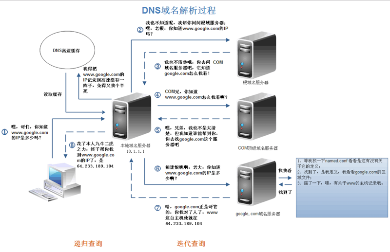

## URL 请求过程

当我们在浏览器中输入 `www.google.com` 后，浏览器会给我们展示最终页面，本文就来讨论一下展示页面的过程到底是怎样的。

### 输入网络地址

当我们开始在浏览器中输入网址的时候，浏览器其实就已经在智能的匹配可能得 URL 了，他会从历史记录，书签等地方，找到已经输入的字符串可能对应的 URL，然后给出智能提示，让你可以补全 URL 地址。对于 google 的 Chrome 的浏览器，他甚至会直接从缓存中把网页展示出来，就是说，你还没有按下 Enter，页面就出来了。

### DNS解析获取域名IP地址

请求一旦发起，浏览器首先要做的事情就是解析这个域名，一般来说，浏览器会首先查看本地硬盘的 hosts 文件，看看其中有没有和这个域名对应的规则，如果有的话就直接使用 hosts 文件里面的 IP 地址。

如果在本地的 hosts 文件没有能够找到对应的 IP 地址，浏览器会发出一个 DNS 请求到本地 DNS 服务器 。本地 DNS 服务器一般都是你的网络接入服务器商提供，比如中国电信，中国移动。

查询你输入的网址的 DNS 请求到达本地 DNS 服务器之后，本地 DNS 服务器会首先查询它的缓存记录，如果缓存中有此条记录，就可以直接返回结果，此过程是递归的方式进行查询。如果没有，本地 DNS 服务器还要向 DNS 根服务器进行查询。

根 DNS 服务器没有记录具体的域名和 IP 地址的对应关系，而是告诉本地 DNS 服务器，你可以到域服务器上去继续查询，并给出域服务器的地址。这种过程是迭代的过程。

本地 DNS 服务器继续向域服务器发出请求，在这个例子中，请求的对象是.com域服务器。.com域服务器收到请求之后，也不会直接返回域名和 IP 地址的对应关系，而是告诉本地 DNS 服务器，你的域名的解析服务器的地址。

最后，本地 DNS 服务器向域名的解析服务器发出请求，这时就能收到一个域名和IP地址对应关系，本地 DNS 服务器不仅要把 IP 地址返回给用户电脑，还要把这个对应关系保存在缓存中，以备下次别的用户查询时，可以直接返回结果，加快网络访问。

#### DNS缓存

DNS 存在着多级缓存，从离浏览器的距离排序的话，有以下几种：浏览器缓存，系统缓存，路由器缓存，IPS服务器缓存，根域名服务器缓存，顶级域名服务器缓存，主域名服务器缓存。

- 在你的 Chrome 浏览器中输入 chrome://dns/，你可以看到 Chrome 浏览器的 DNS 缓存
- 系统缓存主要存在 /etc/hosts 中

#### DNS负载均衡

当一个网站有足够多的用户的时候，假如每次请求的资源都位于同一台机器上面，那么这台机器随时可能会宕掉。处理办法就是用 DNS 负载均衡技术，它的原理是在 DNS 服务器中为同一个主机名配置多个 IP 地址，在应答 DNS 查询时，DNS 服务器对每个查询将以 DNS 文件中主机记录的IP地址按顺序返回不同的解析结果，将客户端的访问引导到不同的机器上去，使得不同的客户端访问不同的服务器，从而达到负载均衡的目的。例如可以根据每台机器的负载量，该机器离用户地理位置的距离等等。

### 建立TCP连接

获取域名对应的 IP 地址之后，浏览器会以一个随机端口，进入到网卡，然后是进入到内核的 TCP/IP 协议栈，还有可能要经过 NetFilter 防火墙（属于内核的模块）的过滤，最终到达 Web 程序，最终建立了 TCP/IP 的连接。

因为 HTTP 报文是包裹在 TCP 报文中发送的，在发送 HTTP 请求之前需要客户端与服务器进行 TCP 连接以保证数据的正确稳定传输。TCP/IP协议可以参考 [TCP/IP协议](articles/tcpip.md) 

### 发送HTTP请求

发送 HTTP 请求的过程就是构建 HTTP 请求报文并通过 TCP 协议中发送到服务器指定端口(HTTP 协议80/8080, HTTPS 协议443)。HTTP 请求报文是由三部分组成：请求行, 请求报头和请求正文。

#### 请求行

格式如下:
Method Request-URL HTTP-Version CRLF

eg：GET index.html HTTP/1.1
常用的方法有：GET、POST、PUT、DELETE、OPTIONS、HEAD。

#### 请求报头

请求报头允许客户端向服务器传递请求的附加信息和客户端自身的信息。

客户端不一定特指浏览器，有时候也可使用 Linux 下的 CURL 命令以及 HTTP 客户端测试工具等。
常见的请求报头有：Accept、Accept-Charset、Accept-Encoding、Accept-Language、Content-Type、Authorization、Cookie、User-Agent等。

#### 请求正文

当使用POST、PUT等方法时，通常需要客户端向服务器传递数据。这些数据就储存在请求正文中。在请求包头中有一些与请求正文相关的信息，例如：现在的 Web 应用通常采用 Rest 架构，请求的数据格式一般为 JSON。这时就需要设置Content-Type:application/json。

### 服务器永久重定向响应

服务器给浏览器响应一个 301 永久重定向响应，这样浏览器就会访问 “http://www.google.com/”  而非 “http://google.com/”。

为什么服务器一定要重定向而不是直接发送用户想看的网页内容呢？其中一个原因跟搜索引擎排名有关。如果一个页面有两个地址，就像 http://www.yy.com/ 和 http://yy.com/ ，搜索引擎会认为它们是两个网站，结果造成每个搜索链接都减少从而降低排名。而搜索引擎知道 301 永久重定向是什么意思，这样就会把访问带 www 的和不带 www 的地址归到同一个网站排名下。还有就是用不同的地址会造成缓存友好性变差，当一个页面有好几个名字时，它可能会在缓存里出现好几次。

#### 301和302的区别

301 和 302 状态码都表示重定向，就是说浏览器在拿到服务器返回的这个状态码后会自动跳转到一个新的 URL 地址，这个地址可以从响应的 Location 首部中获取（用户看到的效果就是他输入的地址 A 瞬间变成了另一个地址 B）——这是它们的共同点。

他们的不同在于。301 表示旧地址 A 的资源已经被永久地移除了（这个资源不可访问了），搜索引擎在抓取新内容的同时也将旧的网址交换为重定向之后的网址；

302 表示旧地址 A 的资源还在（仍然可以访问），这个重定向只是临时地从旧地址 A 跳转到地址 B，搜索引擎会抓取新的内容而保存旧的网址。

#### 重定向原因

- 网站调整（如改变网页目录结构）；
- 网页被移到一个新地址；
- 网页扩展名改变(如应用需要把 .php 改成 .Html 或 .shtml )。

这种情况下，如果不做重定向，则用户收藏夹或搜索引擎数据库中旧地址只能让访问客户得到一个 404 页面错误信息，访问流量白白丧失；再者某些注册了多个域名的网站，也需要通过重定向让访问这些域名的用户自动跳转到主站点等。

#### 跳转的时机

当一个网站或者网页 24-48 小时内临时移动到一个新的位置，这时候就要进行 302 跳转，而使用301 跳转的场景就是之前的网站因为某种原因需要移除掉，然后要到新的地址访问，是永久性的。

清晰明确而言：使用 301 跳转的大概场景如下：

- 域名到期不想续费（或者发现了更适合网站的域名），想换个域名
- 在搜索引擎的搜索结果中出现了不带 www 的域名，而带 www 的域名却没有收录，这个时候可以用301重定向来告诉搜索引擎我们目标的域名是哪一个
- 空间服务器不稳定，换空间的时候

### 浏览器跟踪重定向地址

现在浏览器知道了 “http://www.google.com/” 才是要访问的正确地址，所以它会发送另一个http请求。

### 服务器处理请求

#### 数据的接收

我们知道，IP 协议的作用是把 TCP 分割好的各种数据包传送给接收方。而要保证确实能传到接收方还需要接收方的 MAC 地址，也就是物理地址。IP 地址和 MAC 地址是一一对应的关系，一个网络设备的 IP 地址可以更换，但是 MAC 地址一般是固定不变的。ARP 协议可以将 IP 地址解析成对应的 MAC 地址。当通信的双方不在同一个局域网时，需要多次中转才能到达最终的目标，在中转的过程中需要通过下一个中转站的MAC地址来搜索下一个中转目标。

在找到对方的 MAC 地址后，就将数据发送到数据链路层传输。接收端的服务器在链路层接收到数据包，再层层向上直到应用层。这过程中包括在运输层通过TCP协议讲分段的数据包重新组成原来的HTTP请求报文。

#### 处理请求

一些大一点的网站会将你的请求转到反向代理服务器中，因为当网站访问量非常大，网站越来越慢，一台服务器已经不够用了。于是将同一个应用部署在多台服务器上，将大量用户的请求分配给多台机器处理。此时，客户端不是直接通过 HTTP 协议访问某网站应用服务器，而是先请求到 Nginx，Nginx 再请求应用服务器，然后将结果返回给客户端，这里 Nginx 的作用是反向代理服务器。同时也带来了一个好处，其中一台服务器万一挂了，只要还有其他服务器正常运行，就不会影响用户使用。

- 用户将 HTTP 请求发送给 Nginx 服务器；
- Nginx 会根据用户访问的 URL 和后缀对请求进行判断，如果请求的是静态资源（HTML页面）会直接返回，如果请求的是动态资源，执行下一步；
- Nginx 会通过 fastcgi_pass 将用户的请求发送给 PHP-FPM；
- fastcgi_pass 将动态资源交给 PHP-FPM 后，PHP-FPM 会将资源转给 PHP 脚本解析服务器的 Wrapper；
- Wrapper 收到 PHP-FPM 转过来的请求后，Wrapper 会生成一个新的线程调用 PHP 动态程序解析服务器；
- PHP 会将查询到的结果返回给 Nginx ；
- Nginx 构造一个响应报文将结果返回给用户。

### 返回HTTP响应

HTTP 响应与 HTTP 请求相似，HTTP 响应也由3个部分构成，分别是：状态行、响应头、响应正文

#### 状态行

状态行由协议版本、数字形式的状态代码、及相应的状态描述，各元素之间以空格分隔。

格式:    HTTP-Version Status-Code Reason-Phrase CRLF

例如:    HTTP/1.1 200 OK

#### 响应头

#### 响应正文

服务器返回给浏览器的文本信息，通常 HTML、CSS、JS, 图片等文件就放在这一部分。

### 页面渲染

在浏览器没有完整接受全部 HTML 文档时，它就已经开始显示这个页面了，浏览器是如何把页面呈现在屏幕上的呢？不同浏览器可能解析的过程不太一样，这里我们只介绍 WebKit 的渲染过程，下图对应的就是 WebKit 渲染的过程，这个过程包括：

解析 HTML 以构建 DOM 树 -> 构建 Render 树 -> 布局 Render 树 -> 绘制 Render 树

浏览器在解析 HTML 文件时，会”自上而下“加载，并在加载过程中进行解析渲染。在解析过程中，如果遇到请求外部资源时，如图片、外链的 CSS、iconfont 等，请求过程是异步的，并不会影响 HTML 文档进行加载。

解析过程中，浏览器首先会解析 HTML 文件构建 DOM 树，然后解析 CSS 文件构建渲染树，等到渲染树构建完成后，浏览器开始布局渲染树并将其绘制到屏幕上。这个过程比较复杂，涉及到两个概念：reflow(回流)和 repain(重绘)。

DOM 节点中的各个元素都是以盒模型的形式存在，这些都需要浏览器去计算其位置和大小等，这个过程称为relow；当盒模型的位置、大小以及其他属性，如颜色、字体等确定下来之后，浏览器便开始绘制内容，这个过程称为repain。

页面在首次加载时必然会经历 reflow 和 repain。reflow 和 repain 过程是非常消耗性能的，尤其是在移动设备上，它会破坏用户体验，有时会造成页面卡顿。所以我们应该尽可能少的减少 reflow 和 repain。

当文档加载过程中遇到 JS 文件，HTML 文档会挂起渲染（加载解析渲染同步）的线程，不仅要等待文档中 JS 文件加载完毕，还要等待解析执行完毕，才可以恢复 HTML 文档的渲染线程。因为 JS 有可能会修改DOM，最为经典的document.write，这意味着，在 JS 执行完成前，后续所有资源的下载可能是没有必要的，这是 JS 阻塞后续资源下载的根本原因。所以我明平时的代码中， JS 是放在 HTML 文档末尾的。

JS 的解析是由浏览器中的 JS 解析引擎完成的，比如谷歌的是V8。 JS 是单线程运行，也就是说，在同一个时间内只能做一件事，所有的任务都需要排队，前一个任务结束，后一个任务才能开始。但是又存在某些任务比较耗时，如IO读写等，所以需要一种机制可以先执行排在后面的任务，这就是：同步任务(synchronous)和异步任务(asynchronous)。

JS 的执行机制就可以看做是一个主线程加上一个任务队列(task queue)。同步任务就是放在主线程上执行的任务，异步任务是放在任务队列中的任务。所有的同步任务在主线程上执行，形成一个执行栈;异步任务有了运行结果就会在任务队列中放置一个事件；脚本运行时先依次运行执行栈，然后会从任务队列里提取事件，运行任务队列中的任务，这个过程是不断重复的，所以又叫做事件循环(Event loop)。

在浏览器还没接收到完整的 HTML 文件时，它就开始渲染页面了，在遇到外部链入的脚本标签或样式标签或图片时，会再次发送 HTTP 请求重复上述的步骤。在收到 CSS 文件后会对已经渲染的页面重新渲染，加入它们应有的样式，图片文件加载完立刻显示在相应位置。在这一过程中可能会触发页面的重绘或重排。

Read More:

> [从输入URL到浏览器显示页面发生了什么](http://www.cnblogs.com/kongxy/p/4615226.html)  
>
> [从输入 URL 到页面展示到底发生了什么](https://www.feehi.com/view/5880) 
>
>  [百度面试题：从输入url到显示网页，后台发生了什么？](http://www.cnblogs.com/rollenholt/archive/2012/03/23/2414345.html)  
>
> [从输入URL到页面加载发生了什么?](http://www.cnblogs.com/engeng/articles/5943382.html)  
>
> [HTTP 响应头信息](http://www.runoob.com/http/http-header-fields.html)  