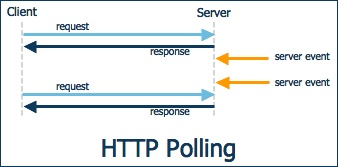
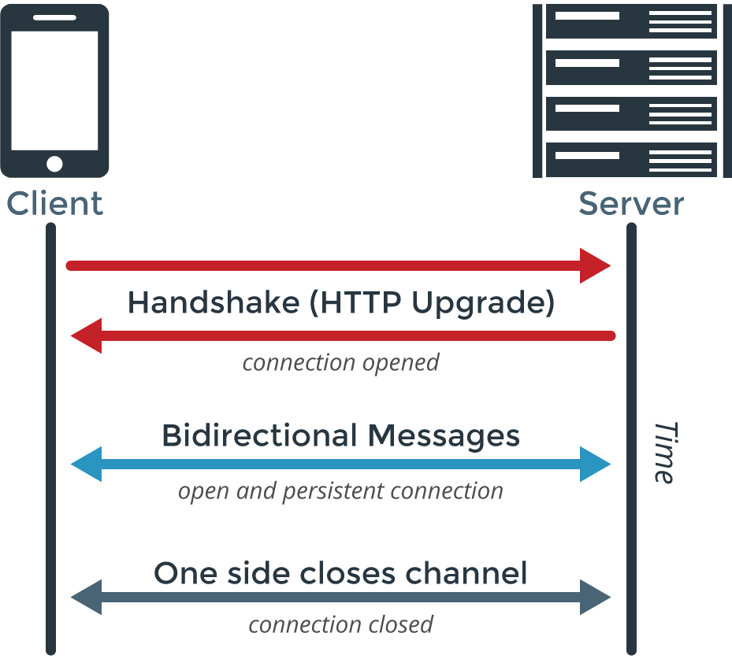

## 聊聊 WebSocket 与 Socket.IO

### 什么是WebSocket

[WebSocket](https://zh.wikipedia.org/wiki/WebSocket) 是与HTTP不同的一种网络传输协议，是HTML5新增加的一种通信协议，目前流行的浏览器都支持该协议，例如 Chrome，Safrie，Firefox，Opera，IE等等。WebSocket的产生背景主要是为了方便客户端与服务器之间的双向通信，是一种全双工的数据通信机制。

### 早期客户端与服务端通信方式

#### Polling（短轮询）

这种方式下，Client 每隔一段时间都会向 Server 发送 HTTP 请求，服务器收到请求后，将最新的数据发回给 Client。一开始必须通过提交表单的形式，这样的后果就是传输很多冗余的数据，浪费了带宽。后来 Ajax 出现，减少了传输数据量。

如图所示，在 Client 向 Server 发送一个请求活动结束后，Server 中的数据发生了改变，所以 Client 向 Server 发送的第二次请求中，Server 会将最新的数据返回给 Client。

但这种方式也存在弊端。比如在某个时间段 Server 没有更新数据，但 Client 仍然每隔一段时间发送请求来询问，所以这段时间内的询问都是无效的，这样浪费了网络带宽。将发送请求的间隔时间加大会缓解这种浪费，但如果 Server 更新数据很快时，这样又不能满足数据的实时性。

#### Comet

鉴于（短）轮询的弊端，一种基于 HTTP 长连接的 “服务器推” 的技术产生了，这种技术被命名为 Comet。其与（短）轮询主要区别就是，在轮询方式下，要想取得数据，必须首先发送请求，在实时性要求较高的情况下，只能增加向 Server 请求的频率；而 Comet 则不同，Client 与 Server 端保持一个长连接，只有数据发生改变时，Server 才主动将数据推送给 Client。Comet 又可以被细分为两种实现方式，一种是长轮询机制，一种是流技术。

###### Long-Polling（长轮询）

Client 向 Server 发出请求，Server 接收到请求后，Server 并不一定立即发送回应给 Client，而是看数据是否更新，如果数据已经更新了的话，那就立即将数据返回给 Client；但如果数据没有更新，那就把这个请求保持住，等待有新的数据到来时，才将数据返回给 Client。

当然了，如果 Server 的数据长时间没有更新，一段时间后，请求便会超时，Client 收到超时信息后，再立即发送一个新的请求给 Server。

如图所示，在长轮询机制下，Client 向 Server 发送了请求后，Server会等数据更新完才会将数据返回，而不是像（短）轮询一样不管数据有没有更新然后立即返回。

这种方式也有弊端。当 Server 向 Client 发送数据后，必须等待下一次请求才能将新的数据发送出去，这样 Client 接收到新数据的间隔最短时间便是 2 * RTT（往返时间），这样便无法应对 server 端数据更新频率较快的情况。

###### HTTP Streaming

流技术基于 Iframe。Iframe 是 HTML 标记，这个标记的 src 属性会保持对指定 Server 的长连接请求，Server 就可以不断地向 Client 返回数据。

可以看出，流技术与长轮询的区别是长轮询本质上还是一种轮询方式，只不过连接的时间有所增加，想要向 Server 获取新的数据，Client 只能一遍遍的发送请求；而流技术是一直保持连接，不需要 Client 请求，当数据发生改变时，Server 自动的将数据发送给 Client。

如图所示，Client 与 Server 建立连接之后，便不会断开。当数据发生变化，Server 便将数据发送给 Client。

但这种方式有一个明显的不足之处，网页会一直显示未加载完成的状态，虽然我没有强迫症，但这点还是难以忍受。

### WebSocket 原理

写到现在，大家会发现，前人推出那么多的解决方案，想要解决的唯一的问题便是怎么让 Server 将最新的数据以最快的速度发送给 Client。但 HTTP 是个懒惰的协议，Server 只有收到请求才会做出回应，否则什么事都不干。因此，为了彻底解决这个 Server 主动向 Client 发送数据的问题，WebSocket应运而生。**WebSocket 是一个全新的、独立的协议，基于 TCP 协议，与 HTTP 协议兼容却不会融入 HTTP 协议，仅仅作为 HTML5 的一部分**。

那 WebSocket 与 HTTP 什么关系呢？简单来说，WebSocket 是一种协议，是一种与 HTTP 同等的网络协议，两者都是应用层协议，都基于 TCP 协议。但是 WebSocket 是一种双向通信协议，在建立连接之后，WebSocket 的 Server 与 Client 都能主动向对方发送或接收数据。同时，WebSocket 在建立连接时需要借助 HTTP 协议，连接建立好了之后 Client 与 Server 之间的双向通信就与 HTTP 无关了。

相比于传统 HTTP 的每次“请求-应答”都要 Client 与 Server 建立连接的模式，WebSocket 是一种长连接的模式。一旦 WebSocket 连接建立后，除非 Client 或者 Server 中有一端主动断开连接，否则每次数据传输之前都不需要 HTTP 那样请求数据。从上面的图可以看出，Client 第一次需要与 Server 建立连接，当 Server 确认连接之后，两者便一直处于连接状态。直到一方断开连接，WebSocket 连接才断开。

### WebSocket的优势

- 较少的控制开销。在连接创建后，服务器和客户端之间交换数据时，用于协议控制的数据包头部相对较小。在不包含扩展的情况下，对于服务器到客户端的内容，此头部大小只有2至10字节（和数据包长度有关）；对于客户端到服务器的内容，此头部还需要加上额外的4字节的掩码。相对于HTTP请求每次都要携带完整的头部，此项开销显著减少了。
- 更强的实时性。由于协议是全双工的，所以服务器可以随时主动给客户端下发数据。相对于HTTP请求需要等待客户端发起请求服务端才能响应，延迟明显更少；即使是和Comet等类似的长轮询比较，其也能在短时间内更多次地传递数据。
- 保持连接状态。与HTTP不同的是，Websocket需要先创建连接，这就使得其成为一种有状态的协议，之后通信时可以省略部分状态信息。而HTTP请求可能需要在每个请求都携带状态信息（如身份认证等）。
- 更好的二进制支持。Websocket定义了二进制帧，相对HTTP，可以更轻松地处理二进制内容。
- 可以支持扩展。Websocket定义了扩展，用户可以扩展协议、实现部分自定义的子协议。如部分浏览器支持压缩等。
- 更好的压缩效果。相对于HTTP压缩，Websocket在适当的扩展支持下，可以沿用之前内容的上下文，在传递类似的数据时，可以显著地提高压缩率。

### 什么是Socket.IO

[Socket.IO](https://zh.wikipedia.org/wiki/Socket.IO) 是一个封装了 Websocket、基于 Node 的 JavaScript 框架，包含 Client 的 JavaScript 和 Server 的 Node。其屏蔽了所有底层细节，让顶层调用非常简单。其不仅支持 WebSocket，还支持许多种轮询机制以及其他实时通信方式，并封装了通用的接口。这些方式包含 Adobe Flash Socket、Ajax 长轮询、Ajax multipart streaming 、持久 Iframe、JSONP 轮询等。换句话说，当 Socket.IO 检测到当前环境不支持 WebSocket 时，能够自动地选择最佳的方式来实现网络的实时通信。

Read More:

> [WebSocket 与 Socket.IO](https://zhuanlan.zhihu.com/p/23467317)
>
> [（一）websocket和socket.io介绍](https://www.jianshu.com/p/144b997e57b4)

