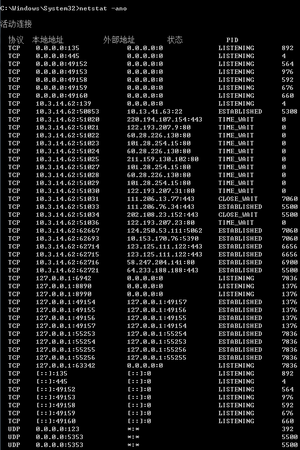
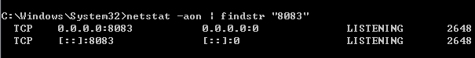
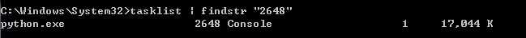

## Windows 查看端口占用并关闭进程

开始-->运行-->cmd，进入命令提示符输入`netstat -ano` 即可看到所有连接的PID，然后在任务管理器中找到这个PID所对应的程序，如果任务管理器中没有PID这一项，可以在任务管理器中选"查看" -> "选择列"。

经常，我们在启动应用的时候发现系统需要的端口被别的程序占用，如何知道谁占有了我们需要的端口，下面介绍一种非常简单的方法。

假设我们需要确定哪个进程占用了8083端口。

#### 查看所有端口的占用情况

`netstat -ano`，结果如图

#### 查看指定端口的占用情况

`netstat -aon | findstr "9050"`，结果如图

可以看到8083端口被进程号为2648的进程占用。

#### 查看PID对应的进程

`tasklist | findstr "2648"`，结果如图

#### 杀死相应进程

`tasklist|findstr "2016"`，结果如图

