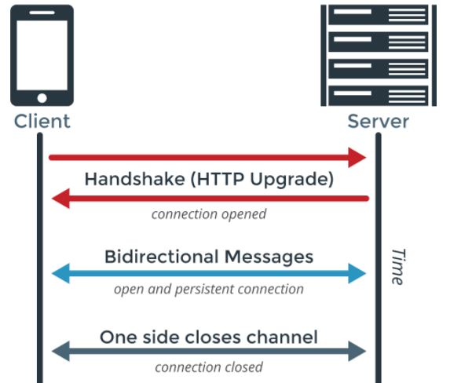

## 聊聊WS和WSS

### 初识WS/WSS

WebSocket （WS）是HTML5一种新的协议，它实现了浏览器与服务器全双工通信，能更好地节省服务器资源和带宽并达到实时通讯。WebSocket建立在TCP之上，同HTTP一样通过TCP来传输数据，但是它和HTTP最大不同是：WebSocket是一种双向通信协议，在建立连接后，WebSocket服务器和Browser/Client Agent都能主动的向对方发送或接收数据，就像Socket一样；WebSocket需要类似TCP的客户端和服务器端通过握手连接，连接成功后才能相互通信。

WSS（Web Socket Secure）是WebSocket的加密版本。WS一般默认是80端口，而WSS默认是443端口，大多数网站用的就是80和433端口。（在高防防护过程中，80和433端口的网站是需要备案才可以接入国内的。）当然网站也会有别的端口，这种如果做高防是方案是可以用海外高防的。WS和WSS的体现形式分别是TCP+WS AS WS ，TCP+TLS+WS AS WS。服务器网址就是 URL。

### 为何使用WS/WSS

随着互联网的蓬勃发展，各种类型的Web应用层出不穷，很多应用要求服务端有能力进行实时推送能力（例如直播间聊天室），以往很多网站为了实现推送技术，所用的技术都是轮询。轮询是在特定的的时间间隔（如每1秒），由浏览器对服务器发出HTTP请求，然后由服务器返回最新的数据给客户端的浏览器。这种传统的模式带来很明显的缺点，即浏览器需要不断地向服务器发出请求，然而HTTP请求可能包含较长的头部，其中真正有效的数据可能只是很小的一部分，显然这样会浪费很多的带宽资源。

在这种情况下，HTML5定义了WebSocket协议，能更好地节省服务器资源和带宽，并且能够更实时地进行通讯。WebSocket实现了浏览器与服务器全双工（full-duplex）通信，允许服务器主动发送信息给客户端。

WebSocket协议的交互过程如下图所示。

### WS特点

- 建立在 TCP 协议之上，服务端实现容易；
- 与 HTTP 协议有良好的兼容性，握手时不容易被屏蔽，可以通过各种 HTTP 代理服务器；
- 数据轻量，实时通讯；
- 可以发送文本和二进制数据；
- 不限制同源，客户端可以与任意服务器端进行通讯。因此WebSocket协议的出现，为很多人解决了关于扩展以及兼容性协议的烦恼问题。

### 与http/https关系

按照标准来是有如下对应关系的：

- http -> new WebSocket('ws://xxx')

- https -> new WebSocket('wss://xxx')

在https下应该使用wss协议做安全链接，且wss下不支持ip地址的写法，写成域名形式。

Read More:

> [WS/WSS协议支持FAQ](https://www.alibabacloud.com/help/zh/doc-detail/63421.htm)
>
> [浅谈WebSocket协议、WS协议和WSS协议原理及关系](https://zhuanlan.zhihu.com/p/75328501)
>
> [http/https与websocket的ws/wss的关系](https://www.jianshu.com/p/72bcc74409ad)